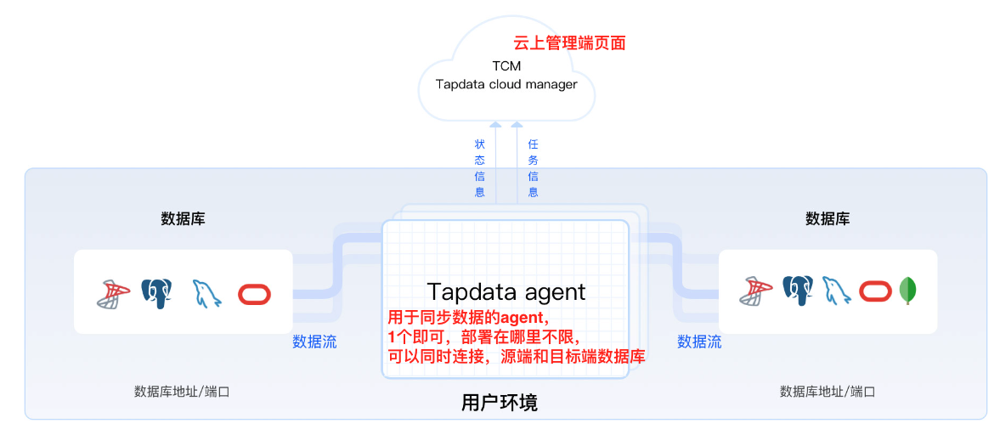
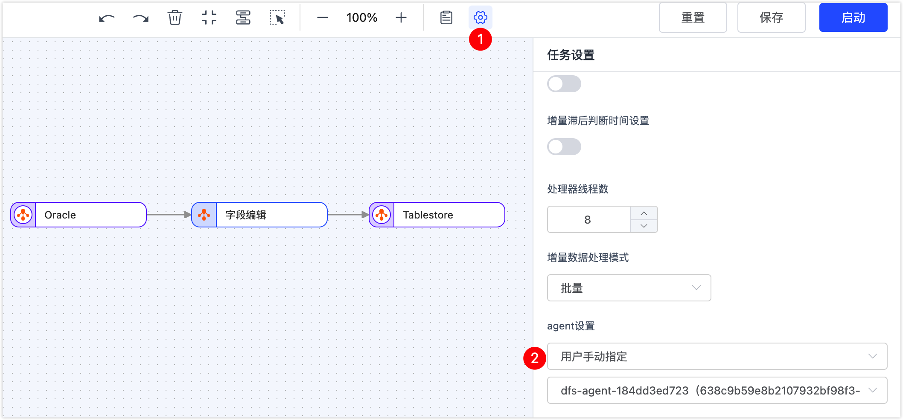

# Agent 部署/运行

本文列举 Tapdata Agent 在部署和运行遇到的常见问题。

### Agent 有什么作用？

您在本地环境部署的 Agent 负责通过流式技术从源系统获取数据、处理转换数据并发送到目标系统，由云上的管理端统一管理，工作流程如下：

:::tip

数据传输不会流转至云上管理端，保障数据安全性。

:::



### 为什么需要将 Agent 部署至本地环境？

Agent 是数据同步、数据异构、数据开发场景中的关键程序。由于数据流转通常对时效性有较高的要求，因此，推荐将 Agent 部署在数据库所属的本地网络中，从而极大降低数据延迟。

更多介绍，见[部署 Tapdata Agent](../quick-start/install-agent)。

### 需要部署多少个 Agent？

只需部署一个 Agent 即可，需确保该 Agent 可和数据的来源/目标端可正常通信。

### 可以部署多个 Agent 吗？

可以，需要确保这些 Agent 可和数据的来源/目标端可正常通信。

一个任务只会在一个 Agent 上运行，任务可能会调度 Agent A，也可能调度 Agent B，通常在任务比较多时，部署多个 Agent 来解决单点负载问题。

### 部署了多个 Agent，某任务的 Agent 异常宕机了如何处理？

您可以编辑对应的任务，然后为其手动指定一个正常运行的 Agent，再对异常的 Agent 进行排查，设置方法如下：



### 如果 Oracle 是 rac 模式，aix 的两节点 rac，如何部署 Agent？

只要能够能连到 rac 就可以了，即 Agent 能连到 rac 的 scan/vip，无需和 Oracle 在一起。 

### Agent 一直是部署状态检测中？

需要根据提示安装部署 agent，如果已经安装部署，然后等待实例上线，如果超过 5 分钟还没有上线的话，可能部署失败。您可以联系在线客服，并提供日志来协助定位问题。

### 安装了DockerWindows (64 bit)，一直检测不通过？

可以直接使用Docker方式部署实例，只需要在终端执行 docker run xxxx 即可启动实例，详细命令请查看Docker部署页说明。

### Agent 启动报错：start timout ？

启动 Agent 失败，可以看下 logs/tapdata-agent.log 日志内容，判断是否为网络问题，或者发送给客户支持协助定位。

### 怎么再次获取 token？

由于一个Agent配置不能同时用于两个实例，产品上没有提供再次获取token重新部署；建议创新创建一个新实例安装部署。

### 输入 token 后报错： java.lang.IllegalStateException: Cannot load configuration class: io.tapdata.Application？

软件包不完整，可以更换一个版本测试验证。

### 如何卸载重装 Agent

- Docker 容器启动的实例，直接删除容器，然后重新运行 启动容器的命令即完成了重新安装
- Host宿主机自建的实例，可以参考下面步骤操作
- 重新部署
  - 将安装目录中 application.yml 保存下来
  - 停止服务：`./tapdata stop -f`
  - 删除安装目录
  - 创建新的安装目录，并将 application.yml 复制到新的安装目录中
  - 下载 tapdata 工具
  - 执行 `./tapdata start backend `

- 创建新实例，全新安装
  - 停止服务: `./tapdata stop -f`
  - 删除安装目录
  - 在控制台创建新实例，根据提示完成部署

### Agent 显示离线，如何重启？

Agent 每隔1分钟就会上报一次心跳，要是连续5次没有上报，就会显示离线。 离线不影响已运行任务的正常运行，但是新建任务会受到影响。 大部分情况都是网络不稳定导致，触发实例离线告警。

如下场景：在个人电脑安装了一个实例，隔一段时间不操作电脑进入休眠状态，导致agent离线；再次操作电脑时，又唤醒了agent，变为运行中。

输入 `./tapdata status` 命令可以检查agent的状态，在安装agent的电脑上输入 `tapdata start` 即可重启 Agent。

如果还是无法启动，可联系在线客服协助定位问题。

### Agent 运行出现 “OutOfMemoryError” 怎么处理？

如果Agent在运行过程中出现 “OutOfMemoryError” 报错，首先要确认部署 Agent 服务器的可用内存是否足够。

如果服务器本身可用内存不够，需要考虑更换Agent部署服务器，或者将任务设置中的【每次读取数量】的值调小。

如果服务器可用内存充足，可以尝试调大Agent的运行内存，然后重新启动Agent即可。

Agent运行内存调整方式

在Agent部署目录下找到`application.yml`文件

修改文件，在文件里增加配置：`tapdataJavaOpts: "-Xms4G -Xmx8G"`

具体的运行内存大小根据服务器的可用内存自行判断设置

```yaml
tapdata:
    conf:
        tapdataPort: '3030'
        backendUrl: 'https://cloud.tapdata.net/api/'
        apiServerPort: ""
        tapdataJavaOpts: "-Xms4G -Xmx8G"
        reportInterval: 20000
        uuid: a5f266a1-a495-412f-a433-29d345713c176
    cloud:
        accessCode: ""
        baseURLs: 'https://cloud.tapdata.net/api/'
        username: null
        token: 
spring:
    data:
        mongodb:
            username: ""
            password: ""
            mongoConnectionString: ""
            uri: ""
            ssl: ""
            sslCA: ""
            sslCertKey: ""
            sslPEMKeyFilePassword: ""
            authenticationDatabase: ""
```

配置文件修改完成后，重启 Agent 生效

```bash
#先停止 Agent
./tapdata stop -f

#然后再启动 Agent
./tapdata start
```


