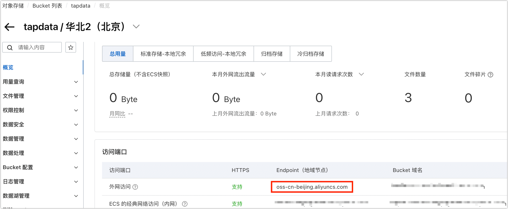

# CSV

Tapdata Cloud 支持读取 Local（本地）、FTP、SFTP、SMB、S3FS 或 OSS 上的文件，支持的文件类型包括 CSV、Excel、[JSON 和 XML](../alpha/json-and-xml.md)，满足多样化的数据流转需求。

CSV 文件是一种以纯文本形式存储表格数据的简单文件格式，每列数据由特殊分隔符分割（如逗号，分号或制表符）。完成 Agent 部署后，您可以跟随本文教程在 Tapdata Cloud 中添加 CSV 数据源，后续可将其作为源或目标库来构建数据管道。

## 注意事项

- 一个连接配置仅对应一个模型（表），如有多个模型您需要分别为其创建链接。
- 如果多个文件的表头不一致，Tapdata 会取并集作为模型。
- CSV 数据源仅适用于数据开发任务，暂不支持在数据复制任务中引用。
- Tapdata Cloud 默认每隔 1 分钟检测 CSV 文件是否发生变更（如新增/修改文件），如发生变更则将涉及的文件全量新增后更新条件字段以完成修改，暂不支持同步删除文件或数据。
- CSV 文件中可用的数据类型为 BOOLEAN、DATETIME、INTEGER、NUMBER、STRING、TEXT。

## 准备工作

本小节介绍在创建 CSV 数据源连接前所需的准备工作，请根据 CSV 文件的存放位置选择阅读。

### 文件存放在 Local/FTP/SFTP/SMB

import Tabs from '@theme/Tabs';
import TabItem from '@theme/TabItem';

<Tabs className="unique-tabs">
   <TabItem value="local" label="Local（本地）">

   
当您将文件存放在 Tapdata Agent（<a href="../../faq/agent-installation#semi-and-full-agent">半托管模式</a>）所属的设备上，可将其作为数据来源，准备工作如下：
 
  <ol>
   <li>登录至 Tapdata Agent 所属设备。</li>
   <li>为便于管理，新建一个文件夹用来存放文件，以 root 用户为例，我们新建一个文件夹为： <code>/root/files</code>。</li>
   <li>将 CSV 文件存放至该文件夹。</li>
  </ol> 
  
后续在配置数据源时，您只需提供<strong>文件存放路径</strong>即可。

   </TabItem>
   <TabItem value="ftp" label="FTP">
    
文件传输协议（FTP）是用于在网络上进行文件传输的一套标准协议。如需将 FTP 服务中的文件作为数据来源，准备工作如下：
 
  <ol>
   <li>安装 FTP 服务（如 <a href="https://security.appspot.com/vsftpd.html">vsftpd</a>）并保障网络通信正常。</li>
   <li>如开启了认证，您需要准备 FTP 的账号与密码，保障其具备文件读取权限。</li>
   <li>记录 CSV 文件存放路径，后续配置数据源时使用。</li>
  </ol>

   </TabItem>
   <TabItem value="sftp" label="SFTP">
   
安全文件传输协议（SFTP）可为文件提供一种安全加密的网络传输方法。如需将 SFTP 服务中的文件作为数据来源，准备工作如下：
 
  <ol>
   <li>安装 SFTP 服务（openssh-client 与 openssh-server）并保障网络通信正常。</li>
   <li>准备 SFTP 服务的账号、密码，保障其具备文件读取权限。</li>
   <li>记录 CSV 文件存放路径，后续配置数据源时使用。</li>
  </ol>

   </TabItem>
   <TabItem value="smb" label="SMB">
   
信息服务快协议（SMB）是一种Linux、UNIX系统上可用于共享文件和打印机等资源的协议。如需将 Samba 服务中的文件作为数据来源，准备工作如下：
 
  <ol>
   <li>安装 SMB （支持 1.0/2.0/3.0 版本）协议的软件，如 Samba ，保障网络通信正常。</li>
   <li>准备 Samba 服务的账号、密码，保障其具备文件读取权限。</li>
   <li>记录 CSV 文件存放的路径，后续配置数据源时使用。</li>
  </ol>

   </TabItem>
  </Tabs>

### 文件存放在 Amazon S3 

Amazon S3 是一种面向互联网的存储服务。您可以通过 Amazon S3 随时在 Web 上的任何位置存储和检索任意大小的数据。当您的文件存放在 Amazon S3 上时，您需要获取用户的访问密钥、S3 存储桶名称、文件路径等信息。

1. 登录[亚马逊云 IAM 管理控制台](https://console.aws.amazon.com/iamv2/home?#/home)。

2. 创建用户并授权。

   1. 在左侧导航栏，选择**访问管理** > **用户**。

   2. 在页面右侧，单击**创建用户**。

   3. 填写用户名并单击**下一步**。

      用户名最多可包含 64 个字符，有效字符包括：A-Z、a-z、0-9 和 `+ =,. @ _-`

   4. 在**权限选项**区域选择**直接附加策略**，然后搜索并选中 **AmazonS3ReadOnlyAccess** 策略。

      

   5. 单击**下一步**，然后单击**创建用户**。

3. 为用户创建访问密钥。

   1. 在跳转到的用户列表页，找到并单击刚刚创建的用户。

   2. 单击**安全凭证**页签，然后在**访问密钥**区域单击**创建访问密钥**。

      

   3. 选择**第三方服务**并单击**下一步**。

   4. 设置描述标签并单击**创建访问密钥**。

   5. 在页面查看或下载访问密钥信息，包含 **Accesskey**、**Secretkey** 信息。

      

      :::tip

      为保障信息安全，请妥善保存访问密钥。如果意外关闭该页面将无法获取该私有访问密钥，此时您需要创建新的访问密钥。

      :::

4. 获取存储桶的区域代码。

   1. 登录[亚马逊云 S3 控制台](https://console.aws.amazon.com/s3/buckets)。

   2. 在存储桶列表页，找到目标存储桶，查看其区域代码。
   
      

### 文件存放在 OSS

阿里云对象存储 OSS 是一款海量、安全、低成本、高可靠的云存储服务，可提供 99.9999999999%（12个9）的数据持久性，99.995%的数据可用性。当您的文件存放在阿里云 OSS 上时，您需要获取用户的访问密钥、Bucket 名称、文件路径等信息。

1. 登录[阿里云 RAM 访问控制台](https://ram.console.aliyun.com/overview)。

2. 创建用户并获取访问密钥（AccessKey）。

   1. 在左侧导航栏，选择**身份管理** > **用户**。

   2. 单击**创建用户**。

   3. 在跳转到的页面填写登录名称、显示名称，选择 OpenAPI 调用方式并单击**确定**。

      

   4. 用户创建完成后，单击下载 CSV 文件，该文件包含访问密钥（AccessKey）信息。

      :::tip

      为保障信息安全，请妥善保存访问密钥。

      :::

3. 为用户授予权限。

   1. 在跳转到的用户列表页，找到并单击刚刚创建的用户。

   2. 单击权限管理页签，然后单击**新增授权**。

   3. 在右侧弹出的面板中，选择授权范围，然后搜索并选中 **AliyunOSSReadOnlyAccess** 策略。

      

   4. 单击**确定**，然后单击**完成**。

4. 获取 OSS 的访问域名（Endpoint）。

   1. 登录[阿里云 OSS 控制台](https://oss.console.aliyun.com/bucket/)。

   2. 找到并单击目标 Bucket（存储桶）。

   3. 单击左侧的概览标签页，下翻至访问端口即可获取外网访问地址对应的 Endpoint。
   
      

## 添加数据源

1. 登录 [Tapdata Cloud 平台](https://cloud.tapdata.net/console/v3/)。

2. 在左侧导航栏，单击**连接管理**。

3. 单击页面右侧的**创建**。

4. 在弹出的对话框中，选择 **CSV**。

5. 在跳转到的页面，根据下述说明填写 CSV 的连接信息。

   

   * **连接名称**：填写具有业务意义的独有名称。
   * **连接类型**：目前仅支持**源头**。
   * **文件协议**：根据 CSV 文件存放的位置选择下述协议，本文以 **S3FS**（Amazon S3 存储桶） 为例演示操作流程。     
     :::tip     
     关于如何获取各协议所需填写的信息，见 [准备工作](#prerequisite)。     
     :::
      * **Local**：文件存放在本地（引擎）所在的设备上，选择此项后，您还需要填写文件路径。
      * **FTP**（文件传输协议）：文件存放在 FTP 服务器上，选择此项后，您还需要填写 FTP 服务器的地址、端口、用户名、口令、文件路径等信息，如上图所示。
      * **SFTP**（安全加密文件传输协议）：文件存放在 SFTP 服务器上，选择此项后，您还需要填写 SFTP 服务器的地址、端口、用户名、口令、文件路径等信息。
      * **SMB**（文件共享协议）：文件存放在 SMB 服务器上，兼容 1.x、2.x、3.x，选择此项后，您还需要填写 SMB 服务器的地址、用户名、口令、文件路径等信息。
      * **S3FS**（遵循S3协议文件系统）：文件存放在 Amazon S3 存储桶上，选择此项后，您还需要填写 Accesskey、Secretkey、终端（固定为 **s3.amazonaws.com**）、桶和文件路径等信息。
      * **OSS**（对象存储服务）：文件存放在阿里云对象存储 OSS 上，选择此项后，您还需要填写云账户的 Accesskey、Secretkey、终端、桶和文件路径等信息。
   * **Agent 设置**：默认为**平台自动分配**，您也可以手动指定。
   * **模型加载时间**：当数据源中模型数量小于 10,000 时，每小时刷新一次模型信息；如果模型数据超过 10,000，则每天按照您指定的时间刷新模型信息。

6. 单击**连接测试**，测试通过后单击**保存**。

   :::tip

   如提示连接测试失败，请根据页面提示进行修复。

   :::

