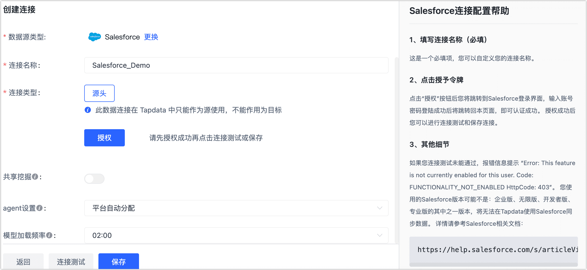

# Salesforce

Salesforce 是一个集成 CRM 平台，可以为您的所有部门提供所有客户的单一共享视图。Tapdata 支持将 Salesforce 作为源库构建数据管道，本文介绍如何在 Tapdata 中添加 Salesforce 数据源。

## 连接 Salesforce

1. 登录 [Tapdata Cloud 平台](https://cloud.tapdata.net/console/v3/)。

2. 在左侧导航栏，单击**连接管理**。

3. 单击页面右侧的**创建连接**。

4. 在弹出的对话框中，搜索并选择 **Salesforce**。

5. 根据下述说明完成数据源配置。

   

   * **连接名称**：填写具有业务意义的独有名称。
   * **连接类型**：仅支持将 Salesforce 作为源头。
   * **授权**：单击授权，在跳转到的页面，登录 Salesforce 账号以完成授权操作（推荐以管理员身份操作）。
     :::tip
     完成操作后，页面将返回至数据源配置页面并显示**成功授权**。
     :::
   * **共享挖掘**：打开[共享挖掘](../../advanced-settings/share-mining.md)开关后，多个任务共享增量日志读取结果，无需从源库重复读取，可极大降低源库负载。
   * **Agent 设置**：默认为**平台自动分配**，您也可以手动指定 Agent。   
   * ***模型加载时间**：当数据源中模型数量小于 10,000 时，每小时刷新一次模型信息；如果模型数据超过 10,000，则每天按照您指定的时间刷新模型信息。

6. 单击**连接测试**，测试通过后单击**保存**。

   :::tip

   如提示连接测试失败，请根据页面提示进行修复。

   :::

   