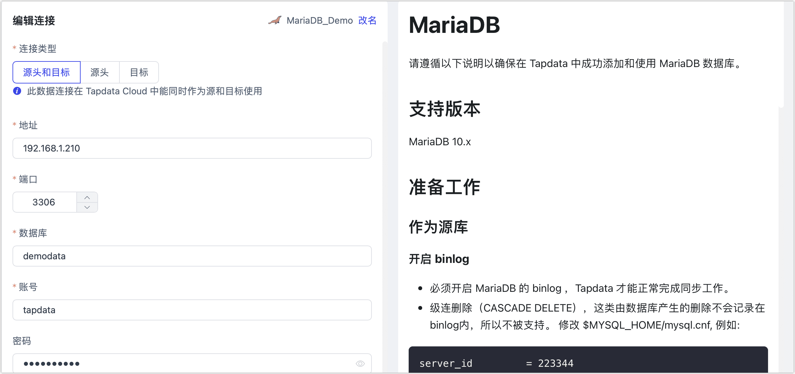

# MariaDB

MariaDB 是一个通用的开源关系数据库管理系统，可用于高可用性事务数据、分析、作为嵌入式服务器，并且广泛的工具和应用程序支持 MariaDB。完成 Agent 部署后，您可以跟随本文教程在 Tapdata Cloud 中添加 MariaDB 数据源，后续可将其作为源或目标库来构建数据管道。

import Tabs from '@theme/Tabs';
import TabItem from '@theme/TabItem';

## 支持版本
MariaDB 10.x

import Content from '../../../reuse-content/beta/beta.md';

<Content />

## 准备工作

### 作为源库

为保障任务的顺利执行，您需要为 MariaDB 数据库开启 Binlog（可实现增量数据同步），然后为数据复制/开发任务创建一个数据库账号。

1. 登录 MariaDB 数据库，执行下述格式的命令，创建用于数据同步/开发任务的账号。

   ```sql
   CREATE USER 'username'@'host' IDENTIFIED BY 'password'
   ```

   * **username**：用户名。
   * **password**：密码。
   * **host**：允许该账号登录的主机，百分号（%）表示允许任意主机。
     示例：创建一个名为 tapdata 的账号：`CREATE USER 'tapdata'@'%' IDENTIFIED BY 'Tap@123456';`
   
2. 为刚创建的账号授予权限，简易示例如下，推荐基于业务需求设置更精细化的权限控制。

```mdx-code-block
<Tabs className="unique-tabs">
<TabItem value="授予指定库权限">
```
```sql
GRANT REPLICATION SLAVE, REPLICATION CLIENT ON *.* TO 'username' IDENTIFIED BY 'password';
GRANT SELECT ON database_name.* TO 'username' IDENTIFIED BY 'password';
```
</TabItem>

<TabItem value="授予所有库权限">

```sql
GRANT REPLICATION SLAVE, REPLICATION CLIENT ON *.* TO 'username' IDENTIFIED BY 'password';
GRANT SELECT ON *.* TO 'username' IDENTIFIED BY 'password';
```
</TabItem>
</Tabs>

* **database_name**：要授予权限的数据库名称。
* **username**：用户名。
* **password**：密码。

3. 为保障读取 MariaDB 数据库的增量数据，您需要跟随下述步骤开启 Binlog。

   1. 使用 `vim` 命令，修改 MariaDB 的配置内容，例如：

      本文演示的场景中，MariaDB 部署在 Ubuntu 操作系统，该配置文件位于 `/etc/mysql/mariadb.cnf`，更多介绍，见 [MariaDB 配置文件介绍](https://mariadb.com/kb/en/configuring-mariadb-with-option-files/)。
   
      ```bash
      server-id              = 1
      log_bin                = /var/log/mysql/myriadb-bin
      expire_logs_days       = 10
      max_binlog_size        = 100M
      binlog_format = ROW
      binlog_row_image = FULL
      ```
   
      - **server_id**：对于 MariaDB 中的每个服务器和复制客户端必须是唯一的，设置为大于 0 的整数。
      - **log_bin**：binlog 文件的基本名称。
      - **expire_logs_days**：二进制日志文件保留的天数，到期自动删除。
      - **max_binlog_size**：单个 binlog 文件的最大大小。
      - **binlog_format**：设置为 row，即记录修改了哪些行。
      - **binlog_row_image**：设置为 full，即记录所有列的数据，无论它们是否更改。
   
   2. 修改完成后，执行下述命令重启 MariaDB 数据库，请在业务低峰期操作以免影响服务。

      ```bash
      systemctl restart mariadb
      ```
   
   3. （可选）登录 MariaDB 数据库，执行下述命令确认配置已生效，即输出的结果中，**format** 的值为 **ROW**。

      ```sql
      SHOW VARIABLES LIKE 'binlog_format';
      ```
   
      输出示例如下：
   
      ```sql
      +---------------+-------+
      | Variable_name | Value |
      +---------------+-------+
      | binlog_format | ROW   |
      +---------------+-------+
      1 row in set (0.00 sec)
      ```


### 作为目标库

1. 登录 MariaDB 数据库，执行下述格式的命令，创建用于数据同步/开发任务的账号。

   ```sql
   CREATE USER 'username'@'host' IDENTIFIED BY 'password'
   ```

   * **username**：用户名。
   * **password**：密码。
   * **host**：允许该账号登录的主机，百分号（%）表示允许任意主机。
     示例：创建一个名为 tapdata 的账号：`CREATE USER 'tapdata'@'%' IDENTIFIED BY 'Tap@123456';`

2. 为刚创建的账号授予权限。

```mdx-code-block
<Tabs className="unique-tabs">
<TabItem value="授予指定库权限">
```
```sql
GRANT SELECT, INSERT, UPDATE, DELETE, ALTER, CREATE, CREATE ROUTINE, CREATE TEMPORARY TABLES, 
DROP ON database_name.* TO 'username';
```
</TabItem>

<TabItem value="授予所有库权限">

```sql
GRANT SELECT, INSERT, UPDATE, DELETE, ALTER, CREATE, CREATE ROUTINE, CREATE TEMPORARY TABLES, 
DROP ON *.* TO 'username';
```
</TabItem>
</Tabs>

* **database_name**：要授予权限的数据库名称。
* **username**：用户名。


### <span id="ssl">开启 SSL 连接（可选）</span>

为进一步提升数据链路的安全性，您还可以选择为 MariaDB 数据库开启 SSL（Secure Sockets Layer）加密，实现在传输层对网络连接的加密，在提升通信数据安全性的同时，保证数据的完整性，具体操作流程如下：

1. 创建 SSL 证书和私钥，可以使用自签名证书或从证书颁发机构获得的证书。

   接下来，我们将演示如何通过 OpenSSL 创建自签名证书，在执行本步骤前，您可以登录 MariaDB 数据库并执行 `SHOW GLOBAL VARIABLES LIKE '%ssl%';` 命令，查看是否生成过 SSL/RSA 文件及 SSL 开启状态。

   1. 登录 MariaDB 数据库所属的设备，执行下述命令生成 CA 证书。

      ```bash
      # 创建并进入证书文件存放目录，您也可以自由调整
      mkdir -p /etc/mysql/ssl&&cd /etc/mysql/ssl
      # 生成 CA 证书
      openssl genrsa 2048 > ca-key.pem
      openssl req -new -x509 -nodes -days 365000 -key ca-key.pem -out ca-cert.pem
      ```

   2. 生成服务器证书和密钥，后续将用于服务端的 SSL 加密。

      ```bash
      openssl req -newkey rsa:2048 -days 365000 -nodes -keyout server-key.pem -out server-req.pem
      openssl rsa -in server-key.pem -out server-key.pem
      openssl x509 -req -in server-req.pem -days 365000 -CA ca-cert.pem -CAkey ca-key.pem -set_serial 01 -out server-cert.pem
      ```

   3. 为双向认证生成客户端证书和密钥。

      ```bash
      openssl req -newkey rsa:2048 -days 365000 -nodes -keyout client-key.pem -out client-req.pem
      openssl rsa -in client-key.pem -out client-key.pem
      openssl x509 -req -in client-req.pem -days 365000 -CA ca-cert.pem -CAkey ca-key.pem -set_serial 01 -out client-cert.pem
      ```

   4. 验证密钥正确性，如无问题则返回 `OK`。

      ```bash
      openssl verify -CAfile ca-cert.pem server-cert.pem
      openssl verify -CAfile ca-cert.pem client-cert.pem 
      ```

2. 编辑 MariaDB 的配置文件，在 `[mysqld]` 部分添加以下内容，需将 `filepath` 更换为 CA 证书相关文件的生成地址，修改完成后保存并退出编辑。

   本案例中 MariaDB 部署在 Ubuntu 操作系统，该配置文件位于 `/etc/mysql/mariadb.cnf`，更多介绍，见 [MariaDB 配置文件介绍](https://mariadb.com/kb/en/configuring-mariadb-with-option-files/)。

   ```bash
   [mysqld]
   # 自签名的 CA 证书
   ssl-ca=/etc/mysql/ssl/ca-cert.pem
   # 服务端证书文件
   ssl-cert=/etc/mysql/ssl/server-cert.pem
   # 服务端私钥文件
   ssl-key=/etc/mysql/ssl/server-key.pem
   
   [client]
   # 客户端连接服务端所需提供的证书文件
   ssl-cert=/etc/mysql/ssl/client-cert.pem
   # 客户端连接服务端所需提供的私钥文件
   ssl-key=/etc/mysql/ssl/client-key.pem
   ```

3. 执行下述命令，调整证书文件权限。

   ```bash
   chown -R mysql:mysql /etc/mysql/ssl/
   ```

4. 登录 MariaDB 数据库，**选择**执行下述格式的命令，调整数据同步/开发任务的账号。

   ```sql
   ALTER USER 'username'@'host' REQUIRE x509; -- 强制要求客户端提供有效证书
   ALTER USER 'username'@'host' REQUIRE ssl; -- 不强制要求客户端提供有效证书
   FLUSH PRIVILEGES;
   ```

   * **username**：用户名。
   * **host**：允许该账号登录的主机，例如使用百分号（%）以允许任意主机。

5. 修改完成后，执行下述命令重启 MariaDB 数据库，请在业务低峰期操作以免影响服务。

   ```bash
   systemctl restart mariadb
   ```

   


## 添加数据源

1. 登录 [Tapdata Cloud 平台](https://cloud.tapdata.net/console/v3/)。

2. 在左侧导航栏，单击**连接管理**。

3. 单击页面右侧的**创建连接**。

4. 在弹出的对话框中，搜索并选择 **MariaDB**。

5. 在跳转到的页面，根据下述说明填写 MariaDB 的连接信息。

   

    * **连接信息设置**
      * **连接名称**：填写具有业务意义的独有名称。
      * **连接类型**：支持将 MariaDB 作为源或目标库。
      * **地址**：数据库连接地址。
      * **端口**：数据库的服务端口。
      * **数据库**：数据库名称，即一个连接对应一个数据库，如有多个数据库则需创建多个数据连接。
      * **账号**：数据库的账号。
      * **密码**：数据库账号对应的密码。
    * **高级设置**
      * **连接参数**：额外的连接参数，默认为空。
      * **时区**：默认为数据库所用的时区，您也可以根据业务需求手动指定。
        如果源库为默认数据库时区（+8:00），目标端数据库为指定时区+0:00，那么假设源端数据库存储的时间为 2020-01-01 16:00:00，目标端数据库存储的时间则为 2020-01-01 08:00:00
      * **包含表**：默认为**全部**，您也可以选择自定义并填写包含的表，多个表之间用英文逗号（,）分隔。
      * **排除表**：打开该开关后，可以设定要排除的表，多个表之间用英文逗号（,）分隔。
      * **Agent 设置**：默认为**平台自动分配**，您也可以手动指定 Agent。
      * **模型加载频率**：数据源中模型数量大于 1 万时，Tapdata Cloud 将按照设置的时间定期刷新模型。
    * **SSL 设置**：选择是否开启 SSL 连接数据源，可进一步提升数据安全性，开启该功能后还需要上传 CA 文件、客户端证书、客户端密钥文件等，相关文件已在[开启 SSL 连接](#ssl)中获取。

6. 单击**连接测试**，测试通过后单击**保存**。

   :::tip

   如提示连接测试失败，请根据页面提示进行修复。

   :::
