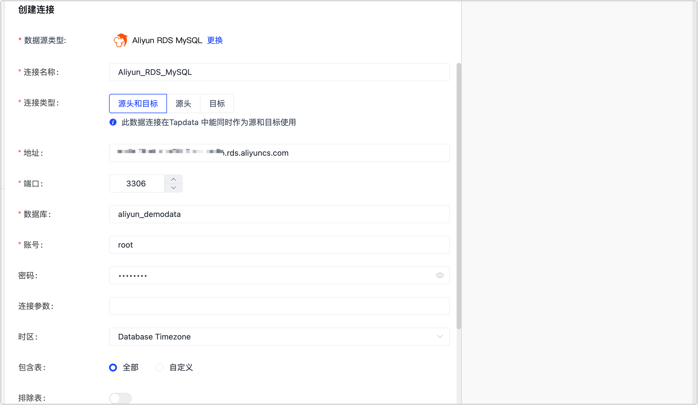

# 连接阿里云 RDS MySQL 

阿里云关系型数据库 RDS（Relational Database Service）是一种稳定可靠、可弹性伸缩的在线数据库服务。Tapdata Cloud 支持将阿里云 RDS MySQL 作为源或目标数据库构建数据管道，本文介绍如何在 Tapdata Cloud 中添加阿里云 RDS MySQL。

## 准备工作

[阿里云 RDS MySQL 准备工作](../../../prerequisites/alpha/aliyun-rds-for-mysql.md)

## 操作步骤

1. 登录 [Tapdata Cloud 平台](https://cloud.tapdata.net/console/v3/)。

2. 在左侧导航栏，单击**连接管理**。

3. 单击页面右侧的**创建连接**。

4. 在弹出的对话框中，单击**认证数据源**，然后选择 **MySQL**。

5. 在跳转到的页面，根据下述说明填写 MySQL 的连接信息。

   

   * 连接信息设置
     * **连接名称**：填写具有业务意义的独有名称。
     * **连接类型**：支持作为源或目标库。
     * **地址**：数据库连接地址，即您在准备工作获取到的外网连接地址。
     * **端口**：数据库的服务端口，默认为 **3306**。
     * **数据库**：数据库名称，即一个连接对应一个数据库，如有多个数据库则需创建多个数据连接。
     * **账号**：具备高权限的账号名称。
     * **密码**：数据库账号对应的密码。
     * **连接参数**：额外的连接参数，默认为空。
   * 高级设置
     * **时区**：默认为数据库所用的时区，您也可以根据业务需求手动指定。
       如果源库为默认数据库时区（+8:00），目标端数据库为指定时区+0:00，那么假设源端数据库存储的时间为 2020-01-01 16:00:00，目标端数据库存储的时间则为 2020-01-01 08:00:00
     * **包含表**：默认为**全部**，您也可以选择自定义并填写包含的表，多个表之间用英文逗号（,）分隔。
     * **排除表**：打开该开关后，可以设定要排除的表，多个表之间用英文逗号（,）分隔。
     * **Agent 设置**：默认为**平台自动分配**，您也可以手动指定 Agent。
     * **模型加载频率**：数据源中模型数量大于 1 万时，Tapdata Cloud 将按照设置的时间定期刷新模型。

6. 单击**连接测试**，测试通过后单击**保存**。
   :::tip
   如提示连接测试失败，请根据页面提示进行修复。
   :::

## 相关文档

[将本地 MySQL 实时同步至阿里云](../../../best-practice/mysql-as-source/mysql-to-aliyun.md)

