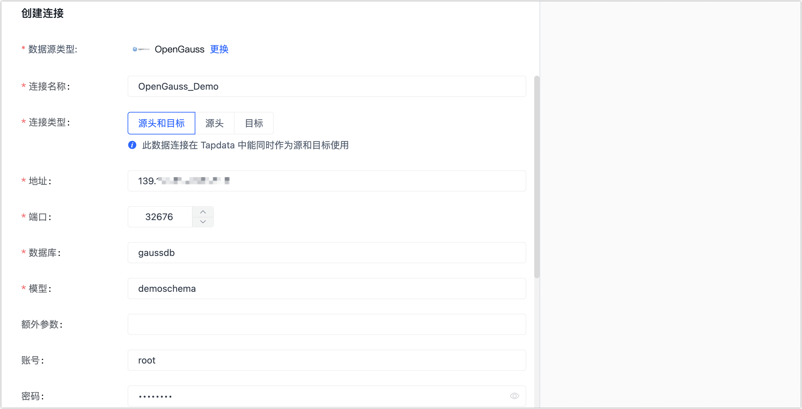

# 连接 openGauss

openGauss 是一款支持 SQL 2003 标准语法，支持主备部署的高可用关系型数据库。Tapdata 支持将 openGauss 作为源和目标数据库来构建数据管道，本文介绍如何在 Tapdata Cloud 中添加 openGauss 数据源。

## 操作步骤

1. 登录 [Tapdata Cloud 平台](https://cloud.tapdata.net/console/v3/)。

2. 在左侧导航栏，单击**连接管理**。

3. 单击页面右侧的**创建连接**。

4. 在弹出的对话框中，单击 **Alpha 数据源**，然后选择 **openGauss**。

5. 根据下述说明完成数据源配置。

   

   * 连接信息设置

     * **连接名称**：填写具有业务意义的独有名称。
     * **连接类型**：支持将 openGauss 数据库作为源或目标。
     * **地址**：数据库连接地址。
     * **端口**：数据库的服务端口。
     * **数据库**：数据库名称，即一个连接对应一个数据库，如有多个数据库则需创建多个数据连接。
     * **模型**：数据库的 Schema 名称。
     * **额外参数**：额外的连接参数，默认为空。
     * **账号**、**密码**：数据库的账号和密码，账号的创建和授权方法，见 [openGauss 数据源准备工作](../../../prerequisites/config-database/alpha/opengauss.md)。

   * 高级设置
     * **日志插件**：保持默认的 **PGOUTPUT**。
     * **时区**：默认为数据库所用的时区，您也可以根据业务需求手动指定。
     * **包含表**：默认为**全部**，您也可以选择自定义并填写包含的表，多个表之间用英文逗号（,）分隔。
     * **排除表**：打开该开关后，可以设定要排除的表，多个表之间用英文逗号（,）分隔。
     * **agent 设置**：默认为**平台自动分配**，您也可以手动指定。
     * **模型加载频率**：数据源中模型数量大于 1 万时，Tapdata 将按照本参数的设定定期刷新模型。

6. 单击**连接测试**，测试通过后单击**保存**。

   :::tip

   如提示连接测试失败，请根据页面提示进行修复。

   :::