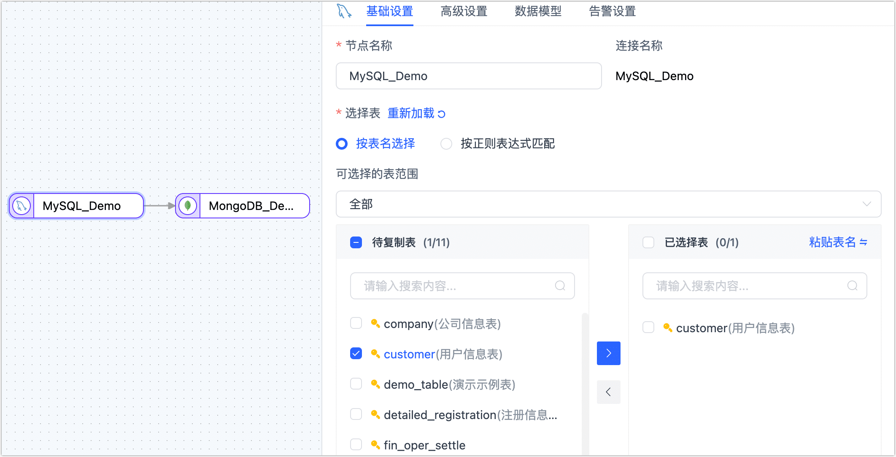
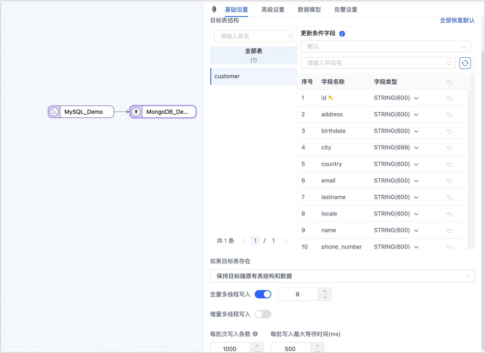

# 创建数据复制任务

数据复制功能可以帮助您实现同/异构数据源间的实时同步，适用于数据迁移/同步、数据灾备、读性能扩展等多种[业务场景](../../introduction/use-cases.md)。本文介绍数据复制功能的具体使用流程，帮助您快速掌握如何创建、监控和管理数据复制任务。

## 前提条件

在创建数据复制任务前，您需要执行下述准备工作：

* [安装 Tapdata Agent](../../quick-start/install-agent)
* [连接数据源](../../quick-start/connect-database.md)

## 操作步骤

本文以 MySQL 实时同步至 MongoDB 为例，为您演示数据复制任务的创建流程，其他数据源也可参考此流程。

1. 登录 [Tapdata Cloud 平台](https://cloud.tapdata.net/console/v3/)。

2. 在左侧导航栏，单击**数据复制**。

3. 单击页面右侧的**创建**，跳转到任务配置页面。

4. 在页面左侧，分别拖拽作为源和目标的数据连接至右侧画布中，然后将二者连接。

   

   :::tip

   除添加数据源节点外，您还可以添加处理节点以完成更复杂的任务，如过滤数据、增减字段等，更多介绍，见[处理节点](../data-development/process-node.md)。

   :::

5. 单击源端节点（本例为 MySQL），根据下述说明完成右侧面板的参数配置。

   

   * **基础设置**
     * **节点名称**：默认为连接名称，您也可以设置一个具有业务意义的名称。
     * **选择表**：根据业务需求选择。
       * **按表名选择**：在待复制表区域框选中表，然后单击向右箭头完成设置。
       * **按正则表达式匹配**：填写表名的正则表达式即可，此外，当源库新增的表满足表达式时，该表也会被自动同步至目标库。
     * **选择可见的表范围**：默认展示全部表，您也可以选择过滤**仅有主键表**或**仅无主键表**，其中，主键表包含具有唯一索引的无主键表。由于无主键表采用全主键的方式来实现数据更新，可能因索引长度超限而报错，且性能可能受限，因此推荐您为无主键表单独建立数据复制任务，避免任务出错，提升数据更新的性能。
   * **高级设置**
     * **DDL 事件采集**：打开该开关后，Tapdata Cloud 会自动采集所选的源端 DDL 事件（如新增字段），如果目标端支持 DDL 写入即可实现 DDL 语句的同步。
     * **批量读取条数**：全量同步时，每批次读取的记录条数，默认为 **100**。     
   * **数据模型**   
     展示源表的表结构信息，包含字段名称和字段类型。   
   * **告警设置**   
     默认情况下，节点的平均处理耗时连续 1 分钟大于等于 5 秒，则发送系统通知和邮件通知，您也可以根据业务需求调整规则或关闭告警。

6. 单击目标端节点（本例为 MongoDB），根据下述说明完成右侧面板的参数配置。

   

   * **基础设置**
     * **节点名称**：默认为连接名称，您也可以设置一个具有业务意义的名称。     
     * **目标表结构**：展示 Tapdata Cloud 将写入目标端的表结构信息，该信息基于源端节点设置所推演，同时会将更新条件自动设置为表的主键，如果没有主键则选用唯一索引字段，无主键和唯一索引时，您需要手动指定更新条件的字段。 
       :::tip
       除此以外，您还可以直接单击目标自动的字段类型，在弹出的对话框中调整字段类型和精度，也可以按照系数调整字段的长度，例如原先字段为 `STRING(200)`，系数设置为 2，则字段为 `STRING(400)`，可解决因字符编码对存储长度要求不同等原因引发的数据写入失败问题。
       :::
     * **重复处理策略**：根据业务需求选择，默认为**保持目标端原有表结构和数据**。 
     * **全量多线程写入**：全量数据写入的并发线程数，默认为 **8**，可基于目标端写性能适当调整。     
     * **增量多线程写入**：增量数据写入的并发线程数，默认未启用，启用后可基于目标端写性能适当调整。     
     * **每批次写入条数**：全量同步时，每批次写入的条目数。     
     * **每批写入最大等待时间**：根据目标库的性能和网络延迟评估，设置最大等待时间，单位为毫秒。     
   * **高级设置**
     * **数据写入模式**：根据业务需求选择。
       * **按事件类型处理**：选择此项后，还需要选择插入、更新、删除事件的数据写入策略。
       * **统计追加写入**：只处理插入事件，丢弃更新和删除事件。
     * **数据源专属配置**：选择是否保存删除数据。
     * **同步分区属性**：打开该功能后，Tapdata Cloud 将自动在目标库中创建分片集合，该功能仅在源和目标库为 MongoDB 集群时生效。
   * **数据模型**   
     展示目标表的表结构信息，包含字段名称和字段类型。     
   * **告警设置**   
     默认情况下，节点的平均处理耗时连续 1 分钟大于等于 5 秒，则发送系统通知和邮件通知，您也可以根据业务需求调整规则或关闭告警。

7. （可选）单击上方的  图标，配置任务属性。

   * **任务名称**：填写具有业务意义的名称。
   * **同步类型**：可选择**全量+增量**，也可单独选择**全量**或**增量**。
     全量表示将源端的存量数据复制到目标端，增量表示将源端实时产生的新数据或数据变更复制到目标端，二者结合可用于实时数据同步场景。
   * **任务描述**：填写任务的描述信息。
   * **高级设置**：设置任务开始的时间、动态调整内存使用
     、定期调度、增量数据处理模式、处理器线程数、Agent 等。

8. 单击**启动**，操作完成后，您可以在当前页面查看到任务的执行情况，如 QPS、延迟、任务事件统计等信息。

   

## 推荐阅读

[监控或管理任务](manage-task.md)

