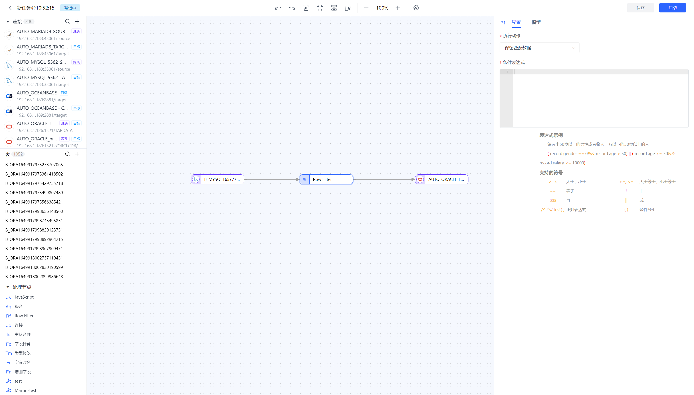
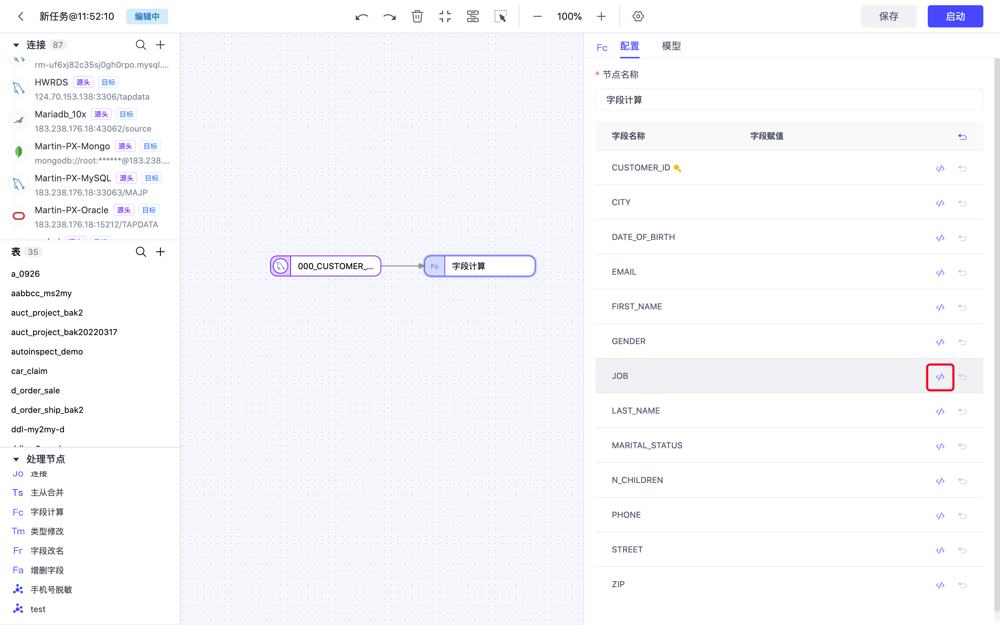
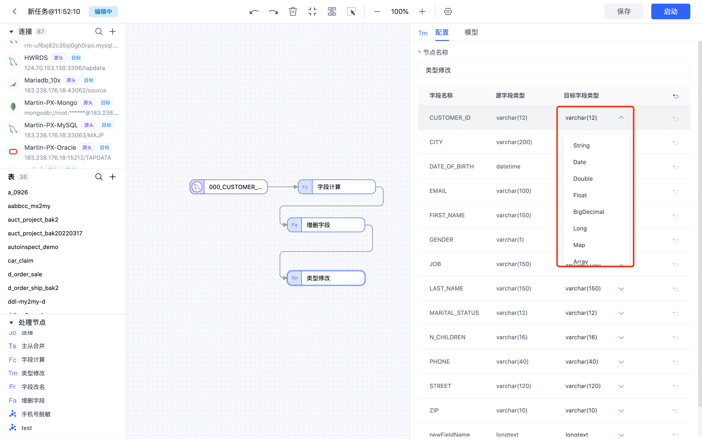
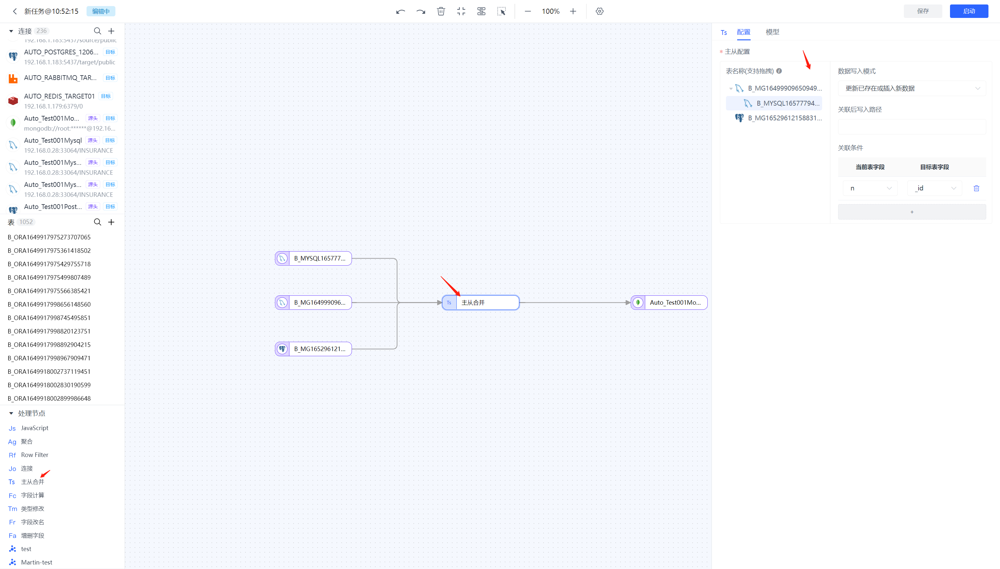
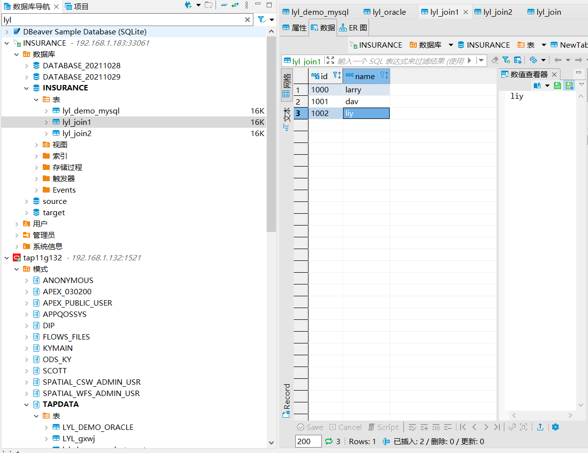
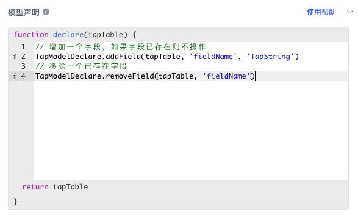

# 添加处理节点

Tapdata 支持在开发任务中添加处理节点，满足对数据进行过滤、字段调整等需求。

## 行过滤器

主要用来对表数据进行过滤，可以设置过滤条件和执行动作。

**执行动作**：设置过滤器要执行的动作

- 保留匹配数据
- 丢弃匹配数据

**条件表达式**：设置过滤条件的表达式

**表达式示例**

筛选出50岁以上的男性或者收入一万以下的30岁以上的人

( record.gender == 0&& record.age > 50) || ( record.age >= 30&& record.salary <= 10000)




## 增删字段

增删字段主要用来增加新的字段或者删除已有字段，将【增删字段】节点添加到画布，然后点击【配置】可以打开节点的配置页面


点击右上角的【+】按钮，可以新增一个字段，支持修改新增字段的名称

点击已有字段后方的删除图标，可以将该字段标记为删除。标记为删除的字段会被丢弃，不会再传递到下一个节点进行处理。


## 字段改名

字段改名节点主要用来对表字段做改名或转大小写操作

首先从左侧处理节点区域拖出一个字段改名界面与源节点和目标节点相连，然后点击该处理节点进行修改操作


右上角操作为：

批量转大写

批量转小写

批量撤回

列表中的右侧操作为单个字段撤回


## 字段计算

字段计算节点可以通过字段间的计算为字段赋值。

在画布上添加字段计算节点，然后点击【配置】，找到要计算的字段，点击配置计算规则。



在打开的字段赋值页面，可以为当前字段添加计算规则，支持使用 JS 能力。


## 类型修改

类型修改节点可以用来调整字段的数据类型。




## 主从合并

主从合并节点主要是为用户解决多张表合并到一张宽表同时表主从关联关系的情况

源端需为多个表节点，目标需为一个MongoDB节点

源端的表之间可通过拖拽嵌套，确定主从关系

数据写入模式：源端数据写到目标端是执行的策略，默认为更新已存在或插入新数据

关联后写入路径：默认为空，输入后会写到目标MongoDB的该路径下

关联条件：设置源与目标的主键关联关系可添加多个，该值一致时判定为同一条数据




**场景演示：**

希望将多张 MySQL、PostgreSQL 的表合并并同步到 MongoDB 中

**操作思路：**将多张需要同步的表的连接创建完成并作为源，然后通过主从合并节点进行连接并最终连接MongoDB节点作为目标

**具体流程：**

1. 打开数据管理-数据开发。
2. 点击右上角**创建任务**按钮。
3. 选择多个MySQL、PostgreSQL连接作为源节点。
4. 拖拽一个主从节点，配置好连接j间的主从关系和关联字段。
5. 选择一个MongoDB连接作为目标节点，选择一个表。
6. 点击右上角**保存**按钮，然后点击任务的**启动**按钮。


## 连接

连接节点主要用来进行表与表之间的连接设置，支持左连接，选择相应字段进行关联即可进行两个表的合并

源端必须为两个表节点


**场景演示：**

希望将两张MySQL的表合并并同步到Oracle中

**操作思路：**

创建两个MySQL连接作为源，然后通过join节点进行连接，再输出到Oracle目标节点

**具体流程：**

1. 打开数据管理-数据开发。
2. 点击右上角**创建任务**按钮。
3. 选择两个MySQL连接作为源节点。
4. 拖拽一个连接节点，配置好连接字段。
5. 选择一个Oracle连接作为目标节点，新建一个表。
6. 点击右上角**保存**按钮，然后点击任务的**启动**按钮。


MySQL表1的结构和数据：lyl_join1




MySQL表2的结构和数据：lyl_join2


任务启动后同步到Oracle表的结构和数据：lyl_join


## JS 处理

支持通过JavaScript脚本或者Java代码对数据进行处理，编写代码时需先检测是否与源节点及目标节点相连，若未相连则无法编辑代码  


### 模型声明

针对JS节点，Tapdata会通过采样数据试运行的方式来推演节点的模型信息。如果发现推演出的模型不准确，丢失或者多了某些字段，可以通过模型声明显式的来定义模型里的字段信息。



在开发任务中，模型声明支持的方法如下所示

```javascript
// 增加一个字段，如果字段已存在则不操作
TapModelDeclare.addField(tapTable, 'fieldName', 'TapString')
// 移除一个已存在字段
TapModelDeclare.removeField(tapTable, 'fieldName')
// 更新一个已存在的字段
TapModelDeclare.updateField(tapTable, 'fieldName', 'TapString')
// 更新字段，如果不存在则新增
TapModelDeclare.upsertField(tapTable, 'fieldName', 'TapString')
// 设置字段为主键
TapModelDeclare.setPk(tapTable, 'fieldName')
// 取消主键
TapModelDeclare.unsetPk(tapTable, 'fieldName')
// 增加索引
TapModelDeclare.addIndex(tapTable, 'indexName', [{'filedName':'fieldName1', 'order': 'asc'}])
// 移除索引
TapModelDeclare.removeIndex(tapTable, 'indexName')
```

参数说明：

- `tapTable`：开发任务时的固定参数，JS节点的返回值
- `fieldName`：要新增或者操作的字段名
- `indexName`：要新增或者操作的索引名
- `TapType`：要新增的字段类型或者要将已有字段的类型修改为的目标类型。目前仅支持使用Tapdata内置的`TapType`。目前支持的`TapType`包括

- -  `TapBoolean`：布尔类型，使用boolean来存储布尔值
  - `TapDate`：日期类型，使用自定义的DateTime存储日期值
  - `TapArray`：数组类型，使用Array存储Array值
  - `TapNumber`：数值类型，使用java 的Double存储数字值
  - `TapBinary`：二进制类型，使用byte[]存储字节数组
  - `TapTime`：时间类型，使用DateTime存储时间值
  - `TapMap`：Map类型，使用Map存储Map值
  - `TapString`：字符串类型，使用java的String存储字符串
  - `TapDateTime`：日期时间类型，使用自定义的DateTime存储日期和时间值
  - `TapYear`：年份，使用DateTime存储时间值

### 应用场景

1. 在JS节点中对数据记录进行加工处理
2. 在JS节点中调用自定义函数实现对数据的处理
3. 在JS节点中调用缓存
4. 其他需要使用JS节点自定义处理逻辑的场景

### 内置函数

#### DateUtil：日期处理

**parse(dateString)**: 将各种格式的日期字符串转换为Date类型，示例


```plain
var dte = DateUtil.parse(‘2010-01-01 00:00:00’);
```


高级用法 parse(dateString, timeoffset): 转换的同时，指定时区偏移量，示例


```plain
// 东8区
var dte = DateUtil.parse('2010-01-01 00:00:00', 8);

// 0时区
var dte = DateUtil.parse('2010-01-01 00:00:00', 0);
```


使用第一种方式，会默认获取java的运行环境时区，获取方式


```plain
jinfo <PID> | grep user.timezone
```


**determineDateFormat(dateString)**: 获取日期格式


```plain
var format = DateUtil.determineDateFormat(‘2010-01-01 00:00:00’);
```


**timeStamp2Date(timestamp, format)**: 将时间戳按照指定格式转为日期字符串


```plain
var dteStr = DateUtil.timeStamp2Date(1592233019140, ‘yyyy-MM-dd HH:mm:ss’);
```


**addYears/addMonths/addDays/addHours/addMinutes/addSeconds**: 对日期的年月日时分秒进行加减运算

```plain
var dte = DateUtil.addYears(new Date(), 1);
dte = DateUtil.addYears(dte, -1);
```


**sameYear/sameMonth/sameDay/sameHour/sameMinute/sameSecond**: 对日期的年月日时分秒进行比较运算


```plain
if ( DataUtil.sameYear(new Date(), new Date()) ) {
    ...
}
```


**日期比较**

```plain
var dte1 = new Date();
var dte2 = new Date();
if(dte1.getTime() >= dte2.getTime()){
   ...
}
```


#### **idGen：ID生成器**

**生成uuid**


```plain
var uuid = idGen.uuid();
```


**生成MongoDB ObjectId**


```plain
var oid = idGen.objectId();
```


**生成MongoDB ObjectId字符串部分**


```plain
var oidStr = idGen.objectIdStr();
```


#### split_chinese：汉语分词工具


split_chinese(String inputString, String language)


**参数说明**

- inputString: 需要进行分词的字符串
- language: inputString的语言字体，只可以是以下几种 

- - 简体中文: CH_S
  - 繁体中文: CH_T
  - 香港繁体: HK_T
  - 台湾繁体: TW_T


**返回值**

数组类型，表示分词后的结果集


```plain
var strs = split_chinese(“我是中国人”, “CH_S”);
```


#### networkUtil: 网络工具

**获取第一张网卡的mac地址**


```plain
var mac = networkUtil.GetAddress("mac");
```


**获取ip地址**


```plain
var ip = networkUtil.GetAddress("ip");
```


#### 常用类型(HashMap, ArrayList, Date)

**HashMap: 对象类型**


```plain
var map = new HashMap();
map.put(“name”, “test”);
map.remove(“name”);
```


**ArrayList: 数组类型**


```plain
var list = new ArrayList();
list.add(“test1”);
list.remove(0);
```


**Date: 日期类型**


```plain
var dte = new Date();
var year = dte.getYear()+1900;
```


#### 数据CRUD操作


**对接Tapdata内建数据连接**


- source: 操作源端的数据库
- target: 操作目标端的数据库


*根据数据库类型分为结构化数据库和MongoDB两种*


**execute(Map<String, Object> executeObj): 数据库执行操作**


返回值：布尔类型，表示操作结果(true - 成功，false - 失败)


executeObj参数说明


- 结构化数据库 

- - sql: 针对关系型数据库的sql执行语句


```plain
var result = source.execute({sql: “update test.user set name=’user001’ where id = 1”});
```


- MongoDB数据库 

- - database: 操作的数据库名称
  - collection: 操作的集合名称
  - op: 操作(insert/ update/ delete)
  - filter: 更新或者删除的条件
  - opObject: 新增、更新、删除的具体数据
  - upsert: 是否采用MongoDB的upsert模式，不存在进行新增，存在则更新，默认：false
  - multi: 是否更新多条记录，默认：false


```plain
var result = target.execute({
    database: “test”,
    collection: “user”,
    op: “update”,
    filter: {id: 1},
    opObject: {name: “user001”, age: 20},
    upsert: true
});
```


**executeQuery(Map<String, Object> executeObj): 数据库查询操作**


返回值：数组类型，表示查询的结果集

executeObj参数说明

- 结构化数据库 

- - sql: 查询语句


```plain
var users = source.executeQuery({sql: “select * from test.user where age>10”});
```


- MongoDB 

- - database: 操作的数据库名称
  - collection: 操作的集合名称
  - filter: 更新或者删除的条件
  - sort: 排序条件 （可选）
  - limit: 限制输出条数（可选）


```plain
var users = target.executeQuery({
    database: “test”,
    collection: “user”,
    filter: {age: {$gt: 10}}，
    sort: {age: -1},
    limit: 10
});
```


**call(String funcName, List<Map<String, Object>> params): 执行存储过程及函数**

:::tip

该方法只有结构化数据库源才能使用，可执行指定的数据库存储过程及自定义函数。

:::


返回值: 键值对类型, 根据存储过程定义的返回值，返回结果对象


参数说明

- funcName: 存储过程/函数名称
- params: 传入的参数 

- - mode: 入参类型，空值默认：in 
    - in: 传入
    - out: 传出
    - in/out: 传入并传出
  - name: 参数名称
  - value: 参数的值
  - type: 参数类类型


#### 对接外部数据

***FAQ: 以下操作只适用于自定义数据连接\***

##### Http

返回值：键值对类型

- code: response code
- data: 返回的数据，可以指定是数组类型还是对象类型，默认：数组


```plain
{code: 200, data: []}
```


通用传入参数

- url: api的网络地址
- parameters: body传参
- header: 头部内容
- returnType: 返回的类型，适用于查询(array/ object)，空值默认：array


**get: 通过get方法调用api**


```plain
rest.get(url, header)
rest.get(url, header, returnType)

var result = rest.get('http://127.0.0.1:1234/users?id=1', {}, '[array/object]'});
```


**post: 通过post方法调用api**


```plain
rest.post(url, parameters)
rest.post(url, parameters, headers, returnType)

var result = rest.post('http://127.0.0.1:1234/users/find', {}, {}, '[array/object]');
```


**patch: 通过patch方法调用api，用于更新数据**


```plain
rest.patch(url, parameters)
rest.patch(url, parameters, headers)

var result = rest.patch('http://127.0.0.1:1234/users?where[user_id]=1', {status: 0}, {});
```


**delete: 通过delete方法调用api，用于删除数据**


```plain
rest.delete(url)
rest.delete(url, headers)

var result = rest.delete(’http://127.0.0.1:1234/users?where[user_id]=1‘, {});
```


##### MongoDB

通用入参说明


- uri: MongoDB数据库连接的URI，遵循MongoDB的连接语法
- collection: MongoDB集合名称
- filter: 查询、更新、删除条件


**getData: 查询数据**


```plain
mongo.getData(uri, collection)
mongo.getData(uri, collection, filter)
mongo.getData(uri, collection, filter, limit, sort)
```


返回值: 数组类型，查询的结果集


参数说明


- limit: 返回行数
- sort: 排序


```plain
var result = mongo.getData(
    'mongodb://127.0.0.1:27017/test', 
    'users', 
    {id: 1}, 
    10, 
    {add_time: -1}
);
```


**insert: 新增数据**


```plain
mongo.insert(url, collection, inserts)
```


无返回值


参数说明


- inserts: 新增的数据，可以是对象或者数组，传入数组则一次性新增多行数据


```plain
mongo.insert(
    'mongodb://127.0.0.1:27017/test', 
    'users', 
    [{id: 1, name: 'test1'}, {id: 2, name: 'test2'}]
);
```


**update: 更新数据**


```plain
mongo.update(url, collection, filter, update)
```


返回值：数字类型, 更新影响行数


参数说明


- update: 更新的数据内容


```plain
var modifyCount = mongo.update(
    'mongodb://127.0.0.1:27017/test', 
    'users', 
    {id: 1}, 
    {name: 'test3'}
);
```


**delete: 删除数据**


```plain
mongo.delete(url, collection, filter)
```


返回值：数字类型，删除的行数


```plain
var deleteCount = mongo.delete(
    'mongodb://127.0.0.1:27017/test', 
    'users', {id: 1}
);
```


#### 自定义数据连接


作为源的时候，自定义数据连接需要通过Tapdata提供的回调函数，将希望同步的数据推送给目标端


- core.push(data): 初始化阶段使用
- core.push(data, op, contextMap): 增量阶段使用


无返回值


参数说明


- data: 数组或者对象类型，推送的数据内容
- op: 字符串类型，推送的数据的操作，i - 新增、u - 更新、d - 删除
- contextMap: 键值对类型，自定义上下文，在增量阶段，会在下一次调用的时候作为参数传入


```plain
// get your data
var data = [...];

core.push(data);
```

 