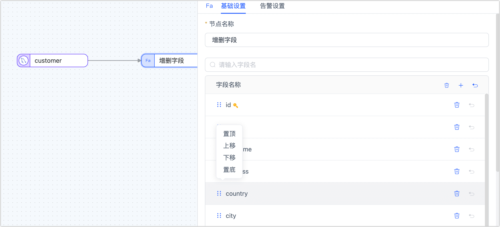
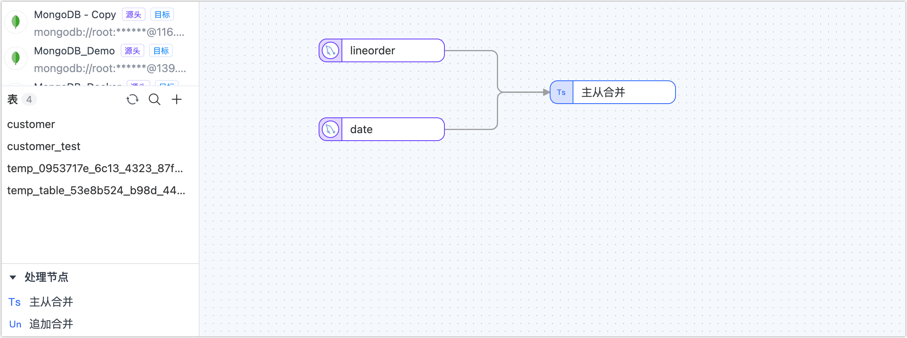
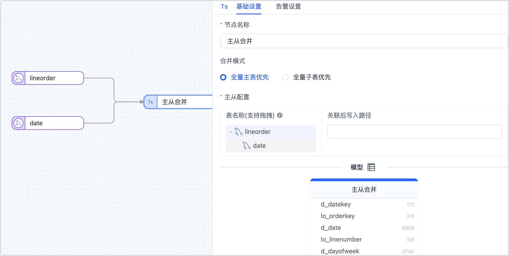
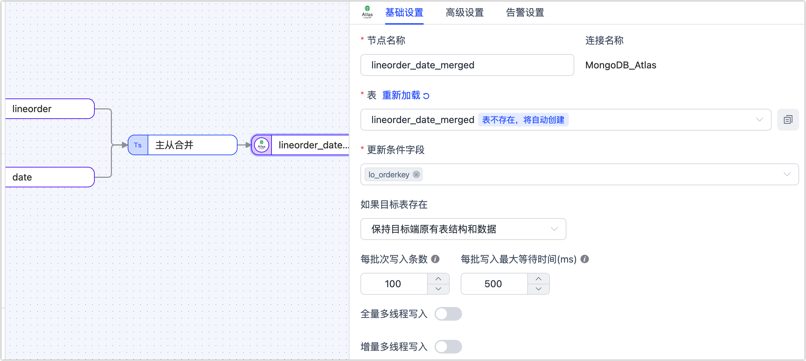
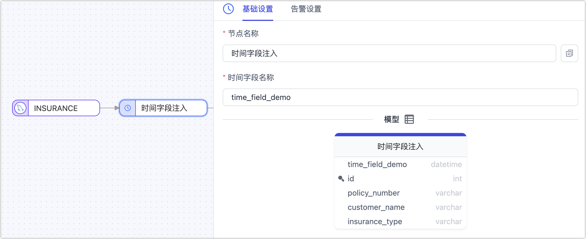

# 添加处理节点

Tapdata Cloud 支持在数据复制/开发任务中添加处理节点，满足对数据进行过滤、字段调整等需求。

## 行过滤器

主要用来对表数据进行过滤，可以设置过滤条件和执行动作。

* **执行动作**：可选择保留或丢弃匹配的数据

* **条件表达式**：设置过滤条件的表达式
* **表达式示例**：筛选出50岁以上的男性或者收入一万以下的30岁以上的人，`( record.gender == 0&& record.age > 50) || ( record.age >= 30&& record.salary <= 10000)`


## <span id="add-and-del-cols">增删字段</span>

可用来增加新的字段或者删除已有字段，将**增删字段**节点添加到画布，将该节点与数据节点按照处理顺序连接起来，随后可配置该节点参数，此外，您还可以调整字段的顺序。如果删除了某个字段，该不会传递到下个节点。




## 字段改名

可用来对字段执行重命名或转换大小写操作，将**字段改名**节点添加到画布，将该节点与数据节点按照处理顺序连接起来，随后可配置该节点参数。


## 字段计算

可通过字段间的计算为字段赋值，将**字段计算**节点添加到画布，将该节点与数据节点按照处理顺序连接起来，随后找到要计算的字段，配置计算规则（支持 JS）。


## 类型修改

类型修改节点可以用来调整字段的数据类型。


## <span id="pri-sec-merged">主从合并</span>

在大数据处理和分析中，数据合并和转换是一个关键的任务，在本案例中，我们以 [SSB 数据集](https://www.cs.umb.edu/~poneil/StarSchemaB.PDF)的 `lineorder` 和 `date` 表为例，介绍如何使用 Tapdata Cloud 来实现多表合并到一个 MongoDB 集合的需求。

:::tip

使用主从合并节点时，需要将 Agent 实例[升级](../manage-agent.md)至 3.5.1 版本，同时，目标库需为自行部署的 MongoDB 或 MongoDB Atlas。

:::

**操作流程**：

1. 登录 [Tapdata Cloud 平台](https://cloud.tapdata.net/console/v3/)。

2. 在左侧导航栏，单击**数据管道** > **数据转换**。

3. 单击页面右侧的**创建**。

4. 在页面左侧依次拖入要执行主从合并的数据源至右侧画布，然后从页面左下角拖入**主从合并**节点，最后将它们按照下述顺序连接起来。

   

5. 依次单击要执行追加合并的数据源，分别在页面右侧的面板中选择待合并的表（**lineorder** / **date**）。

6. 单击**主从合并**节点，将 date 表拖拽进入 lineoder 表中来表示它们的从属关系，随后即可查看到合并后的表结构信息。

   

7. 从页面左侧拖入一个 MongoDB 或 MongoDB Atalas 数据源用于存放追加合并后的表，然后将**主从合并**节点连接至该数据源。

8. 单击用于存放追加合并表的数据源，在页面右侧的面板中选择目标表或输入表名由 Tapdata Cloud 自动创建，完成设置后选择更新条件自动。

   

9. 确认配置无误后，单击**启动**。

   操作完成后，您可以在当前页面观察任务的执行情况，如 QPS、延迟、任务时间统计等信息。


## <span id="union-node">追加合并</span>

通过**追加合并**节点，您可以将多个结构相同/相似的表，合并输出至一个表中，Tapdata 会将字段名一致的数据进行合并，详细规则如下：

- 如果推演出的类型长度和精度不同，则选择最大长度精度。
- 如果推演出的类型不同，则将其转换为一个通用类型。
- 当所有源表的主键字段一致时，则保留主键，否则移除该主键。
- 当所有源表的相同字段都有非空限制时，则保留非空限制，否则移除非空限制。
- 源表的唯一索引不会同步到目标表。


**场景示例：**

希望对 2 个表结构相同的 **student1** 和 **student2** 表执行追加合并操作（Union），然后将结果存在 **student_merge** 表中，表结构及数据如下：


**操作流程**：

1. 登录 [Tapdata Cloud 平台](https://cloud.tapdata.net/console/v3/)。

2. 在左侧导航栏，单击**数据转换**。

3. 单击页面右侧的**创建**。

4. 在页面左侧依次拖入要执行追加合并的数据源至右侧画布，然后从页面左下角拖入**追加合并**节点，最后将它们连接起来。

   

5. 依次单击要执行追加合并的数据源，在页面右侧的面板中选择待合并的表（**student1** / **student2**）。

6. （可选）单击**追加合并**节点，单击**模型**页签查看追加合并后的表结构信息。

7. 从页面左侧拖入一个数据源用于存放追加合并后的表，然后将**追加合并**节点连接至该数据源。

8. 单击用于存放追加合并表的数据源，在页面右侧的面板中选择目标表（**student_merge**）及高级设置。

   :::tip

   如希望由 Tapdata 自动创建表结构，可提前在目标库中创建一个名为 **student_merge** 的空表（表结构不限），然后在此处的**高级设置**中，将**已有数据处理**选择为**清除目标端原有表结构和数据**。

   :::

   

9. 确认配置无误后，单击**启动**。

   操作完成后，您可以在当前页面观察任务的执行情况，如 QPS、延迟、任务时间统计等信息，示例如下：

   


**结果验证**：

查询 **student_merge** 表，结果如下：

```sql
mysql> select * from student_merge;
+---------+------+--------+------+-------+--------+
| stu_id  | name | gender | age  | class | scores |
+---------+------+--------+------+-------+--------+
| 2201101 | Lily | F      |   18 |  NULL |   NULL |
| 2201102 | Lucy | F      |   18 |  NULL |   NULL |
| 2201103 | Tom  | M      |   18 |  NULL |   NULL |
| 2202101 | Lily | F      |   18 |     2 |    632 |
| 2202102 | Lucy | F      |   18 |     2 |    636 |
| 2202103 | Tom  | M      |   18 |     2 |    532 |
+---------+------+--------+------+-------+--------+
6 rows in set (0.00 sec)
```


## <span id="python">Python</span>

如果目前内置的处理节点不能完全满足您的特定需求，或您想对数据进行更加细致和个性化的处理，您也可以添加 Python 处理节点，编写自定义的 Python 脚本来管理数据的处理/加工逻辑，这些经过处理的数据将继续被同步到目标库中，帮助您实现数据链路自由定制，更好地掌控数据的流动和加工。


Python 处理节点支持的版本为 Python 2.7.3，支持的第三方包来源为：requests-2.2.1、PyYAML-3.13、setuptools-44.0.0，上图中的`context` 内容说明如下：

```python
context = {
        "event": {},  # 数据源的事件类型、表名及其他信息
        "before": {}, # 数据变化前的内容
        "info": {},   # 数据源的事件信息
        "global": {}  # 任务周期内，节点维度上的状态存储容器
      }
```

Python 处理节点支持的系统包为：`struct, jarray, _marshal, _bytecodetools, binascii, ucnhash, _sre, sys, cmath, itertools, jffi, operator, _py_compile, array, zipimport, _codecs, _hashlib, bz2, gc, posix, cPickle, synchronize, _random, _imp, errno, __builtin__, _csv, _json, _weakref, thread, exceptions, _ast, cStringIO, _jyio, _collections, _functools, _threading, _jythonlib, math, time, _locale`。

常见库的使用方法参考如下：

```python
# yaml包的使用，请参考：https://pyyaml.org/wiki/PyYAMLDocumentation
data = {'key1': 'value1', 'key2': 'value2'}
yaml_str = yaml.dump(data, default_flow_style=False)
log.info('(1)Use YAML may covert data to YAML string: \n{}', yaml_str)

# 修改指定数据的某个字段验证
record['prefix'] = 'ust-modified'

# 正常打印日志 true
log.info("(3)log a info") # 打印info级别日志
log.warn("(4)log an warn") # 打印warn级别日志

#requests的用法，请参考：https://requests.readthedocs.io/projects/cn/zh_CN/latest/
try: 
  response = requests.get("http://localhost:3000")
  log.info('Request result: {}', response.text)
except Exception as e:
  log.info('Request result: {}', str(e))
  
# json模块的用法，请参考： https://docs.python.org/zh-cn/2.7/library/json.html
log.info("Json value: {}", json.dumps(['Gavin', {'key': ('value', None, 1.0, 2)}]))

# random,time,datetime,uuid的使用
log.info("(7)Time value: {}",time.time()) # time包用法参考：https://docs.python.org/zh-cn/2.7/library/datetime.html
log.info("(7-1)Datetime value: {}", datetime.datetime(2023, 9, 19, 11, 8, 0)) # datetime包用法参考：https://docs.python.org/zh-cn/2.7/library/datetime.html

# math模块的使用，可参考：https://docs.python.org/zh-cn/2.7/library/math.html
log.info("(9)Math value: {}", math.sqrt(100)) 

# hashlib模块的使用， 可参考：https://docs.python.org/zh-cn/2.7/library/hashlib.html
m = hashlib.md5()  # 构建MD5对象
m.update("xjh999".encode(encoding='utf-8')) #设置编码格式 并将字符串添加到MD5对象中
password_md5 = m.hexdigest()  # hexdigest()将加密字符串 生成十六进制数据字符串值
log.info("(10)hashlib value: {}", password_md5) 

# base64包用法参考，请参考：https://docs.python.org/zh-cn/2.7/library/base64.html
try:
  tmpBytes = "xjh999999999".encode()
  tmpBase64 = base64.b64encode(tmpBytes)
  log.info("(11)base64 value: {}", tmpBase64)
except Exception as e:
  log.info('(11)base64 failed：{}',e)

# types包的使用，参考：https://docs.python.org/zh-cn/2.7/library/types.html
log.info("(12)Types value: {}", type(100))
return record
```


## <span id="Unwind">Unwind</span>

**Unwind** 专门设计来处理 JSON 数据结构中的数组内容，可以高效地将数组中的每个元素“展开”，将每个元素转换为独立的数据行。这样的处理方式特别适合于需要对数组数据进行深度分析的场景，例如数据标准化、个性化报表生成、数据转换和数据质量清洗。此外，当目标系统或应用不支持数组格式，或为了与其他数据结构兼容时，Unw**i**nd 节点提供了一种开箱即用的解决方案，确保数据处理和同步流程的高效性和准确性。

假设有一个名为 `customer_json` 的集合，记录了每位顾客购买的商品列表。为了更细致地分析每个商品的销售情况，我们希望将商品列表从数组格式转换为单独的数据行。这样，每个商品都会有一个与之对应的顾客购买记录。为实现这一需求，我们可以在配置数据转换任务时，增加 Unwind 节点来实现，节点配置示例如下。


:::tip

* 如果是 MongoDB 数据库间的转换任务，您还需要加入一个**增删字段**的节点，将 **_id** 移除以免因该数据写入重复而报错。
* 如果是关系型数据库（如 MySQL），则需要在目标表中增加可以区分逻辑的主键。

:::


## <span id="time_injection">时间字段注入</span>

在实时数据集成和同步过程中，捕获并同步增量数据是确保数据一致性和时效性的关键。当数据源不具备完整的 CDC 支持或受限于权限控制无法获取增量日志，我们可以为数据同步链路增加**时间字段注入**节点来为读取到的源表数据自动增加时间戳信息，随后在目标表的配置中选择使用此字段（类型为 **DATETIME**）进行轮询，来实现增量数据的获取，从而进一步提升实时数据获取方式的灵活性。



## <span id="js-process">JS 处理</span>

支持通过 JavaScript 脚本或者 Java 代码对数据进行处理，编写代码时需先检测是否与源节点及目标节点相连，若未相连则无法编辑代码。  


### 模型声明

针对 JS 节点，Tapdata Cloud 会通过采样数据试运行的方式来推演节点的模型信息。如果发现推演出的模型不准确或字段数量发生变化，可通过模型声明显式的来定义模型里的字段信息。


在开发任务中，模型声明支持的方法如下所示：

```javascript
// 增加一个字段，如果字段已存在则不操作
TapModelDeclare.addField(tapTable, 'fieldName', 'TapString')
// 移除一个已存在字段
TapModelDeclare.removeField(tapTable, 'fieldName')
// 更新一个已存在的字段
TapModelDeclare.updateField(tapTable, 'fieldName', 'TapString')
// 更新字段，如果不存在则新增
TapModelDeclare.upsertField(tapTable, 'fieldName', 'TapString')
// 设置字段为主键
TapModelDeclare.setPk(tapTable, 'fieldName')
// 取消主键
TapModelDeclare.unsetPk(tapTable, 'fieldName')
// 增加索引
TapModelDeclare.addIndex(tapTable, 'indexName', [{'filedName':'fieldName1', 'order': 'asc'}])
// 移除索引
TapModelDeclare.removeIndex(tapTable, 'indexName')
```

参数说明：

- `tapTable`：开发任务时的固定参数，JS 节点的返回值
- `fieldName`：要新增或者操作的字段名
- `indexName`：要新增或者操作的索引名
- `TapType`：要新增的字段类型或者要将已有字段的类型修改为的目标类型。目前仅支持使用内置的 `TapType`，支持：
  - `TapBoolean`：布尔类型，使用 boolean 来存储布尔值
  - `TapDate`：日期类型，使用自定义的 DateTime 存储日期值
  - `TapArray`：数组类型，使用 Array 存储 Array 值
  - `TapNumber`：数值类型，使用 Java 的 Double存 储数字值
  - `TapBinary`：二进制类型，使用 byte[] 存储字节数组
  - `TapTime`：时间类型，使用 DateTime 存储时间值
  - `TapMap`：Map类型，使用 Map 存储 Map 值
  - `TapString`：字符串类型，使用 Java 的 String 存储字符串
  - `TapDateTime`：日期时间类型，使用自定义的 DateTime 存储日期和时间值
  - `TapYear`：年份，使用 DateTime 存储时间值


### 应用场景

1. 在JS节点中对数据记录进行加工处理
2. 在JS节点中调用自定义函数实现对数据的处理
3. 在JS节点中调用缓存
4. 其他需要使用JS节点自定义处理逻辑的场景

### JS 内置函数说明

* [标准 JS 内置函数](../../appendix/standard-js.md)：可对数据记录进行处理与运算，如将日期字符串转换为 Date 类型。
* [增强 JS 内置函数（Beta）](../../appendix/enhanced-js.md)：支持标准 JS 内置函数的基础上，可实现外部调用（如网络、数据库等）。

