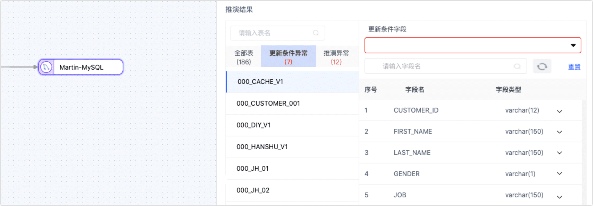
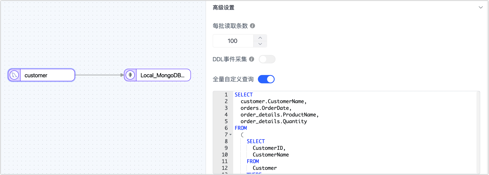

# 产品特性/使用

本文列举使用 Tapdata 过程中的常见问题。

## Tapdata 支持哪些数据源？

Tapdata 支持丰富的数据库，包括常见关系型、非关系型以及队列型数据源，详情见[支持的数据库](../introduction/supported-databases.md)。

## Tapdata 支持试用吗？

支持。您可以点击“[申请试用](https://tapdata.net/tapdata-on-prem/demo.html)‍”‍，Tapdata 工程师会联系您并协助您试用。

## Tapdata 如何收费？

Tapdata 采用订阅制收费，按照您部署的服务器节点数量，按年支付相应的订阅费用。

## 连接测试失败怎么办？

创建数据连接时，需要参照页面右侧连接配置帮助，按指南完成相关参数的设定，您也可以参考[准备工作](../prerequisites)完成设置。

## 配置复制任务时，目标节点推演结果异常？

Tapdata 会自动基于选择源表来推演目标表结构等信息，此处可能遇到的问题如下：

* **更新条件异常**：Tapdata 会将更新条件自动设置为表的主键，如果没有主键则选用唯一索引字段，无主键和唯一索引时，您需要手动指定更新条件的字段。
* **推演异常**：通常是字段类型异常引起，您可以根据页面提示，调整相关字段的类型。

## Tapdata 处理事务的逻辑是什么？

通常一个事务有开始、过程、提交、撤回几种可能，因此事务开始执行后，可能会有多个 SQL 发起，此时 Tapdata 即捕获这些变更并缓存起来。

长时间未提交的事务会导致每次启停任务将从该事务开始挖掘，为避免影响源库和增量同步的性能，Tapdata 会清理超过一定时长的未提交事务，如果清理后源库再提交了该事务，可能导致数据不一致。

为避免此类情况发生，请在配置任务时，设置来源节点（如 Oracle 库）的未提交事务生命时长，以符合业务需求。

## Tapdata 是否支持将表发布 API 服务？

支持（单表），您可以将加工后的表[发布为 API 服务](../user-guide/data-service/create-api-service.md)，以便其他应用程序可以轻松地访问和获取数据。

## 如何基于多表的复杂查询发布为 API 服务？

面对基于多表的复杂查询场景，业界常见的解决方案有物化视图和即席查询（Ad-hoc Query）：

* **物化视图**： 物化视图是一种预先计算和存储的虚拟表，它在查询时提供了高性能的数据访问。通过将多表 Join 操作提前执行并将结果存储为物化视图，可以极大地提高查询性能和响应时间，该方案适用于数据变化频率较低的情况，因为每次数据更新时都需要更新物化视图。
* **即席查询**： 即席查询是根据用户的需求即时执行的查询，没有提前计算和存储的过程，该方案适用于数据变化频率较高的场景，因为它可以实时获取最新的数据，但在多表 Join 操作时可能会导致较高的查询成本和较长的响应时间。

在 Tapdata 中，您可以将多表的复杂查询固化为物化视图提供 API 服务，您可以基于查询的复杂程度和对实时性的要求选择下述方案：

**实时视图方案**

实时视图方案适用于 SQL 语句相对简单，对数据实时性要求高的场景，其核心思想上以多样化的[处理节点](../user-guide/data-pipeline/data-development/process-node)来实现 SQL 语句中的具体操作（如 Join），最终将处理后的数据实时同步到一个新表，最后基于该表创建并发布 API 服务。

具体步骤如下：

1. [创建数据转换任务](../user-guide/data-pipeline/data-development/create-task)。
2. 将 SQL 语句中的具体操作以处理节点来替代。如下图所示，我们预先将 **customer** 和 **company** 表执行连接（Join）操作（通过[连接节点](../user-guide/data-pipeline/data-development/process-node#join)实现），并将其结果存至 **join_result** 表。
3. 启动任务实现数据的实时同步。
4. 基于新表（join_result）[创建并发布 API 服务](../user-guide/data-service/create-api-service.md)。

**跑批视图方案**

面对非常复杂的 SQL 语句（例如 SQL 嵌套、复杂 Join 等），可直接将 SQL 语句在全量阶段执行，将查询结果同步至一个新表，最后基于该表创建并发布 API 服务。该方案适用于 SQL 复杂性高，但对实时性要求不高的场景。

具体步骤如下：

1. [创建数据转换任务](../user-guide/data-pipeline/data-development/create-task)。
2. 在画布中添加源和目标节点。
   :::tip
   目标节点需为弱 Scheme 类的数据源，例如如 MongoDB 或 Kafka。
   :::
3. 在源节点设置阶段，打开全量自定义查询开关，添加全量数据同步阶段需要执行的 SQL 查询语句（不对增量阶段生效）。
   
4. 完成目标节点的设置后，单击页面右上角的设置，将同步类型设置为**全量**，随后基于对实时性的要求设置定期调度的策略。
5. 启动任务，等待任务运行完毕后再基于新表[创建并发布 API 服务](../user-guide/data-service/create-api-service.md)。
