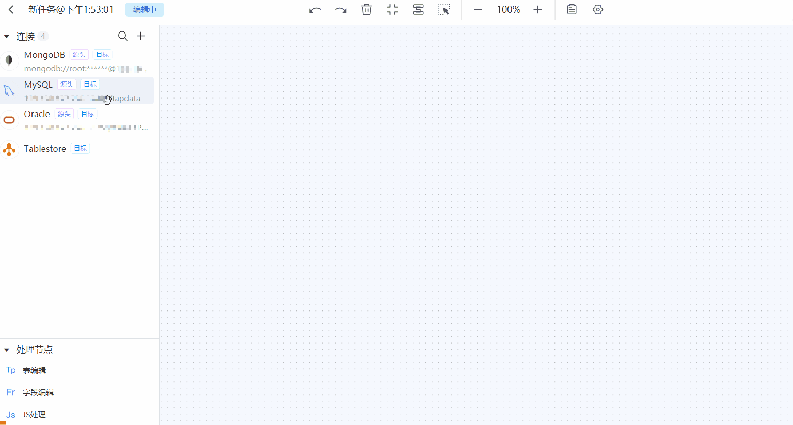

# 创建数据复制任务

数据复制功能可以帮助您实现同/异构数据源间的实时同步，适用于数据迁移/同步、数据灾备、读性能扩展等多种业务场景。本文介绍数据复制功能的具体使用流程，帮助您快速掌握如何创建数据复制任务。

## 操作步骤

本文以 MySQL 实时同步至 MongoDB 为例，为您演示数据复制任务的创建流程，其他数据源也可参考此流程。

1. 登录 Tapdata 平台。

2. 在左侧导航栏，选择**数据管道** > **数据复制**。

3. 单击页面右侧的**创建**，跳转到任务配置页面。

4. 在页面左侧，分别拖拽作为源和目标的数据连接至右侧画布中，然后将二者连接。

5. 将源节点和目标节点连接起来。

   

   :::tip

   除添加数据源节点外，您还可以添加处理节点以完成更复杂的任务，如过滤数据、增减字段等，更多介绍，见[处理节点](#process-node)。

6. 单击源端节点（本例为 MySQL），根据下述说明完成右侧面板的<span id="release310-table-model">参数配置</span>。

   

   * **节点名称**：默认为连接名称，您也可以设置一个具有业务意义的名称。
   * **DDL 事件采集**：打开该开关后，Tapdata 会自动采集所选的源端 DDL 事件（如新增字段），如果目标端支持 DDL 写入即可实现 DDL 语句的同步。
   * **选择表**：根据业务需求选择。
     * **按表名选择**：在待复制表区域框选中表，然后单击向右箭头完成设置。
     * **按正则表达式匹配**：填写表名的正则表达式即可，此外，当源库新增的表满足表达式时，该表也会被自动同步至目标库。
   * **批量读取条数**：全量同步时，每批次读取的记录条数，默认为 **100**。

7. 单击目标端节点（本例为 MongoDB），根据下述说明完成右侧面板的参数配置。

   1. 完成<span id="target-basic-setting">节点基础设置</span>。

      

      * **节点名称**：默认为连接名称，您也可以设置一个具有业务意义的名称。
      * **推演结果**：展示 Tapdata 将写入目标端的表结构信息，该信息基于源端节点设置所推演，同时会将更新条件自动设置为表的主键，如果没有主键则选用唯一索引字段，无主键和唯一索引时，您需要手动指定更新条件的字段。
      
   2. 下翻至**高级设置**区域框，完成高级设置。

      

      - **全量多线程写入**：全量数据写入的并发线程数，默认为 **8**，可基于目标端写性能适当调整。
      - **增量多线程写入**：增量数据写入的并发线程数，默认未启用，启用后可基于目标端写性能适当调整。
      - **每批次写入条数**：全量同步时，每批次写入的条目数。
      - **每批写入最大等待时间**：根据目标库的性能和网络延迟评估，设置最大等待时间，单位为毫秒。
      - **重复处理策略**：根据业务需求选择，也可保持默认。
      - **数据写入模式**：根据业务需求选择。
        - **按事件类型处理**：选择此项后，还需要选择插入、更新、删除事件的数据写入策略。
        - **统计追加写入**：只处理插入事件，丢弃更新和删除事件。
      - **保存删除数据**：选择是否保存删除数据。

8. （可选）单击页面右上角的**设置**，配置任务属性。

   * **任务名称**：填写具有业务意义的名称。
   * **同步类型**：可选择**全量+增量**，也可单独选择**全量**或**增量**。
     全量表示将源端的存量数据复制到目标端，增量表示将源端实时产生的新数据或数据变更复制到目标端，二者结合可用于实时数据同步场景。
   * **任务描述**：填写任务的描述信息。
   * **高级设置**：设置任务开始的时间、共享挖掘、增量数据处理模式、处理器线程数、Agent 等。

9. 单击**保存**或**启动**按钮完成创建，为保障任务的正常运行，Tapdata 会基于节点配置和数据源特征进行预检查，同时打印日志信息。

   

   :::tip

   如提未通过预检查，请根据当前页面的日志提示进行调整。更多信息，见[任务预检查说明](../pre-check.md)。

   :::

10. 启动成功后会自动跳转至任务监控页面，您可以查看任务的 QPS、延迟、任务事件等信息。

    


## <span id="process-node">复制任务支持的处理节点</span>

### 表编辑节点

如果需要对表名进行修改可以使用表编辑节点。

首先从左下角拖拽一个表编辑节点至画布中


点击表编辑节点可以对表名进行设置

可以直接在右侧新表名列表对单个表名进行修改

也可以在下方通过批量操作对所有搜索展示出来的原表名进行修改（修改后需点击应用按钮才会生效）


### 字段编辑节点

如果需要对字段进行修改可以使用字段编辑节点。

首先从左下角拖拽一个字段编辑节点至画布中


进行连线后点击字段编辑节点，可进行字段的屏蔽及批量添加前缀后缀或大小写操作。


### JS 节点

如果需要通过JS脚本对源端进行修改可以使用JS节点。

首先从左下角拖拽一个JS节点至画布中


脚本写完后可节点下方试运行按钮查看输入输出以便进行调试


#### 复制任务JS节点的模型声明

针对JS节点，Tapdata会通过采样数据试运行的方式来推演节点的模型信息。如果发现推演出的模型不准确，丢失或者多了某些字段，可以通过模型声明显式的来定义模型里的字段信息。


在复制任务中，模型声明支持的方法如下所示

```javascript
// 增加一个字段，如果字段已存在则不操作
TapModelDeclare.addField(schemaApplyResultList, 'fieldName', 'TapString')
// 移除一个已存在字段
TapModelDeclare.removeField(schemaApplyResultList, 'fieldName')
// 更新一个已存在的字段
TapModelDeclare.updateField(schemaApplyResultList, 'fieldName', 'TapString')
// 更新字段，如果不存在则新增
TapModelDeclare.upsertField(schemaApplyResultList, 'fieldName', 'TapString')
// 设置字段为主键
TapModelDeclare.setPk(schemaApplyResultList, 'fieldName')
// 取消主键
TapModelDeclare.unsetPk(schemaApplyResultList, 'fieldName')
// 增加索引
TapModelDeclare.addIndex(schemaApplyResultList, 'indexName', [{'filedName':'fieldName1', 'order': 'asc'}])
// 移除索引
TapModelDeclare.removeIndex(schemaApplyResultList, 'indexName')
```

参数说明：

- `schemaApplyResultList`：复制任务时的固定参数
- `fieldName`：要新增或者操作的字段名
- `indexName`：要新增或者操作的索引名
- `TapType`：要新增的字段类型或者要将已有字段的类型修改为的目标类型。目前仅支持使用Tapdata内置的`TapType`。目前支持的`TapType`包括

- -  `TapBoolean`：布尔类型，使用boolean来存储布尔值
  - `TapDate`：日期类型，使用自定义的DateTime存储日期值
  - `TapArray`：数组类型，使用Array存储Array值
  - `TapNumber`：数值类型，使用java 的Double存储数字值
  - `TapBinary`：二进制类型，使用byte[]存储字节数组
  - `TapTime`：时间类型，使用DateTime存储时间值
  - `TapMap`：Map类型，使用Map存储Map值
  - `TapString`：字符串类型，使用java的String存储字符串
  - `TapDateTime`：日期时间类型，使用自定义的DateTime存储日期和时间值
  - `TapYear`：年份，使用DateTime存储时间值


