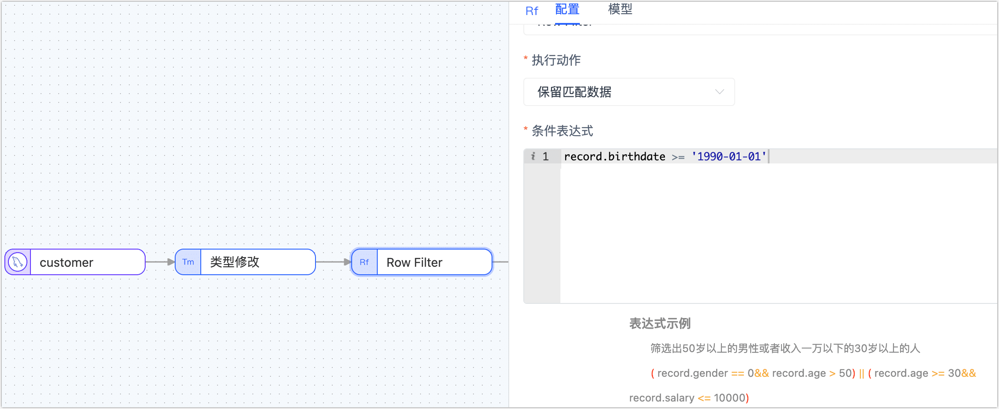
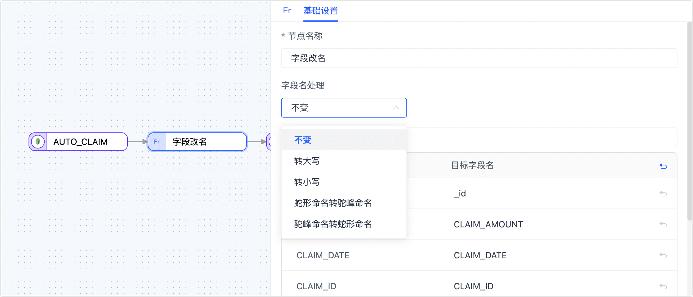
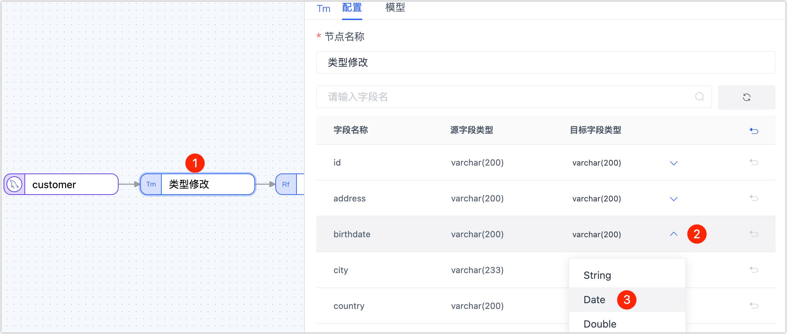
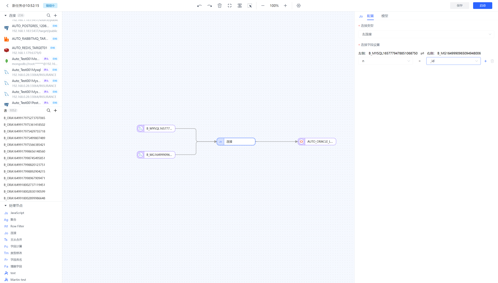

# 添加处理节点

Tapdata 支持在开发任务中添加处理节点，满足对数据进行过滤、字段调整等需求。

## 行过滤器

主要用来对表数据进行过滤，可以设置过滤条件和执行动作。

**执行动作**：设置过滤器要执行的动作

- 保留匹配数据
- 丢弃匹配数据

**条件表达式**：填写数据匹配的表达式，支持的符号如下：

* 比较：大于（`>`）、小于（`<`）、大于等于（`>=`）、小于等于（`<=`）、等于（`==`）
* 逻辑判断：与（`&&`）、或（`||`）、非（`!`）
* 正则表达式：例如 `/^.*$/.test( )`
* 条件分组：如需添加多组条件，请先用英文括号包括每组条件，然后在各组条件间加入逻辑判断符号，例如筛选出 50 岁以上的男性或者收入一万以下的 30岁以上的人，即：`( record.gender == 0&& record.age > 50) || ( record.age >= 30&& record.salary <= 10000)`

**表达式示例**：如下图所示，筛选出生日期晚于 **1991-01-01** 的用户，即为 `record.birthdate >= '1990-01-01'`。




## 增删字段

增删字段主要用来增加新的字段或者删除已有字段，将**增删字段**节点添加到画布并与数据源连接起来，即可根据需求增加或删除字段，如果字段被删除，该字段不会传递至下个节点。


## 字段改名

字段改名节点主要用来对表字段做改名或转大小写操作，将**字段改名**节点添加到画布并与数据源连接起来，单击该节点并找到目标自动进行名称调整，此外您还可以单击小图标执行：

* 批量转大写
* 批量转小写
* 批量撤回操作




## 字段计算

字段计算节点可以通过字段间的计算为字段赋值。

在画布上添加字段计算节点，然后点击【配置】，找到要计算的字段，点击配置计算规则。


在打开的字段赋值页面，可以为当前字段添加计算规则，支持使用 JS 能力。


## 类型修改

类型修改节点可以用来调整字段的数据类型，具体操作如下图所示。




## 主从合并

主从合并节点主要是为用户解决多张表合并到一张宽表同时表主从关联关系的情况

源端需为多个表节点，目标需为一个MongoDB节点

源端的表之间可通过拖拽嵌套，确定主从关系

数据写入模式：源端数据写到目标端是执行的策略，默认为更新已存在或插入新数据

关联后写入路径：默认为空，输入后会写到目标MongoDB的该路径下

关联条件：设置源与目标的主键关联关系可添加多个，该值一致时判定为同一条数据


**场景演示：**

希望将多张 MySQL、PostgreSQL 的表合并并同步到 MongoDB 中

**操作思路：**将多张需要同步的表的连接创建完成并作为源，然后通过主从合并节点进行连接并最终连接MongoDB节点作为目标

**具体流程：**

1. 打开数据管理-数据开发。
2. 点击右上角**创建任务**按钮。
3. 选择多个MySQL、PostgreSQL连接作为源节点。
4. 拖拽一个主从节点，配置好连接j间的主从关系和关联字段。
5. 选择一个MongoDB连接作为目标节点，选择一个表。
6. 点击右上角**保存**按钮，然后点击任务的**启动**按钮。


## <span id="union-node">追加合并</span>

通过**追加合并**节点，您可以将多个结构相同/相似的表，合并输出至一个表中，Tapdata 会将字段名一致的数据进行合并，详细规则如下：

- 如果推演出的类型长度和精度不同，则选择最大长度精度。
- 如果推演出的类型不同，则将其转换为一个通用类型。
- 当所有源表的主键字段一致时，则保留主键，否则移除该主键。
- 当所有源表的相同字段都有非空限制时，则保留非空限制，否则移除非空限制。
- 源表的唯一索引不会同步到目标表。


**场景示例：**

希望对 2 个表结构相同的 **student1** 和 **student2** 表执行追加合并操作（Union），然后将结果存在 **student_merge** 表中，表结构及数据如下：


**操作流程**：

1. 登录 Tapdata 平台。

2. 在左侧导航栏，选择**数据管道** > **数据开发**。

3. 单击页面右侧的**创建**。

4. 在页面左侧依次拖入要执行追加合并的数据源至右侧画布，然后从页面左下角拖入**追加合并**节点，最后将它们连接起来。

   

5. 依次单击要执行追加合并的数据源，在页面右侧的面板中选择待合并的表（**student1** / **student2**）。

6. （可选）单击**追加合并**节点，单击**模型**页签查看追加合并后的表结构信息。

7. 从页面左侧拖入一个数据源用于存放追加合并后的表，然后将**追加合并**节点连接至该数据源。

8. 单击用于存放追加合并表的数据源，在页面右侧的面板中选择目标表（**student_merge**）及高级设置。

   :::tip

   如希望由 Tapdata 自动创建表结构，可提前在目标库中创建一个名为 **student_merge** 的空表（表结构不限），然后在此处的**高级设置**中，将**已有数据处理**选择为**清除目标端原有表结构和数据**。

   :::

   

9. 确认配置无误后，单击**启动**。

   操作完成后，您可以在当前页面观察任务的执行情况，如 QPS、延迟、任务时间统计等信息，示例如下：

   


**结果验证**：

查询 **student_merge** 表，结果如下：

```sql
mysql> select * from student_merge;
+---------+------+--------+------+-------+--------+
| stu_id  | name | gender | age  | class | scores |
+---------+------+--------+------+-------+--------+
| 2201101 | Lily | F      |   18 |  NULL |   NULL |
| 2201102 | Lucy | F      |   18 |  NULL |   NULL |
| 2201103 | Tom  | M      |   18 |  NULL |   NULL |
| 2202101 | Lily | F      |   18 |     2 |    632 |
| 2202102 | Lucy | F      |   18 |     2 |    636 |
| 2202103 | Tom  | M      |   18 |     2 |    532 |
+---------+------+--------+------+-------+--------+
6 rows in set (0.00 sec)
```


## <span id="time-calculation">时间运算</span>

某些场景下，数据处理的源库和目标库的时区不同，此时对日期/时间类型的字段进行运算处理，例如增加几个小时或减少几个小时从而实现时间调整，方便后续业务处理。此场景下，可以通过时间运算节点完成该需求。

**场景示例**：

本案例中，源数据库的时区为 UTC +8，目标库的时区为 UTC +0，时间相差 8 小时。

**操作流程**：

1. 登录 Tapdata 平台。

2. 在左侧导航栏，选择**数据管道** > **数据开发**。

3. 单击页面右侧的**创建**。

4. 在页面左侧依次拖入源库和目标库的数据源，然后在页面左侧拖入时间运算节点并将它们依次连接起来。

5. 单击源节点，完成节点配置和表的选择。

6. 单击**时间运算**节点，在右侧的面板中选择要运算的时间类型和运算方式。

   

   * **节点名称**：默认为连接名称，您也可以设置一个具有业务意义的名称。
   * **请选择您要运算的时间类型**：Tapdata 会自动检测支持的时间类型并展现，您需要基于业务需求选择，此外，您还可以单击**模型**标签页，查看时间类型与列名的对应关系。
   * **请选择运算方式**：支持增加或减少时间，颗粒度为整数的小时，本案例中，我们选择减少 8 小时。

7. 完成目标节点配置及任务配置，具体操作，见[创建数据开发任务](create-task.md)。


**结果验证**：

分别查询源和目标表中同一 id 的数据，可以看到时间已经按照我们的设置减少了 8 个小时。

```sql
-- 源表查询结果
SELECT birthdate FROM customer_new WHERE id="00027f47eef64717aa8ffb8115f1e66a";
+-------------------------+
| birthdate               |
+-------------------------+
| 2021-09-01 09:10:00.000 |
+-------------------------+
1 row in set (0.00 sec)

-- 目标表查询结果
SELECT birthdate FROM customer_new_time WHERE id="00027f47eef64717aa8ffb8115f1e66a";
+-------------------------+
| birthdate               |
+-------------------------+
| 2021-09-01 01:10:00.000 |
+-------------------------+
```


## 连接

连接节点主要用来进行表与表之间的连接设置，支持左连接，选择相应字段进行关联即可进行两个表的合并

源端必须为两个表节点

:::tip

连接节点进行数据处理时，不会在目标表中自动创建主键。

:::




**场景演示：**

希望将两张MySQL的表合并并同步到Oracle中

**操作思路：**

创建两个MySQL连接作为源，然后通过join节点进行连接，再输出到Oracle目标节点

**具体流程：**

1. 打开数据管理-数据开发。
2. 点击右上角**创建任务**按钮。
3. 选择两个MySQL连接作为源节点。
4. 拖拽一个连接节点，配置好连接字段。
5. 选择一个Oracle连接作为目标节点，新建一个表。
6. 点击右上角**保存**按钮，然后点击任务的**启动**按钮。


MySQL表1的结构和数据：lyl_join1


MySQL表2的结构和数据：lyl_join2


任务启动后同步到Oracle表的结构和数据：lyl_join


## <span id="js-process">JS 处理</span>

支持通过 JavaScript 脚本或者 Java 代码对数据进行处理，编写代码时需先检测是否与源节点及目标节点相连，若未相连则无法编辑代码。  


### 模型声明

针对JS节点，Tapdata会通过采样数据试运行的方式来推演节点的模型信息。如果发现推演出的模型不准确，丢失或者多了某些字段，可以通过模型声明显式的来定义模型里的字段信息。


在开发任务中，模型声明支持的方法如下所示：

```javascript
// 增加一个字段，如果字段已存在则不操作
TapModelDeclare.addField(tapTable, 'fieldName', 'TapString')
// 移除一个已存在字段
TapModelDeclare.removeField(tapTable, 'fieldName')
// 更新一个已存在的字段
TapModelDeclare.updateField(tapTable, 'fieldName', 'TapString')
// 更新字段，如果不存在则新增
TapModelDeclare.upsertField(tapTable, 'fieldName', 'TapString')
// 设置字段为主键
TapModelDeclare.setPk(tapTable, 'fieldName')
// 取消主键
TapModelDeclare.unsetPk(tapTable, 'fieldName')
// 增加索引
TapModelDeclare.addIndex(tapTable, 'indexName', [{'filedName':'fieldName1', 'order': 'asc'}])
// 移除索引
TapModelDeclare.removeIndex(tapTable, 'indexName')
```

参数说明：

- `tapTable`：开发任务时的固定参数，JS节点的返回值
- `fieldName`：要新增或者操作的字段名
- `indexName`：要新增或者操作的索引名
- `TapType`：要新增的字段类型或者要将已有字段的类型修改为的目标类型。目前仅支持使用Tapdata内置的`TapType`。目前支持的`TapType`包括

- -  `TapBoolean`：布尔类型，使用boolean来存储布尔值
  - `TapDate`：日期类型，使用自定义的DateTime存储日期值
  - `TapArray`：数组类型，使用Array存储Array值
  - `TapNumber`：数值类型，使用java 的Double存储数字值
  - `TapBinary`：二进制类型，使用byte[]存储字节数组
  - `TapTime`：时间类型，使用DateTime存储时间值
  - `TapMap`：Map类型，使用Map存储Map值
  - `TapString`：字符串类型，使用java的String存储字符串
  - `TapDateTime`：日期时间类型，使用自定义的DateTime存储日期和时间值
  - `TapYear`：年份，使用DateTime存储时间值

### 应用场景

1. 在JS节点中对数据记录进行加工处理
2. 在JS节点中调用自定义函数实现对数据的处理
3. 在JS节点中调用缓存
4. 其他需要使用JS节点自定义处理逻辑的场景

### JS 内置函数说明

* [标准 JS 内置函数](../../../appendix/standard-js.md)：可对数据记录进行处理与运算，如将日期字符串转换为 Date 类型。
* [增强 JS 内置函数（Beta）](../../../appendix/enhanced-js.md)：支持标准 JS 内置函数的基础上，可实现外部调用（如网络、数据库等）。


