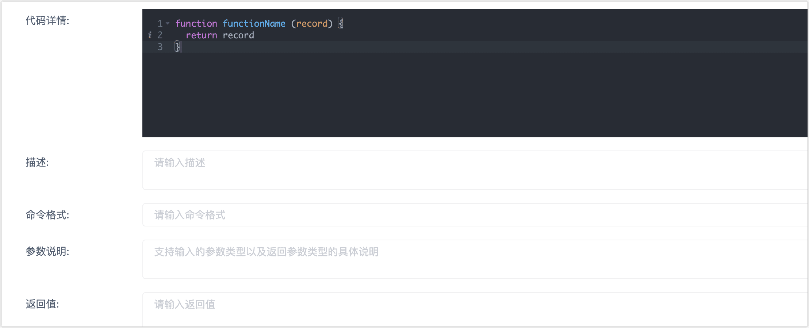
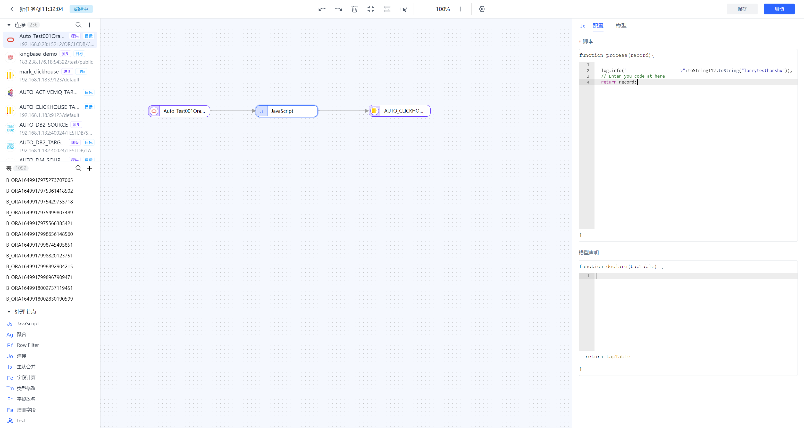

# 管理函数

函数管理主要用来对用户系统内可供用户使用的函数进行管理，函数类型主要包括：

- 自定义函数：用户在页面点击【创建函数】直接创建的函数
- 第三方jar包：用户通过导入第三方jar包引入的函数
- 系统函数：系统内部提供的可供用户调用的函数

## 创建函数

点击【创建函数】按钮可以打开函数创建页面创建一个新的函数。

创建一个函数，需要填写以下信息：

- 代码详情：用户可以在代码详情里编写自己的函数逻辑
- 描述：自定义函数的功能描述
- 命令格式：自定义函数的命令格式，方便在调用函数输入命令后的提示
- 参数说明：支持输入的参数类型以及返回参数类型的具体说明
- 返回值：自定义函数的返回值

函数属性设置完成后，点击保存按钮即可完成自定义函数的保存。

后续在使用JS处理节点时就可以引用该函数进行使用。

## 导入jar包

点击函数管理右上方的【导入jar包】按钮，打开函数导入页面（仅支持tapdata规范的jar）

JS自定义函数，自定义jar开发指南 

- jar文件：上传需要导入的jar包文件，文件最大10M
- 包名：输入要导入的函数的包名，然后点击加载函数可以将该包下的函数全部加载出来
- 函数列表：显示加载出的所有函数　

**导入及使用流程**：

1. 打开数据管道-函数管理。

2. 点击右上角**导入jar包**按钮，具体配置如下：

   * jar文件：点击上传按钮上传一个jar包
   * 包名：输入该jar包的包名，例：com.tapdata.demo.plugin

3. 点击右侧**加载函数**按钮。

4. 点击下方**保存**按钮，保存成功，跳转到函数管理界面。

5. 创建一个开发任务，在 JS 节点中即可使用该 jar 包中的函数。

   `toString112.toString("larrytesthanshu"));`，通用格式为：函数名称.方法名（具体参数）

6. 点击右上角**保存**，然后点击任务的**启动**

## 使用函数

可在JS节点中使用创建好的函数

（代码逻辑为打印该日志）

