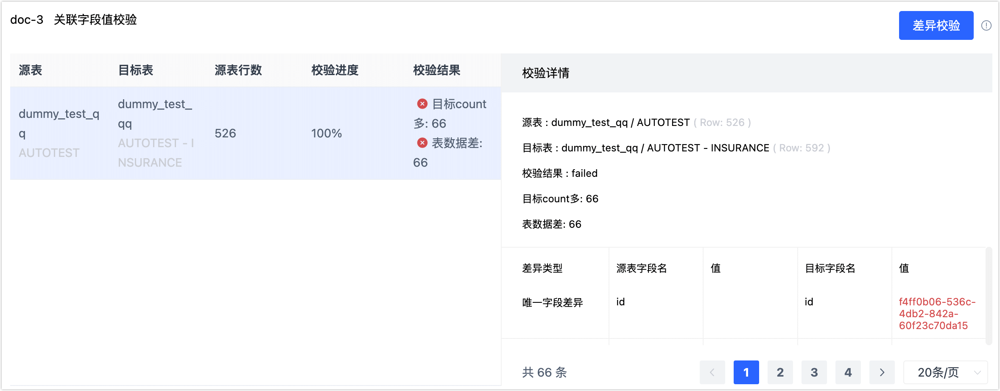

# 数据校验

基于多种自研技术，Tapdata 可最大程度保障数据一致性。除此以外，Tapdata 还支持对数据表执行数据校验，帮助您进一步验证和确保数据流转的正确性，满足生产环境的严苛要求。本文介绍数据校验任务的配置流程。

## 操作步骤

1. 登录 Tapdata 平台。

2. 在左侧导航栏，选择**数据管道** > **数据校验**。

3. 单击页面右上角的**创建**，填写任务名称，然后选择任务模式并根据下述说明填写各项参数：

import Tabs from '@theme/Tabs';
import TabItem from '@theme/TabItem';

<Tabs className="unique-tabs">
    <TabItem value="windows" label="对数据复制/开发任务执行校验" default>
    

      <ul></img>
          <ul>
          <li>  <b>校验任务模式</b>：选择<b>为特定的 PIPELINE 创建的校验任务</b>。</li>
          <li>  <b>选择任务</b>：选择待校验的数据复制/数据转换任务。</li>
          <li>  <b>结果输出</b>：选择<b>输出所有不一致的数据</b>或<b>只输出来源表不一致的数据</b>。</li>
          <li>  <b>校验任务告警</b>：选择当任务运行出错或校验结果不一致时，告警信息的规则配置和通知方式。</li>
          <li>  <b>校验类型</b>：目前支持下述三种校验方式。</li>
          <ul>
如在同步过程中修改了表的字段名，那么执行<b>表全字段值校验</b>或<b>关联字段值校验</b>时，可能因字段名不匹配而导致校验失败。

                  <li><b>快速 count 校验</b>：对源表和目标表的行数进行校验，不会展示具体的差异内容，速度极快。</li>
                  <li><b>全表字段值校验</b>：对源表和目标表的全部字段的值逐行校验，可展示所有字段的差异内容，速度较慢。</li>
                  <li><b>关联字段值校验</b>：仅对源表和目标表的关联字段的值进行校验，速度中等。</li>
              </ul>
          <li><b>校验频次</b>：默认为<b>单次校验</b>，如选择为<b>重复校验</b>，您还需要设置校验执行的起止时间和任务间隔时间。</li>
          <li><b>错误保存条数</b>：即不一致数据保存的最大条数，默认为 100，最大为 10000，推荐设置较大的值以确保记录的完整性。</li>
          <li><b>校验条件</b>：推荐选择<b>自动添加表</b>，即由 Tapdata 自动加载数据复制/开发任务中的源/目标数据表，此外，您也可以手动添加表、设置高级校验并添加 JS 校验逻辑。</li>
        </ul>
        </ul>
   </TabItem>
   <TabItem value="mac" label="自定义待校验的源和目标表">
       <ul></img>
          <ul>
          <li>  <b>校验任务模式</b>：选择<b>指定任意表的校验任务</b>。</li>
          <li>  <b>结果输出</b>：选择<b>输出所有不一致的数据</b>或<b>只输出来源表不一致的数据</b>。</li>
          <li>  <b>校验任务告警</b>：选择当任务运行出错或校验结果不一致时，告警信息的规则配置和通知方式。</li>
          <li>  <b>校验类型</b>：目前支持下述三种校验方式。</li>
          <ul>
                  <li><b>快速 count 校验</b>：对源表和目标表的行数进行校验，不会展示具体的差异内容，速度极快。</li>
                  <li><b>全表字段值校验</b>：对源表和目标表的全部字段的值逐行校验，可展示所有字段的差异内容，速度较慢。</li>
                  <li><b>关联字段值校验</b>：仅对源表和目标表的关联字段的值进行校验，速度中等。</li>
              </ul>
          <li><b>校验频次</b>：默认为<b>单次校验</b>，如选择为<b>重复校验</b>，您还需要设置校验执行的起止时间和任务间隔时间。</li>
          <li><b>错误保存条数</b>：即不一致数据保存的最大条数，默认为 100，最大为 10000，推荐设置较大的值以确保记录的完整性。</li>
          <li><b>校验条件</b>：单击 </img> 图标，手动指定待校验的校验源/目标数据连接、待校验的表、索引字段、待校验模型，此外，您还可以通过高级校验添加 JS 校验逻辑。
如需校验多个表，可单击<b>添加表</b>继续添加校验条件。
</li>
        </ul>
        </ul>
   </TabItem>
  </Tabs>

4. 单击**保存并执行**，校验任务开始执行，您也可以单击**保存**并稍后执行。

5. （可选）单击校验任务对应的**详情**，查看详细校验结果。

   

   :::tip

   当校验类型为**全表字段值校验**或**关联字段值校验**时，您还可以单击右上角的**差异校验**，对本次全量校验的差异数据结果进行再次校验，以确认数据是否已经一致。

   :::

## 常见问题

* 问：支持定时执行数据校验吗？

  答：支持，可在配置校验任务时选择**校验频次**为**重复校验**，然后根据需要选择执行时间和间隔时间。

* 问：为什么会出现数据校验不一致？

  答：Tapdata 基于多种自研技术保障数据一致性，通常数据校验不一致的原因包括但不限于以下几种原因：

  * 有客户端在目标表中新写或修改了数据
  * 数据复制过程中修改了表的字段名
  * 数据增量复制有延迟，源表中新的数据变更尚未同步到目标表

* 问：校验任务提示失败，如何处理？

  答：单击校验任务对应的**详情**，查看相关报错提示，或联系我们[获取技术支持](../../support.md)。

