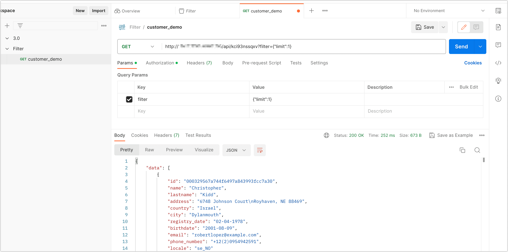

# API 查询参数说明

调用已发布的 API 接口时，支持在 URL 查询字符串中添加查询条件，从而查询结果的快速过滤。本文介绍支持的过滤器和相关使用示例。


## 支持的过滤器

- **[Field Filter（字段过滤器）](#field)**：按需返回指定的字段。
- **[Limit Filter（返回记录数过滤器）](#limit)**：限定返回记录行数。
- **[Skip Filter（跳过指定记录数过滤器）](#skip)**：跳过指定行数返回数据。
- **[Where Filter（查询条件过滤器）](#where)**：根据一组具有逻辑关系的条件查询匹配数据并返回，类似 SQL 的 WHERE 子句。

本案例中，我们已经将 customer 表[发布为 API 服务](create-api-service)，该表的数据来源于随机生成，其表结构和数据样例如下：

```sql
mysql> SELECT * FROM customer LIMIT 1\G;
*************************** 1. row ***************************
           id: 000329567a744f6497a843993fcc7a30
         name: Christopher
     lastname: Kidd
      address: 6748 Johnson Court
Royhaven, NE 88469
      country: Israel
         city: Dylanmouth
registry_date: 02-04-1978
    birthdate: 2001-08-09
        email: robertlopez@example.com
 phone_number: +12(2)0954942591
       locale: se_NO
1 row in set (0.00 sec)
```

您也可以通过 Postman 工具来实现可视化调用，如下图所示：




接下来，我们将介绍并各类过滤器的使用方法并提供示例，即上图 **Query Params** 的设置，对应的是请求 URL 中问号后的参数。


## <span id="field">Field Filter</span>

默认情况下，查询返回结果中包含数据模型（表）的所有字段，通过为模型中的字段名设置 **true** 或 **false** 来实现字段的过滤，语法如下：

```bash
# 方法一
filter[fields][propertyName]=<true|false>&filter[fields][propertyName]=<true|false>...

# 方法二
filter={"fields":{"propertyName1":<true|false>,"propertyName2":<true|false>,...}}
```

### 使用示例

假设我们需要只返回 **customer** 表中的 **id**、**name**、**city** 字段的值，示例如下：

```bash
# 方法一
?filter[fields][id]=true&filter[fields][name]=true&filter[fields][city]=true

# 方法二
?filter={"fields":{"id":true,"name":true,"city":true}}
```

### 返回示例

```json
{    
    "data": [      
    {          
        "level": "INFO",          
        "message": "generator controller /home/lg/workspace/nodejs/apig/src/controllers/logs-v-1.controller.ts",         "date": "2019-07-13T09:12:05.134Z"      
    }, {          
        "level": "INFO",          
        "message": "generator controller /home/lg/workspace/nodejs/apig/src/controllers/logs-v-1.controller.ts",         "date": "2019-07-13T09:12:05.134Z"      
    },      ...    
    ]
}
```

## <span id="limit">Limit Filter</span>

限制返回记录总条数等于或小于一个指定的数值，默认为 **10**，通常与 Skip Filter 配合使用，实现分页查询，语法如下：

```bash
# 方法一
filter[limit]=n

# 方法二
filter={"limit":n}
```

### 使用示例

假设我们需要只返回 **customer** 表的 1 条查询结果，示例如下：

只返回10条查询结果：

```bash
# 方法一
?filter[limit]=1

# 方法二
?filter={"limit":1}
```

### 返回示例

```json
{
    "data": [
        {
            "id": "000329567a744f6497a843993fcc7a30",
            "name": "Christopher",
            "lastname": "Kidd",
            "address": "6748 Johnson Court\nRoyhaven, NE 88469",
            "country": "Israel",
            "city": "Dylanmouth",
            "registry_date": "02-04-1978",
            "birthdate": "2001-08-09",
            "email": "robertlopez@example.com",
            "phone_number": "+12(2)0954942591",
            "locale": "se_NO"
        }
    ],
    "total": {
        "count": 49998
    },
    "api_monit_info": {
        "recv_timestmap": 1688868479316,
        "db_request_exhaust": 147,
        "resp_timestmap": 1688868479463
    }
}
```


## <span id="skip">Skip Filter</span>

返回第 1 个开始跳过指定个数记录后的查询结果，通常与 Limit Filter 配合使用，实现分页查询，语法如下：

```bash
# 方法一
filter[skip]=n

# 方法二
filter={"skip":n}
```

### 使用示例

**示例一**：查询结果中，从第 10 条记录开始返回：

```bash
# 方法一
?filter[skip]=10

# 方法二
?filter{"skip":10}
```


**示例二**：每页数据显示 10 条记录，查询第 5 页的数据：

```bash
# 方法一
?filter[limit]=10&filter[skip]=50

# 方法二
?filter={"limit":10,"skip"=50} 
```


### 返回示例

下述示例以案例二为例，展示返回结果

```json
{
    "data": [
        {
            "id": "004c44345baf4b60b8dacc253f7a2ca3",
            "name": "Kristen",
            "lastname": "Potts",
            "address": "77579 Rodriguez Mountain\nCamachoburgh, MI 90174",
            "country": "Botswana",
            "city": "West Erin",
            "registry_date": "20-11-2005",
            "birthdate": "2017-01-29",
            "email": "csmith@example.net",
            "phone_number": "190.036.2878x2721",
            "locale": "ff_SN"
        },
        ......
    ],
    "total": {
        "count": 49998
    },
    "api_monit_info": {
        "recv_timestmap": 1688869060330,
        "db_request_exhaust": 150,
        "resp_timestmap": 1688869060480
    }
}
```


## <span id="where">Where Filter</span>

在实现业务逻辑过程中，通常需要使用至少一组具有逻辑关系的查询条件来过滤出需要的数据，您可以指定一组或多组条件来查询数据，通常写法如下：

* 等值查询

  ```bash
  # 方法一
  ?filter[where][property]=value
  
  # 方法二
  ?filter={"where":{"property":value}}
  
  ```

* 逻辑查询

  ```bash
  # 方法一
  ?filter[where][property][operator]=value
  
  # 方法二
  ?filter={"where":{"property":{"operator":value}}}
  ```


其中，**property** 表示数据模型中的属性名称，即表中的字段名称；**operator** 表示逻辑运算符，支持的运算符如下：

- **and**：逻辑与操作。
- **or**：逻辑或操作。
- **gt**：大于。
- **gte**：大于等于。
- **lt**：小于。
- **lte**：小于等于。
- **between**：区间查询，大于等于第一个值，小于等于第二个值。
- **inq**：判断一个字段的值是否包含在一组值中。
- **nin**：**inq** 的否定操作，即判断一个字段的值是否不包含在一组值中。
- **like**：模糊查询匹配，查询满足条件的数据。
- **nlike**：like 的否定操作，即模糊查询与条件相反的数据。
- **regexp**：正则表达式匹配查询。


### and / or

通过 and or 操作符号组合两个或多个查询条件调用接口查询数据，语法如下：

```bash
# 方法一
filter[where][<and|or>][0]condition1&filter[where][<and|or>][1]condition2...

# 方法二
filter={"where":{"<and|or>":[condition1,condition2,...]}}
```


#### 使用示例

在 **customer** 表中，查询出生日期是 **1975-06-06**，且城市为 **New Samanthamouth** 的用户。

```bash
# 方法一
?filter[where][and][0][birthdate]=1975-06-06&filter[where][and][1][city]=New Samanthamouth

# 方法二
?filter={"where":{"and":[{"birthdate":"1975-06-06","city":"New Samanthamouth"}]}}
```


#### 返回示例

```json
{
    "data": [
        {
            "id": "000a132c28344988b5daaf2f0c6b9954",
            "name": "Jacky",
            "lastname": "Nguyen",
            "address": "73134 Sarah Ridge\nBondfurt, OH 15941",
            "country": "San Marino",
            "city": "New Samanthamouth",
            "registry_date": "20-01-1972",
            "birthdate": "1975-06-06",
            "email": "laurenfowler@example.com",
            "phone_number": "(936)087-8257x93235",
            "locale": "ts_ZA"
        }
    ],
    "total": {
        "count": 1
    },
    "api_monit_info": {
        "recv_timestmap": 1688873722593,
        "db_request_exhaust": 197,
        "resp_timestmap": 1688873722790
    }
}
```


### gt / gte / lt / lte / like / nlike / regexp

语法如下

```bash
# 方法一
filter[where][property][operator]=value

# 方法二
filter={"where":{"property":{"operator":value}}}
```


#### 使用示例

在 **customer** 表中，查询出生日期晚于 **1990-01-12** 的用户，示例如下：

```bash
# 方法一
?filter[where][birthdate][gte]=1990-01-12T00:00:00.000Z

# 方法二
?filter={"where":{"birthdate":{"gte":"1990-01-12T00:00:00.000Z"}}}
```

:::tip

日期格式为有时区的标准时间格式（[ISO 8601](https://www.w3.org/TR/NOTE-datetime)）。

:::

#### 返回示例

```bash
{
    "data": [
        {
            "id": "000329567a744f6497a843993fcc7a30",
            "name": "Christopher",
            "lastname": "Kidd",
            "address": "6748 Johnson Court\nRoyhaven, NE 88469",
            "country": "Israel",
            "city": "Dylanmouth",
            "registry_date": "02-04-1978",
            "birthdate": "2001-08-09",
            "email": "robertlopez@example.com",
            "phone_number": "+12(2)0954942591",
            "locale": "se_NO"
        },
        ......
    ],
    "total": {
        "count": 31247
    },
    "api_monit_info": {
        "recv_timestmap": 1688875703851,
        "db_request_exhaust": 161,
        "resp_timestmap": 1688875704012
    }
}
```


### between

语法如下

```bash
# 方法一
filter[where][property][between][0]=value1&filter[where][property][between][1]=value2...

# 方法二

filter={"where":{"property":{"between":[value1,value2]}}}
```

#### 使用示例

在 customer 表中，查询出生日期在 **2000-01-01** 到 **2000-12-31** 之间的用户信息，示例如下：

```bash
# 方法一
?filter[where][birthdate][between][0]=2000-01-01T00:00:00.000Z&filter[where][birthdate][between][1]=2000-12-31T00:00:00.000Z

# 方法二
filter={"where":{"birthdate":{"between":["2000-01-01T00:00:00.000Z","2000-12-31T00:00:00.000Z"]}}}
```


#### 返回示例

```bash
{
    "data": [
        {
            "id": "00718aab2967437a8023412577eeb517",
            "name": "Alejandra",
            "lastname": "Briggs",
            "address": "804 Taylor Ports\nWest Anthonyville, MA 31944-9522",
            "country": "Wallis and Futuna",
            "city": "North Rogershire",
            "registry_date": "19-08-1981",
            "birthdate": "2000-02-02",
            "email": "jordanjames@example.net",
            "phone_number": "066-496-6956",
            "locale": "szl_PL"
        },
       ......
    ],
    "total": {
        "count": 975
    },
    "api_monit_info": {
        "recv_timestmap": 1688874573597,
        "db_request_exhaust": 162,
        "resp_timestmap": 1688874573759
    }
}
```


### inq / nin

语法如下：

```bash
# 方法一
filter[where][property][<inq | nin>][0]=value1&filter[where][property][<inq | nin>][1]=value2...

# 方法二
filter={"where":{"property":{"<inq|nin>":[value1,value2]}}}
```

#### 使用示例

在 **customer** 表中，查询城市为 **North Rogershire** 的用户，示例如下：

```bash
# 方法一
filter[where][city][inq][0]=North Rogershire

# 方法二
filter={"where":{"city":{"inq":["North Rogershire"]}}}
```


#### 返回示例

```json
{
    "data": [
        {
            "id": "00718aab2967437a8023412577eeb517",
            "name": "Alejandra",
            "lastname": "Briggs",
            "address": "804 Taylor Ports\nWest Anthonyville, MA 31944-9522",
            "country": "Wallis and Futuna",
            "city": "North Rogershire",
            "registry_date": "19-08-1981",
            "birthdate": "2000-02-02",
            "email": "jordanjames@example.net",
            "phone_number": "066-496-6956",
            "locale": "szl_PL"
        }
    ],
    "total": {
        "count": 1
    },
    "api_monit_info": {
        "recv_timestmap": 1688875001651,
        "db_request_exhaust": 193,
        "resp_timestmap": 1688875001844
    }
}
```


### regexp

语法如下：

```bash
# 方法一
?filter[where][property][regexp]=value

# 方法二
filter={"where":{"property":{"regexp":"value"}}}
```


#### 使用示例

在 **customer** 表中，查询电话号码以 **816-426** 开头的用户，示例如下：

```bash
# 方法一
?filter[where][phone_number][regexp]=^816-426

# 方法二
filter={"where":{"phone_number":{"regexp":"^816-426"}}}
```


#### 返回示例

```json
{
    "data": [
        {
            "id": "0006fa4712ca4e6c8ce08f453014a9b2",
            "name": "Jose",
            "lastname": "Norris",
            "address": "42227 Davis Ville Suite 114\nLawsonmouth, CT 90874",
            "country": "Cape Verde",
            "city": "New Karen",
            "registry_date": "11-04-1976",
            "birthdate": "1990-01-12",
            "email": "scottburke@example.org",
            "phone_number": "816-426-9514x16320",
            "locale": "nds_NL"
        }
    ],
    "total": {
        "count": 1
    },
    "api_monit_info": {
        "recv_timestmap": 1688875584796,
        "db_request_exhaust": 207,
        "resp_timestmap": 1688875585003
    }
}
```