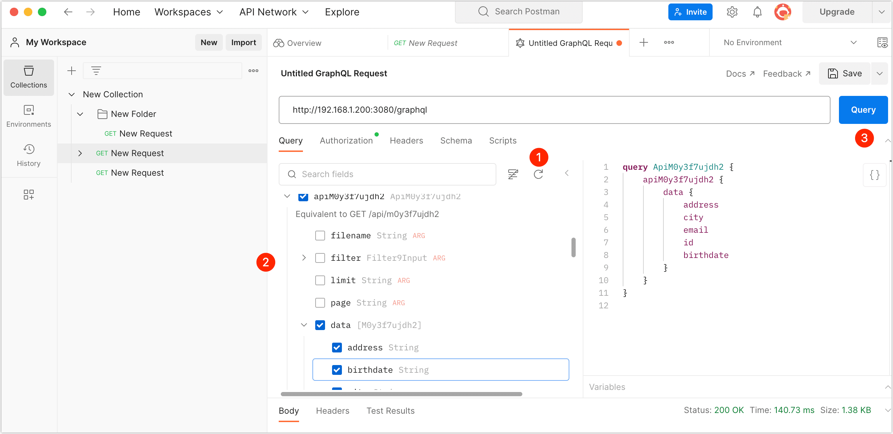

# 通过 GraphQL 查询 API

GraphQL 提供了一种查询语言，支持以声明方式从服务器请求数据，例如请求架构中的特定数据。Tapdata 集成了 GraphQL，您可以通过 API 服务地址来执行请求。

本文我们将介绍如何借助 Postman 工具，通过 GraphQL 查看 API 数据服务。

## 操作步骤

1. 登录 Tapdata 平台。

2. 获取 GraphQL 查询请求地址。

   1. 在左侧导航栏，选择**数据服务** > **API 服务器**。

   2. 在本页面获取 API 服务器的访问地址，本案例中为 `192.168.1.200:3080`。

      

   3. 在浏览器中输入 API 服务器的访问地址并加上 `/graphql` 后缀，例如 `http://192.168.1.200:3080/graphql`，即获得 GraphQL 查询请求地址。

3. 获取 API 服务的 Access Token 认证信息。

   1. 在左侧导航栏，选择**数据服务** > **服务管理**。

   2. 找到并单击目标服务名称。

   3. 在右侧的面板中，单击**调试**标签页，下翻至实例代码处即可获取 Access Token 认证信息。

      

4. 打开 [Postman 工具](https://www.postman.com/)，然后在软件页面的顶部单击 **Workspaces** 并选择您的 Workspace。

5. 单击 **New**，然后在弹出的对话框中选择 **GraphQL Request**。

   

6. 在 Request URL 文本框中，填写您在步骤 2 中获取到的 GraphQL 查询请求地址。

7. 单击文本框下方的 **Authorization**，选择 **Type** 为 **Bearer Token** 并填写您在步骤 3 中获取到的 Access Token 认证信息。

   

8. 单击 Query 标签页，首先单击刷新按钮获取所有 API 列表，随后找到目标 API，选择要查询的数据，最后单击 **Query**。

   

   :::tip

   您可以在 Tapdata 的**服务管理**页面，单击目标服务，下翻至**服务访问**区域框，确认  API 名称和服务名称的对应关系。

   :::

   查询成功后，页面下方将返回本次查询的结果，示例如下。

   