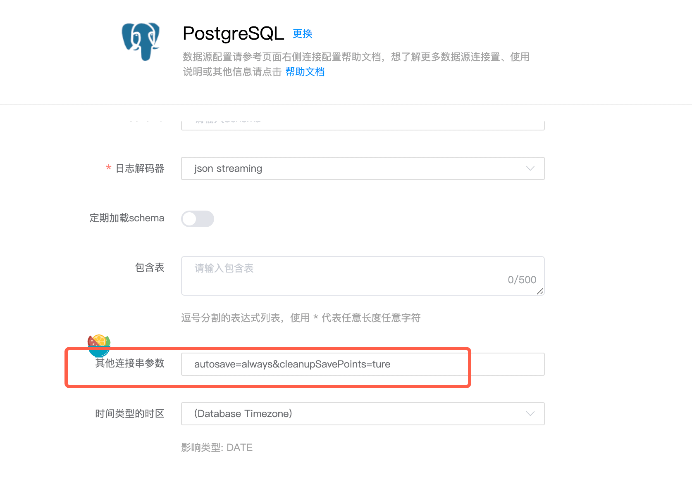
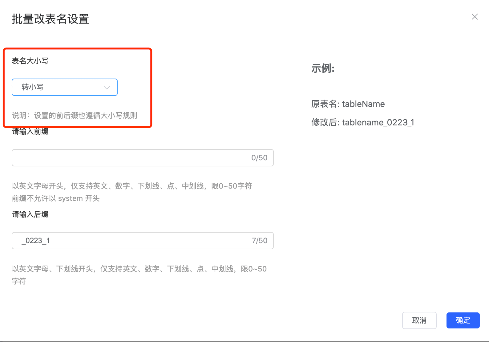

# 数据复制/开发

本文列举在使用数据同步/开发功能时遇到的常见问题。


### 数据复制和数据转换有什么区别？ 

数据复制主要用于整库或多表的数据同步，可满足数据库迁移上云、数据库升级、数据库备份等业务需求。

数据转换主要用于数据建模、数据 ETL、数据清理、数据合并（包括多表合并到单表）、宽表建设等业务场景，最大的不同点是数据开发的目标通常只能是单表。


### 配置复制任务前需要检查源端数据库吗？

建议在任务配置前对源端数据库情况做如下了解，预估数据复制的规模：

- 源库有多少张表
- 最大的表有多少行，占用空间多少，大致推算出每条记录是多少 KB
- 这些表的主键（primary key），或者唯一索引（unique key）的情况
- 日常情况下这些表的增量事件，比如大约每天的增删改事件有多少

### 执行数据复制时，是否推荐将所有表放在一个任务中执行？

不推荐。我们建议对数据表进行分类，同类数据表用一个独立任务来处理，避免某类表的问题导致整个任务中断。

### 数据表的分类原则有哪些？

推荐的分类原则如下：

* 只有主键或者只有唯一索引的表：Tapdata Cloud 对此类表的能力支持比较完善，通常不会发生异常。
* 有主键且有唯一索引的表：此类表在一些极端情况下会出现目标表违反唯一索引的报错。
* 无主键和唯一索引的表：复制任务执行时会对此类表会进行全字段的同步匹配，对来源端大并发的增量同步场景执行速度会比较慢。
* 数据量超大的表：对于行数在千万以上表，建议使用单表配置任务，避免影响其他表的同步性能。


### 任务状态一直处于“启动中”，如何解决？

您可以联系我们[获取技术支持](../support.md)。


### 重置任务失败？

您需要在 Tapdata Cloud 的 Agent 页面中，检查任务对应 Agent 的健康状态。


### 任务显示错误，除了任务日志外还可以检查什么日志？

您还查看分析 Agent 的日志信息，路径为 Agent 安装目录下的 **logs/tapdata-agent.log**。


### 是否支持跨区域、跨网络的数据同步？

支持。Tapdata Cloud通过 Agent 来连接源和目标，仅通过开放有限的网络服务，即可实现同步需求。

### 是否支持源和目标为同一对象的数据同步？

支持。只需要同步操作的数据对象开放相应数据权限。


### 是否支持DDL操作的实时同步？

不支持。


### 是否支持跨时区/字符集的数据同步？

支持。


### 是否支持分库分表的数据同步？

支持。Tapdata Cloud 可以从多源同时同步到同一目标表。


### 是否支持更改数据同步对象在目标库中的名称？

支持。


### 是否支持过滤部分字段或数据？

支持。


### 是否支持新增或移除同步对象？

支持。


### CDC 的解析是在 agent 端完成吗？ 

是的。


### 在创建任务时，待复制表列表为空？

加载 Schema 和创建连接是异步过程，因此可能出现加载不及时或者加载失败的情况，可以通过“连接管理->具体连接->加载schema”来手动更新。


### 部分表已经同步了数据，若重新全量同步，之前的数据会清空吗？

不会。


### 任务停止后，再次启动是否会丢失数据？

不会，Tapdata Cloud 通过 checkpoint 机制保证数据完整性。


### 任务连接测试和错误日志出现乱码？

通常是因为时区设置不正确，可更改时区后重试。


### 增加 DDL 时如何操作？

1. 在业务低峰期停止服务。
2. 校验源表，目标表数据是否完全一致；一致后，才能停止 CDC，否则会丢失数据； 
3. 停止源 CDC。
4. 进行源表 DDL，重启 CDC。 
5. 进行目标表 DDL。
6. 重新拉取连接 Schema。
7. 重启同步 Agent 服务。


### Oracle 同步到 MySQL，出现中文乱码怎么办？

在创建连接时可通过 jdbc 转换

`?useUnicode=true&characterEncoding=utf8 `或者 `?useUnicode=true&characterEncoding=gbk`


### PostgreSQL 作为目标时，如果事务失败后重试报错： ERROR : current transaction is aborted, commands ignored until end of transaction block

需要在配置 PostgreSQL 连接时，在连接串里增加如下参数即可解决：

```
autosave=always&cleanupSavePoints=ture
```



### 任务运行中能更改吗，例如增加同步的表？

可以重新编辑任务，不过要增加表的话，可能会影响原有的同步任务，需要去重置原有任务进度。如果要增加表不影响原有的，建议还是新建一个任务。


### 实时复制主表数据，从表数据也在增加，会有冲突吗？

Tapdata Cloud 会做 upsert 操作，如果目标已有数据，会识别出来，并按照源端更新，如果从表数据完全是新的，则不会影响。


### 开启增量并发的选项 为什么会和无主键同步冲突呢？ 

 增量并发按照主键来将数据分组处理，无主键的情况下，这个分组处理的能力就失效了，所以做成了互斥 。


### 建表成功了，为什么任务运行时还报目标表不存在？

对于有些库做目标时，如果目标库设置了不区分表名大小写。当源表是大写表名时，同步到目标库会被强制转换为小写表名。此时任务通过源表的大写表名去目标库匹配时就会报找不到目标表的错误。

此时您可以通过任务设置过程中的字段映射设置里，将表名强制转换为与目标库表名大小写一致，即可正常同步。




### 任务无法删除？

当任务状态为调度中、运行中、停止中、强制停止中等中间状态时，是不能删除任务的，只有任务停下来后才能删除任务。


### 建计划任务时，无法搜索到表？

需要加载到源库的模型才可以创建任务。

编辑任务 -> 选择表 -> 加载模型。


### 任务的所属 agent 关联逻辑是什么？

目前是根据任务数做负载调度，以后会支持根据标签调度。


### 创建任务时，源地址的数据没有正确加载？

可以先检查实例所在机器是否可以访问数据库，如果仍然不能加载的话，可以联系在线客服支持协助解决。