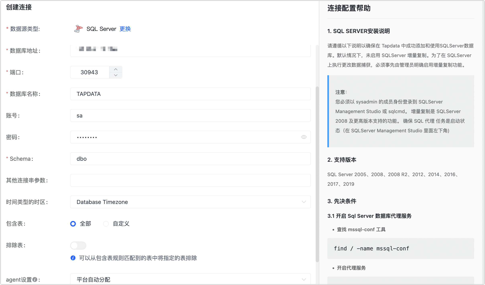

# SQL Server
import Content from '../../reuse-content/_all-features.md';

<Content />

SQL Server 数据库是 Microsoft 开发设计的一个关系数据库智能管理系统（RDBMS）。完成 Agent 部署后，您可以跟随本文教程在 Tapdata 中添加 SQL Server 数据源，后续可将其作为源或目标库来构建数据管道。


## 支持版本

SQL Server 2005、2008、2008 R2、2012、2014、2016、2017、2019、2022

:::tip

本文以 SQL Sever 2017 为例演示操作流程，其操作系统为 Windows Server 2019，如您部署在 Linux 平台且作为源库时，您还需要[安装并启用 SQL Server 代理](https://learn.microsoft.com/zh-cn/sql/linux/sql-server-linux-setup-sql-agent?view=sql-server-2017#EnableAgentAfterCU4)。

:::

<details>
<summary>SQL Server 2005 作为源库解决方案</summary>
由于 CDC 支持从 SQLServer 2008 开始支持，对于较早的版本，您需要使用 Custom SQL 功能来模拟更改数据捕获，在从旧版本复制数据时，源表必须有一个更改跟踪列，比如 <b>LAST_UPDATED_TIME</b>，它在每次插入或更新记录时都会更新；随后在创建数据复制任务时，任务的同步类型选择为<b>全量</b>，将<b>重复运行自定义 SQL</b>设置为 <b>True</b>，同时在映射设计上提供适当的自定义 SQL。

</details>

## 准备工作

### 作为源库

1. 以管理员（例如 **sa**）身份，登录到 SQL Server Management Studio 或 sqlcmd。

2. [启用 SQL Server 代理服务](https://learn.microsoft.com/zh-cn/sql/ssms/agent/start-stop-or-pause-the-sql-server-agent-service?view=sql-server-ver16)。 

3. 执行下述命令，启用变更数据捕获能力。

   1. 启用数据库级别的 CDC，在执行命令时，您需要替换 **database_name** 为真实的数据库名。

      ```sql
      -- 启用变更数据捕获能力
      USE database_name
      GO
      EXEC sys.sp_cdc_enable_db
      GO
      
      -- 查看是否启用变更数据捕获，is_cdc_enabled 值为 1 即表示已启用该功能
      SELECT [name], database_id, is_cdc_enabled
      FROM sys.databases
      WHERE [name] = N'database_name'
      GO
      ```

   2. 启用表级别的 CDC。

      ```sql
      USE database_name
      GO
      EXEC sys.sp_cdc_enable_table 
      @source_schema = N'schema_name', 
      @source_name   = N'table_name',
      @role_name     = N'role_name',
      @supports_net_changes = 1
      GO
      ```

      - **database_name**：数据库名称。
      - **schema_name**：架构名称，例如 **dbo**。
      - **table_name**：数据表的名称。
      - **role_name**：可以访问更改数据的角色，如不希望使用设置角色，可将其设置为 NULL，如果在启用增量复制时指定了角色，则需确保数据库用户具有适当的角色，以便 Tapdata 可以访问增量复制表。


4. 依次执行下述格式的命令，创建用于数据复制/转换任务的用户。

   ```sql
   -- 创建登录账户
   CREATE LOGIN login_name WITH PASSWORD='passwd', default_database=database_name;
   
   -- 创建数据库操作用户
   CREATE USER login_name FOR LOGIN login_name with default_schema=schema_name;
   
   ```

   * **login_name**：登录名，即用户名。
   * **passwd**：用户密码。
   * **database_name**：与登录关联的默认数据库，即要登录的数据库名。
   * **schema_name**：数据库架构名称（例如 **dbo**），它充当对象（例如表、视图、过程和函数）的命名空间或容器。相关资料，见[创建数据库架构](https://learn.microsoft.com/zh-cn/sql/relational-databases/security/authentication-access/create-a-database-schema?view=sql-server-ver16)。

   下述示例表示创建一个名为 **tapdata** 的用户，指定登录的数据库为 **demodata**，架构为 **dbo**：

   ```sql
   -- 创建登录账户
   CREATE LOGIN tapdata WITH password='Tap@123456', default_database=demodata;
   
   -- 创建数据库操作用户
   CREATE USER tapdata FOR LOGIN tapdata with default_schema=dbo;
   ```

5. 为刚创建的账号授予权限，您也可以基于业务需求自定义权限控制。

   ```sql
   -- 授予读取指定架构下所有表的权限
   GRANT SELECT ON SCHEMA::schema_name TO tapdata;
   
   -- 授予读取变更数据捕获的权限，其架构固定为 cdc
   GRANT SELECT ON SCHEMA::cdc TO tapdata;
   ```

   * **login_name**：登录名，即用户名。
   * **schema_name**：数据库架构名称（例如 **dbo**），它充当对象（例如表、视图、过程和函数）的命名空间或容器。

   下述示例表示授予 **tapdata** 用户，拥有 **dbo** 架构和 **cdc** 架构下所有表的读取权限。

   ```sql
   GRANT SELECT ON SCHEMA::dbo TO tapdata;
   GRANT SELECT ON SCHEMA::cdc TO tapdata;
   ```

7. （可选）如需向从节点读取增量数据以实现数据同步，您需要为从节点设置上述步骤。


### 作为目标库

1. 以管理员（例如 **sa**）身份，登录到 SQL Server Management Studio 或 sqlcmd。

2. 依次执行下述格式的命令，创建用于数据复制/转换任务的用户。

   ```sql
   -- 创建登录账户
   CREATE LOGIN login_name WITH PASSWORD='passwd', default_database=database_name;
   
   -- 创建数据库操作用户
   CREATE USER login_name FOR LOGIN login_name with default_schema=schema_name;
   
   ```

   * **login_name**：登录名，即用户名。
   * **passwd**：用户密码。
   * **database_name**：与登录关联的默认数据库，即要登录的数据库名。
   * **schema_name**：数据库架构名称（例如 **dbo**），它充当对象（例如表、视图、过程和函数）的命名空间或容器。相关资料，见[创建数据库架构](https://learn.microsoft.com/zh-cn/sql/relational-databases/security/authentication-access/create-a-database-schema?view=sql-server-ver16)。

   下述示例表示创建一个名为 **tapdata** 的用户，指定登录的数据库为 **demodata**，架构为 **dbo**：

   ```sql
   -- 创建登录账户
   CREATE LOGIN tapdata WITH password='Tap@123456', default_database=demodata;
   
   -- 创建数据库操作用户
   CREATE USER tapdata FOR LOGIN tapdata with default_schema=dbo;
   ```

3. 为刚创建的账号授予权限，您也可以基于业务需求自定义权限控制。

   ```sql
   -- 授予建表权限
   GRANT ALTER ON SCHEMA::schema_name TO login_name;
   GRANT CREATE TABLE TO login_name;
   
   -- 授予增删改查所有表的权限
   GRANT DELETE, INSERT, SELECT, UPDATE ON SCHEMA::schema_name TO login_name;
   ```

   * **login_name**：登录名，即用户名。
   * **schema_name**：数据库架构名称（例如 **dbo**），它充当对象（例如表、视图、过程和函数）的命名空间或容器。

   下述示例表示授予 **tapdata** 用户，在 **dbo** 架构建表并对所有表执行增删改查的权限：

   ```sql
   GRANT ALTER ON SCHEMA::dbo TO tapdata
   GRANT CREATE TABLE TO tapdata
   GRANT DELETE, INSERT, SELECT, UPDATE ON SCHEMA::dbo TO tapdata;
   ```


## <span id="ssl">开启 SSL 连接（可选）</span>

为进一步提升数据链路的安全性，您还可以选择为 SQL Server 数据库开启 SSL（Secure Sockets Layer）加密，实现在传输层对网络连接的加密，在提升通信数据安全性的同时，保证数据的完整性，具体操作可参考官方文档：

* [Windows 平台](https://learn.microsoft.com/zh-cn/sql/database-engine/configure-windows/configure-sql-server-encryption?view=sql-server-ver15)
* [Linux 平台](https://learn.microsoft.com/zh-cn/sql/linux/sql-server-linux-encrypted-connections?view=sql-server-ver15&tabs=server)

:::tip

完成配置后，妥善保存证书相关文件，后续将后续在配置连接时使用。

:::


## 添加数据源

1. [登录 Tapdata 平台](../../user-guide/log-in.md)。

2. 在左侧导航栏，单击**连接管理**。

3. 单击页面右侧的**创建**。

4. 在弹出的对话框中，搜索并选择 **SQL Server**。

5. 在跳转到的页面，根据下述说明填写 SQL Server 的连接信息。

   

   * 连接信息设置
      * **连接名称**：填写具有业务意义的独有名称。
      * **连接类型**：支持将 SQL Server 作为源或目标库。
      * **数据库地址**：数据库连接地址。
      * **端口**：数据库的服务端口。
      * **数据库名称**：数据库名称，即一个连接对应一个数据库，如有多个数据库则需创建多个数据连接。
      * **账号**：数据库的账号。
      * **密码**：数据库账号对应的密码。
      * **Schema**：Schema 名称。
   * 高级设置
      * **其他连接串参数**：额外的连接参数，默认为空。
      * **时间类型的时区**：默认为数据库所用的时区，您也可以根据业务需求手动指定。
      * **使用 SSL/TLS**：选择是否开启 SSL 连接数据源，可进一步提升数据安全性，开启该功能后还需要上传 CA 证书、证书密码和服务器主机名信息，相关文件已在[开启 SSL 连接](#ssl)中获取。
      * **共享挖掘**：[挖掘源库](../../user-guide/advanced-settings/share-mining.md)的增量日志，可为多个任务共享源库的增量日志，避免重复读取，从而最大程度上减轻增量同步对源库的压力，开启该功能后还需要选择一个外存用来存储增量日志信息。
      * **包含表**：默认为**全部**，您也可以选择自定义并填写包含的表，多个表之间用英文逗号（,）分隔。
      * **排除表**：打开该开关后，可以设定要排除的表，多个表之间用英文逗号（,）分隔。
      * **Agent 设置**：默认为**平台自动分配**，您也可以手动指定 Agent。
      * **模型加载频率**：数据源中模型数量大于 1 万时，Tapdata 将按照设置的时间定期刷新模型。

6. 单击**连接测试**，测试通过后单击**保存**。

   :::tip

   如提示连接测试失败，请根据页面提示进行修复。

   :::


## 扩展阅读


本小节介绍在使用变更数据捕获功能时可能会遇到的问题，更多信息，请参考[微软官方文档](https://docs.microsoft.com/en-us/sql/relational-databases/system-stored-procedures/change-data-capture-stored-procedures-transact-sql?view=sql-server-ver15)。


* 清理变更数据捕获日志

  SQL Server 不会自动变更数据捕获日志，需要进行如下设置开启清理任务。

  ```sql
  --retention 的单位为分钟，本处设定清理周期为2天
  USE AdventureWorks2012;  
  GO  
  EXECUTE sys.sp_cdc_change_job   
      @job_type = N'cleanup',  
      @retention = 2880;  
  GO 
  ```

* 如果对增量同步表的字段执行了 DDL 操作（如增加字段），您需要执行下述操作重启变更数据捕获，否则可能出现数据无法同步或报错等情况。

  ```sql
  --关闭该表的变更数据捕获
  go
  EXEC sys.sp_cdc_disable_table
  @source_schema = N'[Schema]',
  @source_name = N'[Table]',
  @capture_instance = N'[Schema_Table]'
  go
  // capture_instance一般为schema_table的格式拼接而成，可以通过以下命令，查询实际的值
  exec sys.sp_cdc_help_change_data_capture
  @source_schema = N'[Schema]',
  @source_name = N'[Table]';
  
  
  --启动该表的变更数据捕获
  use [数据库名称]
  go
  EXEC sys.sp_cdc_enable_table
  @source_schema = N'[Schema]',
  @source_name = N'[Table]',
  @role_name = N'[Role]'
  go
  ```

  

* 开启全库变更数据捕获

  ```sql
  -- 全局替换 将 TAPDATA 替换为实际的数据库名
  -- 全局替换 将 INSURANCE 替换为实际的 schema 名称
  USE TAPDATA
  GO
  EXEC sys.sp_cdc_enable_db
  GO
  
  declare @table_name varchar(100)
  declare @database_name varchar(100)
  declare @schema_name varchar(100)
  
  set @database_name = 'TAPDATA'
  set @schema_name = 'INSURANCE'
  
  declare my_cursor cursor for SELECT TABLE_NAME
                               FROM TAPDATA.INFORMATION_SCHEMA.TABLES
                               where TABLE_CATALOG = @database_name
                                 and TABLE_SCHEMA = @schema_name;
  open my_cursor
  fetch next from my_cursor into @table_name
  while @@FETCH_STATUS = 0
      begin
          begin try
              exec sys.sp_cdc_enable_table
                   @source_schema = @schema_name,
                   @source_name = @table_name,
                   @role_name = NULL
          end try
          begin catch
              print('[ERROR] ' + @table_name)
          end catch
  
          fetch next from my_cursor into @table_name
      end
  close my_cursor
  deallocate my_cursor
  ```

* 关闭全局变更数据捕获

  ```sql
  -- 全局替换 将 TAPDATA 替换为实际的数据库名
  -- 全局替换 将 INSURANCE 替换为实际的 schema 名称
  USE TAPDATA
  GO
  
  declare @table_name varchar(100)
  declare @database_name varchar(100)
  declare @schema_name varchar(100)
  
  set @database_name = 'TAPDATA'
  set @schema_name = 'INSURANCE'
  
  declare my_cursor cursor for SELECT TABLE_NAME
                               FROM TAPDATA.INFORMATION_SCHEMA.TABLES
                               where TABLE_CATALOG = @database_name
                                 and TABLE_SCHEMA = @schema_name;
  open my_cursor
  fetch next from my_cursor into @table_name
  while @@FETCH_STATUS = 0
      begin
          begin try
              EXEC sys.sp_cdc_disable_table
                   @source_schema = @schema_name,
                   @source_name = @table_name,
                   @capture_instance = 'all';
          end try
          begin catch
              print ('[ERROR] ' + @table_name)
          end catch
  
          fetch next from my_cursor into @table_name
      end
  close my_cursor
  deallocate my_cursor
  
  EXEC sys.sp_cdc_disable_db
  GO
  ```

  
