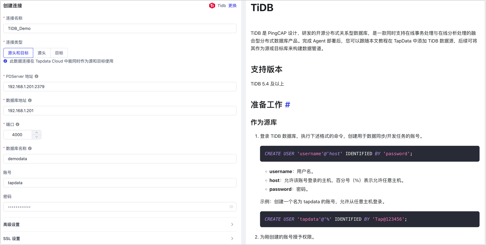

# TiDB
import Content from '../../reuse-content/_all-features.md';

<Content />

TiDB 是 PingCAP 设计、研发的开源分布式关系型数据库，是一款同时支持在线事务处理与在线分析处理的融合型分布式数据库产品。完成 Agent 部署后，您可以跟随本文教程在 TapData 中添加 TiDB 数据源，后续可将其作为源或目标库来构建数据管道。

```mdx-code-block
import Tabs from '@theme/Tabs';
import TabItem from '@theme/TabItem';
```

## 前提条件

* 若使用 **TapData Enterprise** 或 **Community** 版本，需升级至 **3.8.0** 或更高版本。
* 若使用 **TapData Cloud** 版本，则需为**半托管**类型的 **Agent 实例**。

## 支持版本

TiDB 5.4 及以上

## 注意事项

* TiDB 集群与 TapData 引擎（Agent）之间需能正常通信，以保障数据的正常读取和同步。

* 将 TiDB 作为源以实现增量数据同步场景下，待同步的表需具备主键或唯一索引。

* 为进一步简化使用流程，TapData 的 TiDB 连接器集成了 TiCDC，可基于数据变更日志解析为有序的行级变更数据。更多原理及概念介绍，见 [TiCDC 概述](https://docs.pingcap.com/zh/tidb/stable/ticdc-overview)。

* TiDB 版本为 8.0 以上时，如需将其作为源执行增量数据同步，Tapdata Agent 需为半托管实例，且需部署在 Linux 平台。


## <span id="prerequisite">准备工作</span>

1. 登录 TiDB 数据库，执行下述格式的命令，创建用于数据同步/开发任务的账号。

   ```sql
   CREATE USER 'username'@'host' IDENTIFIED BY 'password';
   ```

   * **username**：用户名。
   * **host**：允许该账号登录的主机，百分号（%）表示允许任意主机。
   * **password**：密码。

   示例：创建一个名为 tapdata 的账号，允许从任意主机登录。

   ```sql
   CREATE USER 'tapdata'@'%' IDENTIFIED BY 'your_passwd';
   ```


2. 为刚创建的账号授予权限。

```mdx-code-block
<Tabs className="unique-tabs">
<TabItem value="作为源库">
```
```sql
-- 全量 + 增量同步所需权限如下
GRANT SELECT ON *.* TO 'username' IDENTIFIED BY 'password';
```
</TabItem>

<TabItem value="作为目标库">

```sql
-- 授予指定库权限
GRANT SELECT, INSERT, UPDATE, DELETE, ALTER, CREATE, CREATE ROUTINE, CREATE TEMPORARY TABLES, DROP ON database_name.* TO 'username';

-- 授予所有库权限
GRANT SELECT, INSERT, UPDATE, DELETE, ALTER, CREATE, CREATE ROUTINE, CREATE TEMPORARY TABLES, DROP ON *.* TO 'username';
```
</TabItem>
</Tabs>

* **database_name**：数据库名称。
* **username**：用户名。

3. 如需执行增量数据同步，且 TiDB 版本高于 8.0，您还需要跟随下述步骤安装相关 CDC 工具。
   1. 下载 TiCDC 工具，下载地址格式为 `https://tiup-mirrors.pingcap.com/cdc-v${ti-db-version}-linux-${system-architecture}.tar.gz` 。
   
      * `${ti-db-version}`：TiDB 版本，例如：`8.0.1`
      * `${system-architecture}`：操作系统架构，例如：`amd64`（即 x86_64） 或者 `arm64`
   
      例如 8.1.0 版本的 Linux（x86_64 架构）的 TiCDC 下载地址为：https://tiup-mirrors.pingcap.com/cdc-v8.1.0-linux-AMD64.tar.gz
   
   2. 将下载的压缩包解压并命名为 `cdc`，瑞后将其移动至 `{tapData_dir}/run-resource/ti-db/tool` 目录中。
   
      其中，`tapData_dir` 表示 TapData 安装目录。
   
   3. 赋予 `{tapData_dir}/run-resource/ti-db/tool/cdc` 可读可写可执行权限。


## 添加数据源
1. [登录 TapData 平台](../../user-guide/log-in.md)。

2. 在左侧导航栏，单击**连接管理**。

3. 单击页面右侧的**创建**。

4. 在弹出的对话框中，搜索并选择 **TiDB**。

5. 在跳转到的页面，根据下述说明填写 TiDB 的连接信息。

   

   * **连接信息设置**
      * **连接名称**：填写具有业务意义的独有名称。
      * **连接类型**：支持将 TiDB 数据库作为源或目标。
      * **PD Server 地址**：填写 PDServer 的连接地址和端口，默认端口号为 **2379**，本参数仅在作为源库时需填写。
      * **数据库地址**：数据库连接地址。
      * **端口**：数据库的服务端口，默认为 **4000**。
      * **数据库名称**：数据库名称，即一个连接对应一个数据库，如有多个数据库则需创建多个数据连接。
      * **账号**、**密码**：数据库的账号和密码，账号的创建和授权方法，见[准备工作](#prerequisite)。
      
   * **高级设置**
      * **其他连接串参数**：额外的连接参数，默认为空。
      * **时间类型的时区**：默认为数据库所用的时区，您也可以根据业务需求手动指定。
      * **共享挖掘**：[挖掘源库](../../user-guide/advanced-settings/share-mining.md)的增量日志，可为多个任务共享源库的增量日志，避免重复读取，从而最大程度上减轻增量同步对源库的压力，开启该功能后还需要选择一个外存用来存储增量日志信息，本参数仅在作为源库时需填写。
      * **包含表**：默认为**全部**，您也可以选择自定义并填写包含的表，多个表之间用英文逗号（,）分隔。
      * **排除表**：打开该开关后，可以设定要排除的表，多个表之间用英文逗号（,）分隔。
      * **agent 设置**：默认为**平台自动分配**，您也可以手动指定。
      * **模型加载时间**：当数据源中模型数量小于 10,000 时，每小时刷新一次模型信息；如果模型数据超过 10,000，则每天按照您指定的时间刷新模型信息。
      * **开启心跳表**：当连接类型选择为**源头和目标**、**源头**时，支持打开该开关，由 Tapdata 在源库中创建一个名为 **_tapdata_heartbeat_table** 的心跳表并每隔 10 秒更新一次其中的数据（数据库账号需具备相关权限），用于数据源连接与任务的健康度监测。
      
   * **SSL 设置**：选择是否开启 SSL 连接数据源，可进一步提升数据安全性，开启该功能后还需要上传 CA 文件、客户端证书、密钥填写客户端密码。更多介绍，见[生成自签名证书](https://docs.pingcap.com/zh/tidb/stable/generate-self-signed-certificates)。
   
6. 单击**连接测试**，测试通过后单击**保存**。

   :::tip

   如提示连接测试失败，请根据页面提示进行修复。

   :::

