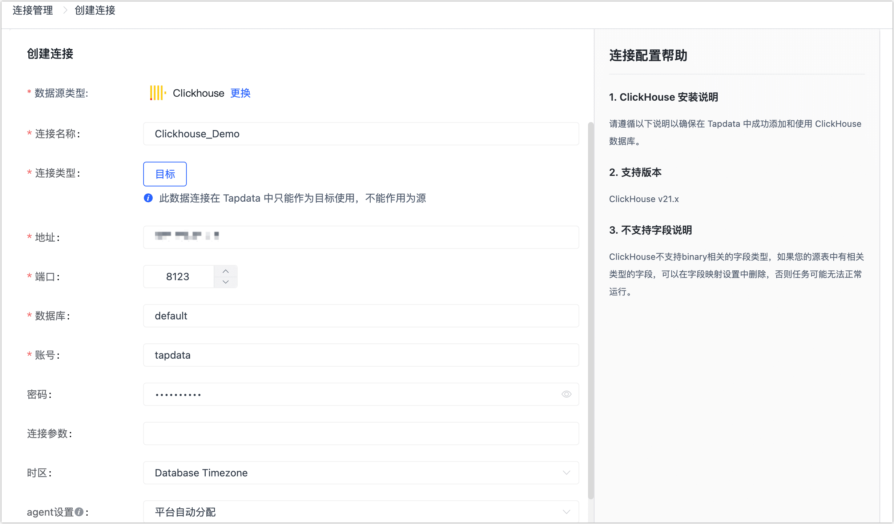

# ClickHouse
import Content from '../../reuse-content/_all-features.md';

<Content />

ClickHouse 是一个用于联机分析（OLAP）的列式数据库管理系统（DBMS）。完成 Agent 部署后，您可以跟随本文教程在 Tapdata 中添加 ClickHouse 数据源，后续可将其作为目标库来构建数据管道。

## 支持版本

ClickHouse v21.x

## 注意事项

暂不支持 binary 相关的字段类型，如包含在配置数据同步/开发任务时，通过字段映射将其删除。

## 准备工作

1. 调整配置文件 **user.xml**，启用访问权限控制并重启服务，具体操作，见[官方文档](https://clickhouse.com/docs/zh/operations/access-rights#enabling-access-control)。

   :::tip

   您也可以使用通过修改该文件[完成账号配置](https://clickhouse.com/docs/zh/operations/settings/settings-users/)，本文演示权限控制开启后，如何创建和授权账号。

   :::

2. 登录 ClickHouse 数据库，执行下述格式的命令，创建用于数据同步/开发任务的账号。

   ```sql
   CREATE USER username HOST 'host' IDENTIFIED WITH protection BY 'password';
   ```

   * **username**：用户名。
   * **host**：允许该账号登录的主机，**ANY** 表示允许任意主机。
   * **protection**：密码保护方式。
   * **password**：密码。

   示例：创建一个名为 **tapdata** 的账号，采用 sha256_password 密码保护机制，允许其从任意主机登录。

   ```sql
   CREATE USER tapdata HOST ANY IDENTIFIED WITH sha256_password BY 'Tap@123456';
   ```

3. 为刚创建的账号授予权限，简易示例如下，您还可以基于业务需求设置更精细化的权限控制。更多介绍，见[授权语法](https://clickhouse.com/docs/zh/sql-reference/statements/grant/)。

   ```sql
   GRANT SELECT, INSERT, CREATE TABLE, ALTER TABLE, ALTER UPDATE, DROP TABLE, TRUNCATE ON database_name.* TO username
   ```

   * **database_name**：要授予权限的数据库名称。
   * **usernmae**：用户名。

## 添加数据源

1. [登录 Tapdata 平台](../../user-guide/log-in.md)。

2. 在左侧导航栏，单击**连接管理**。

3. 在页面右侧，单击**创建连接**。

4. 在跳转到的页面，单击**认证数据源**标签页，然后选择 **ClickHouse**。

5. 根据下述说明完成数据源配置。

   

   * 连接信息设置
      * **连接名称**：填写具有业务意义的独有名称。
      * **连接类型**：仅支持将 ClickHouse 数据库作为目标。
      * **地址**：数据库连接地址。
      * **端口**：数据库的 HTTP API 服务端口，默认为 **8123**，如开启了 SSL 加密，默认端口为 8443，更多介绍，见[网络端口说明](https://clickhouse.com/docs/en/guides/sre/network-ports/)。
      * **数据库名称**：数据库名称，即一个连接对应一个数据库，如有多个数据库则需创建多个数据连接。
      * **账号**、**密码**：数据库的账号和密码。
      * **其他连接串参数**：额外的连接参数，默认为空。
   * 高级设置
      * **时区**：默认为数据库所用的时区，您也可以根据业务需求手动指定。
      * **agent 设置**：默认为**平台自动分配**，您也可以手动指定。
      * **模型加载频率**：数据源中模型数量大于 1 万时，Tapdata 将按照本参数的设定定期刷新模型。

6. 单击**连接测试**，测试通过后单击**保存**。

   :::tip

   如提示连接测试失败，请根据页面提示进行修复。

   :::

