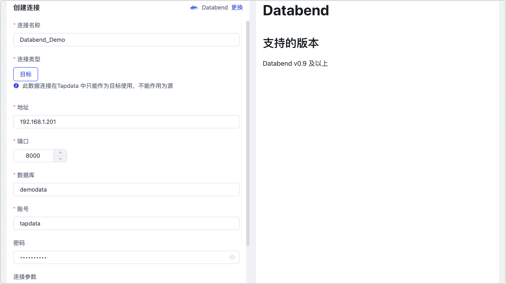

# Databend
import Content1 from '../../reuse-content/_all-features.md';

<Content1 />

Databend 是一个开源的 Elastic 和 Workload-Aware 现代云数据仓库，Databend 使用最新的矢量化查询处理技术，帮助用户在对象存储上进行快速的数据分析。

接下来，跟随本文介绍在 Tapdata 平台上连接本地部署的 Databend。

## 支持版本

Databend v0.9 及以上

import Content from '../../reuse-content/beta/_beta.md';

<Content />

## 准备工作

1. 登录 Databend 数据库，执行下述格式的命令，创建用于数据同步/开发任务的账号。

   ```sql
   CREATE USER 'username' IDENTIFIED BY 'password';
   ```

   - **username**：用户名。
   - **password**：密码。

   示例：创建一个名为 tapdata 的账号。

   ```sql
   CREATE USER 'tapdata' IDENTIFIED BY 'Tap@123456';
   ```

2. 为刚创建的账号授予指定数据库的所有权限，以便 Tapdata 可自动创建同步的目标表，您也可以基于业务需求设置更精细化的权限控制。更多介绍，见 [GRANT 语法](https://databend.rs/doc/sql-commands/ddl/user/grant-privileges)。

   ```sql
   -- 请根据下述提示更换 database_name 和 username
   GRANT ALL ON database_name.* TO username;
   ```

   * **database_name**：要授予权限的数据库名称。
   * **usernmae**：用户名。


## 连接 Databend

1. [登录 Tapdata 平台](../../user-guide/log-in.md)。

2. 在左侧导航栏，单击**连接管理**。

3. 单击页面右侧的**创建**。

4. 在弹出的对话框中，搜索并选择 **Databend**。

5. 在跳转到的页面，根据下述说明填写 Databend 的连接信息。

   

    - **基础连接设置**
      - **连接名称**：填写具有业务意义的独有名称。
      - **连接类型**：仅支持将 Databend 作为同步的**目标库**。
      - **数据库地址**：Databend 的连接地址。
      - **端口**：Databend 的服务端口，端口为 **8000**。
      - **数据库名称**：一个连接对应一个数据库，如有多个数据库则需创建多个数据连接。
      - **账号**、**密码**：分别填写数据库的账号和密码。
      - **连接参数**：额外的[连接参数](https://databend.rs/doc/develop/jdbc#configuring-connection-string)，默认为空。
    - **高级设置**
      - **Agent 设置**：默认为**平台自动分配**，您也可以手动指定 Agent。
      - **模型加载时间**：当数据源中模型（表）数量小于1万时，每小时刷新一次模型；当大于1万时，则会每天在指定的时间刷新模型。

6. 单击页面下方的**连接测试**，提示通过后单击**保存**。

   :::tip

   如提示连接测试失败，请根据页面提示进行修复。

   :::
