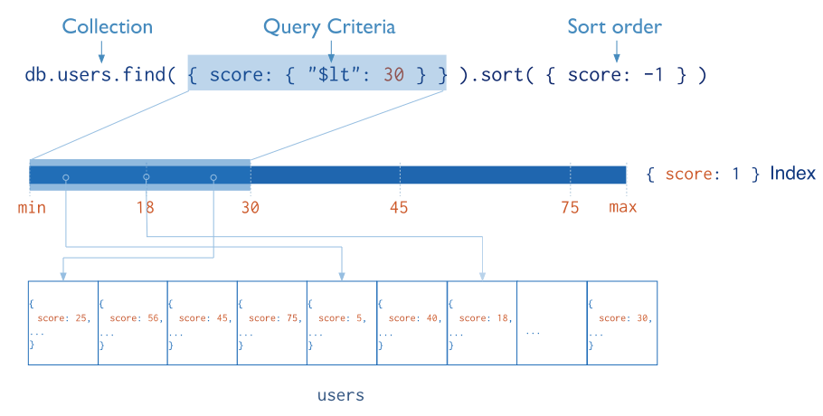

# 索引

索引支持在 TapDB 中高效执行查询。如果没有索引，TapDB 就必须扫描集合中的每个文档以返回查询结果。如果查询存在适当的索引，TapDB 就可以使用该索引来限制其必须扫描的文档数。

索引可提高查询性能，但添加索引会影响写入操作的性能。对于写入读取率高的集合，由于每次插入操作都必须同时更新所有索引，因此会带来较高的索引成本。

## 用例

如果应用程序对相同字段重复运行查询，则可以为这些字段创建索引以提高性能。例如，设想以下场景：

场景 | 索引类型
:--- | :---
人力资源部门经常需要通过员工 ID 来查找员工。您可以在员工 ID 字段上创建索引以提高查询性能。 | 单字段索引
销售人员经常需要按位置查找客户信息。位置存储在一个嵌入式对象中，其中包含 state、city 和 zipcode 等字段。您可以在 location 对象上创建索引，以提高对该对象的查询性能。 | 单字段索引在嵌入式文档上
杂货店经理经常需要按名称和数量查找库存商品，以确定哪些商品库存不足。您可以同时为 item 和 quantity 字段创建单个索引，以提升查询性能。 | 复合索引

:::warning

在嵌入式文档上创建索引时，仅指定整个嵌入式文档的查询使用该索引。对文档中的特定字段的查询不使用该索引。

:::


## 开始体验

您可以使用驱动程序方法或 TapDB Shell 创建和管理索引。 

### 使用驱动程序方法或 TapDB Shell 创建和管理索引

您可以使用驱动程序方法或 TapDB Shell 来创建和管理索引。如要了解详情，请参阅本页面提供的资源。

## 详情

索引是一种特殊的数据结构，它以易于遍历的形式存储一小部分集合数据集。 TapDB 索引使用 B-Tree 数据结构。

索引可存储某个特定字段或多个字段的值，并按字段的值进行排序。索引项的排序支持高效的等值匹配和基于范围的查询操作。此外，TapDB 还可使用索引中的顺序来返回排序后的结果。

下图说明了一个使用索引来选择匹配文档并为其排序的查询：



从根本上来说，TapDB 中的索引与其他数据库系统中的索引类似。 TapDB 在collection级别定义索引，并支持 TapDB collection中文档的任何字段或子字段上的索引。

## 默认_id索引

TapDB 在创建collection期间对 _id 字段创建 唯一索引 。`_id`索引可防止客户端插入两个具有相同`_id`字段值的文档。 您不能在`_id`字段上删除此索引。

:::warning

注意
在分片集群中，如果您不使用 _id 字段作为分片键，那么您的应用程序必须确保 _id 字段中值的唯一性，以防止出错。这一般是通过使用自动生成的标准ObjectId

:::

## 创建索引

要在TapDB shell中创建索引，请使用`db.collection.createIndex()`。

```
db.collection.createIndex( <key and index type specification>, <options> )
```

以下示例在`name`字段上创建单键降序索引：

```
db.collection.createIndex( { name: -1 } )
```

仅当尚不存在相同规范的索引时， `db.collection.createIndex()`方法才会创建索引。

[1]	TapDB 索引使用 B-Tree 数据结构。

### 索引名称

索引的默认名称是索引键和索引中每个键的方向（即 1 或 -1）的连接，使用下划线作为分隔符。 例如，在`{ item : 1, quantity: -1 }`上创建的索引的名称为`item_1_quantity_-1` 。

您可以使用自定义名称创建索引，例如创建一个比默认名称更易于理解的索引名称。 例如，考虑一个需要频繁查询`products` collection以填充现有库存数据的应用程序。以下`createIndex()`方法在`item`和`quantity`上创建一个名为`query for inventory`的索引：

```
db.products.createIndex(
    { item: 1, quantity: -1 } ,
    { name: "query for inventory" }
)
```

您可以使用`db.collection.getIndexes()`方法查看索引名称。 索引一旦创建就无法重命名。 相反，您必须删除索引并使用新名称重新创建索引。

## 索引类型

TapDB 提供了许多不同的索引类型来支持特定的数据和查询类型。

### 单个字段

除了 TapDB 定义的`_id`索引外，TapDB 还支持对文档的单个字段创建用户定义的升序/降序索引。


对于单字段索引和排序操作，索引键的排序顺序（即升序或降序）并不重要，因为 TapDB 可以沿任一方向遍历索引。

有关单字段索引的更多信息，请参阅单字段索引和使用单字段索引进行排序。

### 复合索引

TapDB 还支持针对多个字段的用户自定义索引，即复合索引。

复合索引中列出的字段顺序很重要。 例如，如果复合索引由`{ userid: 1, score: -1 }`组成，则索引首先按`userid`排序，然后在每个`userid`值中按`score`排序。


对于复合索引和排序操作，排序顺序（即 升序或降序）可以决定索引是否可以支持排序操作。 有关索引顺序对复合索引结果的影响的更多信息，请参阅排序顺序。

### 多键索引

TapDB 使用多键索引来索引存储在数组中的内容。 如果您对保存数组值的字段建立索引，TapDB 会为数组的每个唯一元素创建单独的索引项。 这些多键索引允许查询通过匹配数组的一个或多个元素来选择包含数组的文档。 如果索引字段包含数组值，TapDB 会自动判断是否创建多键索引；无需显式指定多键类型。


有关多键索引的更多信息，请参阅多键索引和多键索引边界。

### 地理空间索引

为了支持地理空间坐标数据的高效查询，TapDB 提供了两种特殊索引：返回结果时使用平面几何的2d 索引和使用球面几何返回结果的2dsphere 索引。

该索引为稀疏索引。 如果要使用稀疏索引创建复合索引，请先查看使用稀疏复合索引的特殊注意事项。

有关地理空间索引的高级介绍，请参阅地理空间索引。

### 文本搜索索引

TapDB 提供了一种 text 索引类型，以支持在集合中搜索字符串内容。要了解有关文本索引的更多信息，请参阅文本索引。

该索引为稀疏索引。 如果要使用稀疏索引创建复合索引，请先查看使用稀疏复合索引的特殊注意事项。

### 哈希(Hashed)索引

为了支持基于哈希的分片，TapDB 提供了一种哈希索引类型，用于索引字段值的哈希。这些索引在其范围内的值分布更随机，但仅支持等值匹配，不支持基于范围的查询。

### 聚集索引

从 TapDB 5.3 开始，您可以使用集群索引创建集合。使用集群索引创建的集合称为“集群化集合”。

请参阅集群化集合

### 通配符索引 (Wildcard Indexes)

从 TapDB 4.2 开始，您可以使用通配符索引来支持对多个字段、任意字段或未知字段的查询。 创建通配符索引时，您可以指定$**来表示所有字段或所有值，以便使用单个命令对以下任何内容进行索引：

- 字段的所有值

- 文档中的所有字段

- 文档中除特定字段路径（Field Path）之外的所有字段

- 文档中的多个特定字段

- 要了解更多信息，请参阅通配符索引。

## 索引属性

### 唯一索引

索引的唯一属性会导致 TapDB 拒绝索引字段的重复值。 除唯一约束之外，唯一索引在功能上可与其他 TapDB 索引互换。

### 部分索引

部分索引仅对collection中符合指定过滤表达式的文档进行索引。通过对collection中的文档子集进行索引，部分索引的存储要求更低，索引创建和维护的性能成本也更低。

部分索引提供了比稀疏索引更全面的功能，因此应优先选择部分索引。

### 稀疏索引

索引的稀疏属性可确保索引仅包含具有索引字段的文档的条目。 索引会跳过没有索引字段的文档。

您可以将稀疏索引选项与唯一索引选项结合使用，以防止插入索引字段具有重复值的文档，并跳过索引缺少索引字段的文档。

### TTL 索引

TTL 索引是特殊索引，TapDB 可以使用它在一定时间后自动从集合中删除文档。 这对于某些类型的信息（例如机器生成的事件数据、日志和会话信息）来说是理想的选择，这些信息只需在数据库中保留有限的时间。

有关实现说明，请参阅通过设置 TTL 使集合中的数据过期。

### 隐藏索引

4.4 版本新增.

隐藏索引对查询规划器不可见，并且不能用于支持查询。

通过向规划器隐藏索引，用户可以评估在不实际删除索引的情况下删除索引的潜在影响。如有不利影响，用户可以取消隐藏索引，而不必重新创建已删除的索引。由于索引在隐藏期间得到完全维护，因此一旦取消隐藏，索引就立即可用。

除`_id`索引外，您可以隐藏任何索引。

## 索引使用

索引可以提高读取操作的效率。 分析查询性能教程提供了带索引和不带索引的查询的执行统计信息示例。

有关 TapDB 如何选择要使用的索引的信息，请参阅查询优化器。

## 索引和排序规则

排序规则允许用户为字符串比较指定特定于语言的规则，例如字母大小写和重音符号规则。

要使用索引进行字符串比较，操作还必须指定相同的排序规则。换言之，如果一个操作对索引字段进行字符串比较，但又设定了与索引字段不同的排序规则，那么这个设有排序规则的索引将无法支持该操作。

:::warning

由于配置了排序规则的索引是通过 ICU 排序规则键来实现排序，因此，相比未配置排序规则的索引的索引键，有排序规则感知的索引键可能会更大。

:::

例如，集合 `myColl` 在字符串字段 category 上具有一个索引，排序规则语言环境为 `"fr"`。

```
db.myColl.createIndex( { category: 1 }, { collation: { locale: "fr" } } )
```

以下查询操作指定了与索引相同的排序规则，因此可以使用索引：

```
db.myColl.find( { category: "cafe" } ).collation( { locale: "fr" } )
```

而以下查询操作默认使用“简易的”二进制排序器，因此无法使用索引：

```
db.myColl.find( { category: "cafe" } )
```

如果一个复合索引的前缀键不是字符串、数组和嵌入式文档，在这种情况下，即使查询操作指定了一个与索引不同的排序规则，它仍然可以利用该复合索引来支持对其前缀健的比较。

例如，集合 `myColl` 在数值字段 `score` 和 `price` 以及字符串字段 `category` 上有一个复合索引；该索引使用排序规则语言环境 `"fr"` 创建，用于进行字符串比较：

```
db.myColl.createIndex(
    { score: 1, price: 1, category: 1 },
    { collation: { locale: "fr" } } )
```

以下操作使用 `"simple"` 二进制排序规则进行字符串比较，它们可以使用索引：

```
db.myColl.find( { score: 5 } ).sort( { price: 1 } )
db.myColl.find( { score: 5, price: { $gt: NumberDecimal( "10" ) } } ).sort( { price: 1 } )
```

以下操作使用 `"simple"` 二进制排序规则对索引的 `category` 字段进行字符串比较，它们可以使用索引仅完成查询的 `score: 5` 部分：

```
db.myColl.find( { score: 5, category: "cafe" } )

```

:::warning

与文档键（包括嵌入式文档键）的匹配使用简单的二进制比较。这意味着类似“foo.bár”的键的查询不会匹配“foo.bar”键，无论您为 strength 参数设置了什么值。

:::

有关排序规则的更多信息，请参阅排序规则参考页面。

以下索引只支持简单的二进制比较，不支持排序规则

- 文本索引，

- 2d索引，以及

- geoHaystack索引。

## 覆盖查询

当查询条件和查询投影仅包含索引字段时，TapDB 会直接从索引返回结果，而无需扫描任何文档或将文档调入内存。 这些涵盖的查询可以非常高效。


有关涵盖查询的更多信息，请参阅涵盖查询。

## 索引并集

TapDB 可以使用索引的交集来完成查询。 对于指定复合查询条件的查询，如果一个索引可以满足查询条件的一部分，而另一个索引可以满足查询条件的另一部分，那么 TapDB 就可以使用这两个索引的交集来完成查询。 使用复合索引和使用索引交集哪个更高效取决于特定的查询和系统。

有关索引交集的详细信息，请参阅索引交集。

## 限制

索引适用某些限制，例如索引键的长度或每个collection的索引数量。有关详细信息，请参阅索引限制。

## 其他注意事项

虽然索引可以提高查询性能，但索引也会带来一些操作注意事项。 有关更多信息，请参阅索引的操作注意事项。

在索引构建期间，应用程序可能会遇到性能下降或要索引集合的读/写权限受限的问题。

有关索引构建过程的更多信息，请参阅填充collection上的索引构建，特别是复制环境中的索引构建部分。

某些驱动程序使用NumberLong(1)而不是1来指定索引顺序。 生成的索引是相同的。