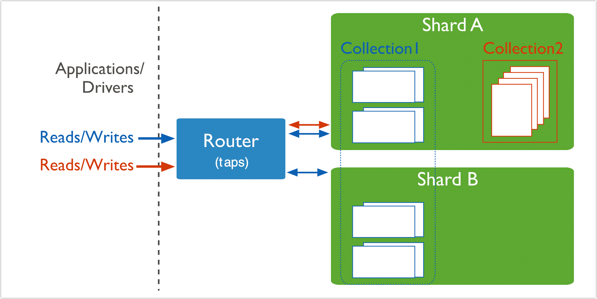
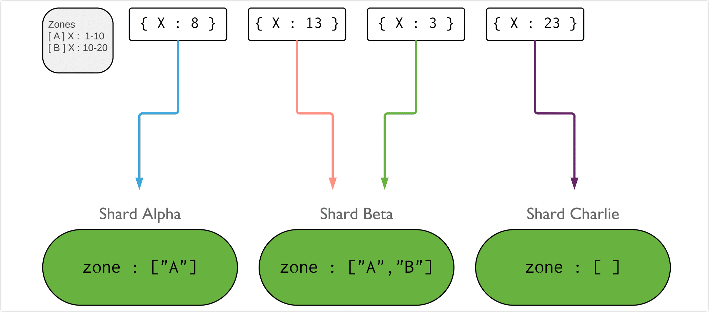

# 分片

分片是一种跨多台机器分布数据的方法。TapDB 通过分片支持超大数据集和高吞吐量操作的部署。

大型数据集或高吞吐量应用程序可能对单个服务器的容量构成挑战。例如，较高的查询速率可能会耗尽服务器的 CPU 容量，而大于系统 RAM 的工作集大小会对磁盘驱动器的 I/O 容量造成压力。

解决系统增长问题有两种方法：垂直扩展和水平扩展。

- **垂直扩展**（Vertical Scaling）：增加单个服务器的容量，例如使用更强大的 CPU、添加更多 RAM 或增加存储空间。但单台机器的硬件限制和云提供商的配置上限，使得垂直扩展存在实际的最大值。
- **水平扩展**（Horizontal Scaling）：将系统数据集和负载划分到多台服务器上，并按需增加服务器以提高容量。虽然单台机器的容量可能有限，但多台机器一起处理工作负载，往往比单台高性能服务器更高效。水平扩展增加了基础设施和维护的复杂性，但扩展的成本通常低于高端硬件的成本。

TapDB 支持通过水平扩展进行分片。

## 分片集群

TapDB 分片集群由以下组件构成：

- **分片**：每个分片都包含分片数据的一个子集，每个分片都必须作为一个副本集。
- **taps**：充当查询路由器，在客户端应用程序和分片集群之间提供接口。taps 支持对冲读，从而最大限度地降低延迟。
- **配置服务器**：存储集群的元数据和配置设置。从 TapDB 3.4 开始，配置服务器必须作为副本集（CSRS）部署。

下图描述了分片集群内各组件之间的交互：

TapDB 在集合级别对数据进行分片，将集合数据分布到集群中的各个分片上。

## 分片键

TapDB 使用分片键在分片之间分发集合的文档。分片键由文档中的一个或多个字段组成。

分片集合中的文档可能缺少分片键字段。跨分片分发文档时，缺少的分片键字段将视为具有 null 值，但在路由查询时则不会。

从 TapDB 5.0 开始，您可以通过更改集合的分片键对集合重新分片，还可以通过向现有分片键添加字段来优化分片键。

分片键值决定了文档在分片中的分布。您可以更新文档的分片键值，除非分片键字段是不可变的 `_id` 字段。

### 分片键索引

对已填充的集合进行分片，该集合必须具有以分片键开头的索引。对空集合进行分片时，如果该集合没有指定分片键的索引，TapDB 会创建支持索引。

### 分片键策略

分片键的选择影响分片集群的性能、效率和可扩展性。即使硬件和基础架构最佳，选择不当的分片键也会造成瓶颈。分片键及其索引的选择也会影响集群可使用的分片策略。

## 块

TapDB 将分片数据划分为多个块，每个块都有一个基于分片键的范围（包含下限和排除上限）。

## 平衡器和均匀数据分布

为了使集群中所有分片的数据均匀分布，平衡器在后台运行，以跨分片迁移数据范围。

## 分片的优点

### 读/写

TapDB 将读写工作负载分布在各个分片上，使每个分片处理一部分操作。通过增加分片，可以跨集群水平扩展读写工作负载。

对于包含分片键或复合分片键前缀的查询，taps 可以将查询定位到特定分片。这些有针对性的操作比向集群中的每个分片广播更高效。

taps 支持对冲读取以最大限度地减少延迟。

### 存储容量

分片将数据分布在各个分片上，使每个分片包含整个集群数据的一个子集。随着数据集的增长，额外的分片增加了集群的存储容量。

### 高可用性

将配置服务器和分片部署为副本集可以提高可用性。

即使一个或多个分片副本集不可用，分片集群仍可继续执行部分读取和写入。虽然无法访问不可用分片上的数据，但可用分片上的读取或写入仍可成功。

## 分片前的注意事项

分片集群基础设施要求和复杂性需要仔细规划、执行和维护。

一旦集合被分片，TapDB 不提供取消分片的方法。虽然稍后可以重新分片集合，但务必仔细考虑分片键的选择，以避免可扩展性和性能问题。

如果查询不包含分片键或复合分片键的前缀，taps 执行广播操作，查询分片集群中的所有分片。这些分散/聚集查询可能是长时间运行的操作。

从 TapDB 5.1 开始，启动、重新启动或添加具有集群范围写关注 (CWWC) 的分片服务器时，必须设置 `sh.addShard()`。

如果 `CWWC` 未设置，并且分片配置为默认写入关注 `{ w: 1 }`，则分片服务器将无法启动或添加，并返回错误。

## 分片集合和非分片集合

数据库可以混合使用分片集合和非分片集合。分片集合被分区并分布在集群中的分片上。非分片集合存储在主分片上。每个数据库都有自己的主分片。

## 连接到分片集群

您必须连接到 taps 路由器才能与分片集群中的任何集合进行交互。这包括分片集合和非分片集合。客户端不应连接到单个分片来执行读取或写入操作。

您可以使用 TapDB shell 连接到 TapDB 实例的相同方式，或使用 TapDB 驱动程序连接到 taps。

## 分片策略

TapDB 支持两种分片策略来在分片集群之间分发数据。

### 哈希分片

哈希分片计算分片键字段值的哈希值，并根据哈希值将数据分配到块中。

:::tip

TapDB 在使用哈希索引解析查询时会自动计算哈希值，应用程序无需计算哈希。

:::

虽然分片键的范围可能“接近”，但其哈希值不太可能位于同一块上。哈希分布有利于更均匀的数据分布，尤其是在分片键单调变化的数据集中。

然而，哈希分布导致对分片键的范围查询不太可能针对单个分片，从而导致更多的集群范围广播操作。

### 范围分片

范围分片根据分片键值将数据划分为不同范围，并根据分片键值为每个块分配范围。

一系列值“接近”的分片键更有可能位于同一块上。这允许进行有针对性的操作，因为 taps 可以将操作仅路由到包含所需数据的分片。

范围分片的效率取决于分片键的选择。选择不当的分片键可能会导致数据分布不均匀，进而导致性能瓶颈。

## 分片集群中的区域

区域可以帮助改善跨多个数据中心的分片集群的数据局部性。

在分片集群中，您可以根据分片键创建分片数据区域，并将每个区域与集群中的一个或多个分片关联。一个分片可以与任意数量的区域关联。在平衡集群时，TapDB 仅将区域覆盖的块迁移到与该区域关联的分片。

每个区域涵盖一个或多个分片键值范围，并始终包括其下边界但不包括其上边界。

定义区域覆盖的新范围时，必须使用分片键中包含的字段。如果使用复合分片键，则范围必须包含分片键的前缀。更多详细信息，请参阅区域中的分片键。

在选择分片键时，考虑将来可能使用的区域。

:::tip

从 TapDB 4.0.3 开始，在对空集合或不存在的集合进行分片之前设置区域和区域范围，可以更快地设置区域分片。

:::

## 分片中的排序规则

使用 `shardCollection` 带有选项的命令对具有默认排序规则 `collation : { locale : "simple" }` 的集合进行分片。成功分片需要：

- 集合必须有一个以分片键为前缀的索引。
- 索引必须具有排序规则 `{ locale: "simple" }`。

当使用排序规则创建新的集合时，请确保在对集合进行分片之前满足这些条件。

:::tip

对分片集合的查询继续使用为集合配置的默认排序规则。要使用分片键索引的排序规则 `simple`，请在查询的排序规则文档中指定 `{ locale : "simple" }`。
:::

## 变更流

从 TapDB 3.6 开始，副本集和分片集群可以使用变更流（Change Streams）。变更流允许应用程序访问实时数据变更，而无需担心跟踪 oplog 的复杂性和风险。应用程序可以使用变更流订阅一个或多个集合上的所有数据变更。

## 事务

随着分布式事务的引入，分片集群上可以进行多文档事务。

在事务提交之前，事务中所做的数据更改在事务外部不可见。

但是，当事务写入多个分片时，并非所有外部读取操作都需要等待已提交事务的结果在所有分片上可见。例如，如果事务已提交，并且写入 1 在分片 A 上可见，但写入 2 在分片 B 上尚不可见，则读取关注 `"local"` 的外部读取可以读取写入 1 的结果，而无需查看写入 2。