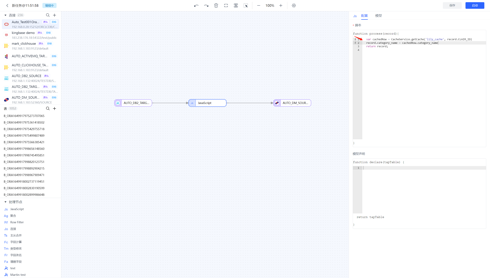
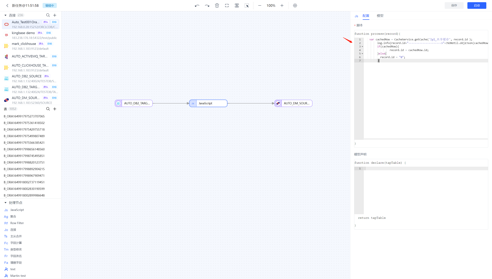

# 创建共享缓存

import Content from '../../reuse-content/_enterprise-features.md';

<Content />

共享缓存主要是为解决部分热点数据会被多个任务调用做处理时对源库产生太大压力，所以将这些数据放到缓存里供多个任务使用。


## 创建共享缓存

1. [登录 Tapdata 平台](../log-in.md)。

2. 在左侧导航栏，选择**数据管道** > **共享缓存**。

3. 在页面右侧，单击**新建缓存**。

4. 在弹出的对话框中，根据下述说明完成配置。

   

   * **缓存名称**：必填、支持中英文。
   * **缓存主键**：必填、可多选，用来对数据进行唯一识别。
   * **所属连接**：选择一个想要缓存的连接。
   * **所属表**：选择想要缓存的表。
   * **缓存键**：选择一个字段作为主键识别数据进行缓存。
   * **缓存字段**：选择需要进行缓存的常用字段。
   * **缓存最大内存**：系统会保存的最大内存量，超过则按调用时间，将最不常用的数据删掉
   * **外存配置**：选择外存，您为缓存单独[创建外存](../manage-system/manage-external-storage.md)来存储相关数据。
   * **应用代码**：根据填写的信息生成，可复制后在任务的 JS 节点中进行使用该缓存。

5. 单击**保存**。

6. （可选）对于配置好的共享缓存，您可以将其选中并导出备份或分享给其他团队成本，您也可以导入共享缓存配置。
   

   


## 使用共享缓存

用户可以通过任务中的 JS 节点来使用缓存，首先可以先点击缓存名称，在右侧点击应用代码的复制按钮，复制缓存代码供之后使用


创建一个需要使用缓存的开发任务

选择一个JS节点，点击该节点并输入之前复制的代码，粘贴完成后再写入需要执行的处理逻辑




所有配置都填写后点击保存按钮创建完成。


## 应用场景

用户在进行数据同步将一些数据从源表写到目标表时，可能需要与其他第三张表的数据进行交互处理，如果直接在JS里去库中取数据，如果同时开启的任务较多则比较费时且对库的压力较大，现在用户可以将第三张表中的一部分常用数据写到共享缓存中供各个任务去调用处理。


**操作思路：**

先创建一个共享缓存，选择一个连接作为缓存中间库，再复制下方应用代码，最后在创建一个开发任务在JS节点中粘贴这些代码，连接源和目标。


**具体流程：**

1. 登录 Tapdata，单击左侧导航栏的数据管道 > **共享缓存**。

2. 创建共享缓存。

   1. 点击右上角**新建缓存**按钮，配置信息如下：

      * 缓存名：可任意命名，例test04

      * 所属连接：选择一个mongo作为提供缓存数据来源的库，即将该库中数据存到共享缓存中供其他任务使用

      * 所属表：选择一个表传输数据到缓存中

      * 缓存建：选择一个字段作为缓存建，目的是作为唯一识别每条数据的主键

      * 缓存字段：选择你想要进行缓存的字段

        其他为非必填

   2. 复制下方**应用代码**，创建任务时要用。

   3. 点击下方保存按钮，跳转至共享缓存界面。

3. 打开数据管道-数据转换，点击右上角**创建任务**按钮。

4. 选择一个连接作为源节点。

5. 拖拽一个JS节点并将刚才复制的应用代码粘贴进去。

6. 选择一个连接作为目标节点。

7. 连接好源节点-JS节点-目标节点 后，点击右上角**保存**按钮。

8. 点击左上角返回按钮，跳转至任务列页。

9. 点击该任务的启动按钮，即可启动一个使用共享缓存的任务。




**JS 代码**：（代码逻辑是打印缓存日志，看看数据是否已经到了缓存中）

```java
function process(record){
// Enter you code at here
       var cachedRow = CacheService.getCache('lyl_共享缓存', [record.id](http://record.id/) );
       log.info([record.id](http://record.id/)+"--------------------->"+JSONUtil.obj2Json(cachedRow));
       if(cachedRow){
                [record.id](http://record.id/) = [cachedRow.id](http://cachedrow.id/);
       }else{
          [record.id](http://record.id/) = "0";
        }
        return record;
}
```


MongoDB中的数据

