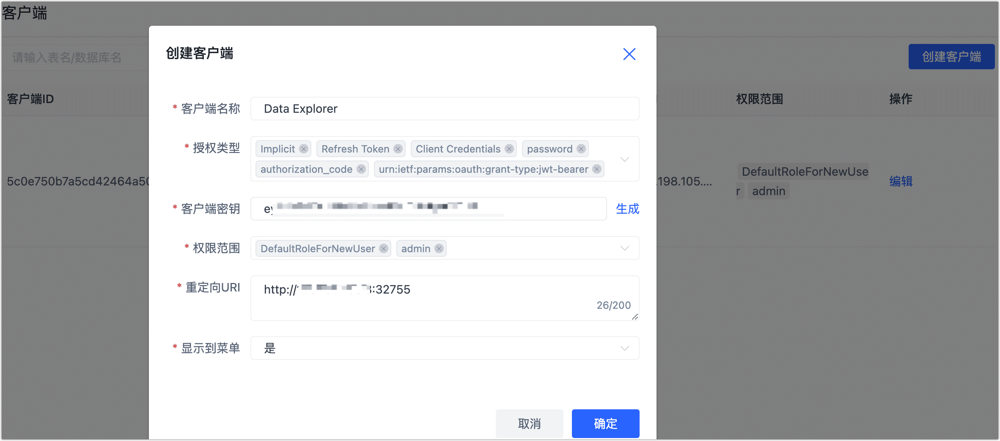

# 创建客户端

import Content from '../../reuse-content/_enterprise-and-community-features.md';

<Content />

API客户端是用来管理和创建调用API，开发者设计开发的应用程序或者其他需要调用 API 接口的应用程序（统称客户端应用）在接入数据发布系统前需要先注册，注册完成后，得到一个专属客户端ID（client_id）和客户端密钥（client_secret）

## 操作步骤

1. [登录 Tapdata 平台](../log-in.md)。

2. 在左侧导航栏，选择**数据服务** > **客户端**。

3. 单击右上角的**创建客户端**，填写相应信息并单击**确定**。

   

   - **客户端名称**：填写具有业务意义的名称。

   - **授权类型**：允许客户端应用使用的授权类型，默认如下：

     - **Implicit**：隐式授权方式，认证过程需要用户输入用户名密码确认授权，适用于网页应用请求 API 接口来获取数据的场景。
     - **Client credentials**：客户端密钥授权方式，客户端使用密钥直接换取访问令牌，不需要用户授权确认，适用于后台应用直接调用 API 接口的场景。
   
   - **客户端密钥**：选择的授权类型包含 **Client credentials** 时，必须填写。
   
     :::tip
   
     客户端密钥是客户端应用取得 API 访问授权的重要依据，应妥善保存，避免公共网络环境传输。
   
     :::
   
   - **权限范围**：允许客户端应用访问的接口范围，直接决定该客户端可以使用的 API 接口。当客户端的权限范围和 API 的权限范围存在交集时，则该客户端即可访问该 API。
   
   - **重定向 URL**：当使用 **implicit** 授权方式时，用于回调客户端应用并传递访问 API 接口的令牌等参数。
   
   
   
   

